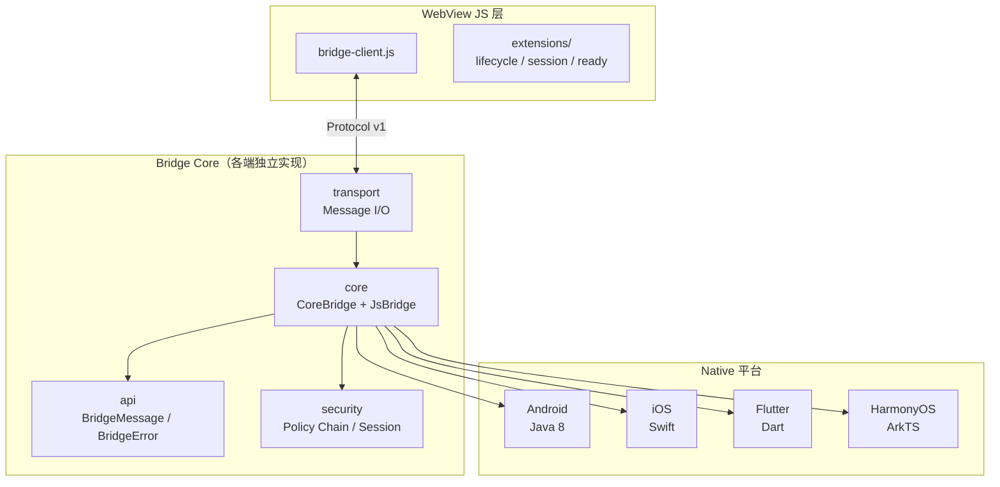

# JsBridge2

多端 JS-Native 桥接库，同一协议、同一会话模型、同一套 WebAssets，运行在 Android / iOS / Flutter / HarmonyOS 四端。

## 开源协议

本项目采用 [MIT License](LICENSE) 开源协议。

## 快速开始

### 10 分钟快速体验

**前置要求**：
- Android: JDK 8+, Android SDK
- iOS: Xcode 13+, Swift 5.5+
- Flutter: Flutter 3.0+
- HarmonyOS: DevEco Studio 4.0+

**步骤 1：克隆项目**

```bash
git clone https://github.com/xesam/JsBridge2.git
cd JsBridge2
```

**步骤 2：构建并同步 WebAssets**

> **⚠️ 首次构建前必须执行此步骤**，四端 WebAssets 不纳入版本控制，需由本地构建填充。

```bash
cd web-assets
pnpm install
pnpm sync    # 构建 JS SDK 并同步到四端
pnpm check   # 验证四端文件一致性
```

**步骤 3：运行 Demo（选择任一平台）**

<details>
<summary><strong>Android Demo</strong></summary>

```bash
cd js_bridge_android
./gradlew :js-bridge-core:test                    # 运行单元测试
./gradlew :js-bridge-example:assembleDebug       # 构建 Demo APK
# 安装到设备后，打开 Demo 查看交互示例
```
</details>

<details>
<summary><strong>iOS Demo</strong></summary>

```bash
cd js_bridge_ios
swift test --package-path js-bridge-core-swift   # 运行单元测试
open js-bridge-example/JsBridgeExample.xcodeproj # 打开 Xcode 运行 Demo
```
</details>

<details>
<summary><strong>Flutter Demo</strong></summary>

```bash
cd js_bridge_flutter
flutter test                                      # 运行测试
flutter run                                       # 启动 Demo
```
</details>

<details>
<summary><strong>HarmonyOS Demo</strong></summary>

```bash
cd js_bridge_hm/js-bridge-example
# 在 DevEco Studio 中打开项目，点击运行
```
</details>

### JS 侧集成

> 完整 API 文档见 [web-assets/packages/sdk/README.md](web-assets/packages/sdk/README.md)

JS SDK 由 `pnpm sync` 构建为 IIFE bundle（`jsbridge-sdk.js`），暴露全局 `window.JsBridgeSDK`，供 WebView 内 `<script src>` 加载。

```html
<!-- 1. 加载 SDK bundle（由 web-assets 构建产物复制到 WebView 资源目录） -->
<script src="./jsbridge-sdk.js"></script>
<script>
  const {
    BridgeClient, BridgeProtocol,
    createNativeTransport, registerWebEntry,
    createSessionApi, createReadyExtension,
    createLifecycleBridge,
  } = window.JsBridgeSDK

  // 2. 创建 transport + client，绑定消息接收
  const transport = createNativeTransport()
  const client = new BridgeClient(transport)
  registerWebEntry(client, transport)

  // 3. 创建 session API + ready 扩展（封装握手流程）
  const sessionApi = createSessionApi(client, {
    readyMethod: BridgeProtocol.METHOD_HANDSHAKE,
  })
  const ready = createReadyExtension(sessionApi, {
    readyMethod: BridgeProtocol.METHOD_HANDSHAKE,
  })

  // 4. 订阅生命周期事件（可选）
  const lifecycle = createLifecycleBridge(client, {
    lifecycleMethod: BridgeProtocol.METHOD_LIFECYCLE_STATE,
  })
  lifecycle.on((payload) => console.log('state:', payload.state, 'seq:', payload.seq))

  // 5. 握手成功后调用 Native 方法
  ready.bootstrapReady({
    onSuccess(res) {
      sessionApi.callNativeApi('getUser', {
        userId: '001',
        success(user) { console.log('user:', user) },
        fail(err)    { console.error(err) },
      })
    },
    onFail(err) { console.error('handshake failed', err) },
  })
</script>
```

<details>
<summary><strong>npm 包方式（发布后可用）</strong></summary>

`jsbridge-sdk` 发布到 npm 后，支持以 ES 模块方式消费：

```javascript
import {
  BridgeClient, BridgeProtocol,
  createNativeTransport, registerWebEntry,
  createSessionApi, createReadyExtension,
  createLifecycleBridge,
} from 'jsbridge-sdk'
```

> 当前包尚未发布到 npm，请使用上面的 IIFE bundle 方式。
</details>

### Native 侧集成

各端完整集成教程见对应平台的 README：[Android](js_bridge_android/README.md) · [iOS](js_bridge_ios/README.md) · [Flutter](js_bridge_flutter/README.md) · [HarmonyOS](js_bridge_hm/README.md)

<details>
<summary><strong>Android</strong></summary>

```java
import io.github.xesam.android.bridge.JsBridge;
import io.github.xesam.android.bridge.extensions.system.AndroidWebViewBridgeTransport;
import io.github.xesam.android.bridge.extensions.system.AndroidWebViewPageContextProvider;

// Level 0 — 开发模式
JsBridge bridge = new JsBridge(
    new AndroidWebViewBridgeTransport(webView),
    new AndroidWebViewPageContextProvider(webView),
    new JsBridge.KernelConfig(),
    new JsBridge.SecurityConfig()
);

// Level 2 — 生产模式
JsBridge bridge = new JsBridge(
    new AndroidWebViewBridgeTransport(webView),
    new AndroidWebViewPageContextProvider(webView),
    new JsBridge.KernelConfig(),
    JsBridge.SecurityConfig.secure()
        .allowedOrigins(Set.of("https://your-domain.com"))
        .methodWhitelist(Set.of("getUser"))
        .defaultCapabilities(Set.of("getUser"))
);

// 注册 handler
bridge.registerNativeHandler("getUser", (payload, callback) -> {
    callback.success(new JSONObject().put("name", "xesam"));
});

// 页面加载时重置
webView.setWebViewClient(new WebViewClient() {
    @Override
    public void onPageFinished(WebView v, String url) {
        bridge.resetTransport();
        bridge.resetForNewPage();
    }
});
```
</details>

<details>
<summary><strong>iOS</strong></summary>

```swift
import BridgeCore
import BridgeSystem  // WKWebViewBridgeTransport

// 创建 transport（封装 WKScriptMessageHandler + evaluateJavaScript + bootstrap script）
let transport = WKWebViewBridgeTransport(webView: webView)

// Level 0 — 开发模式
let bridge = JsBridge(
    securityConfig: JsBridge.SecurityConfig(),
    pageContextProvider: WebViewPageContextProvider(webView: webView),
    transport: transport
)

// Level 2 — 生产模式
var config = JsBridge.SecurityConfig.secure()
config.allowedOrigins = ["file://", "https://your-domain.com"]
config.methodWhitelist = [BridgeApiContract.methodHandshake, "getUser"]
config.defaultCapabilities = ["getUser"]
let bridge = JsBridge(
    securityConfig: config,
    pageContextProvider: WebViewPageContextProvider(webView: webView),
    transport: transport
)

// 注册 handler
bridge.registerHandler(method: "getUser") { payload in
    return .success(.object(["name": .string("xesam")]))
}

// 建立入站闭环（transport 收到 JS 消息 → 策略检查 → 分发 → 响应自动发回）
bridge.bindTransport()

// 页面加载时重置
bridge.resetForNewPage()
```
</details>

<details>
<summary><strong>Flutter</strong></summary>

```dart
import 'package:js_bridge_core/js_bridge_core.dart';
import 'package:webview_flutter/webview_flutter.dart';

// Level 0 — 开发模式
final bridge = JsBridge(securityConfig: SecurityConfig());

// Level 2 — 生产模式
final bridge = JsBridge(
  securityConfig: SecurityConfig.secure()
    ..allowedOrigins = {'file://', 'flutter-asset://'}
    ..methodWhitelist = {'bridge.handshake', 'getUser'}
    ..defaultCapabilities = {'getUser'},
);

// 绑定 transport（Native → JS 方向）+ PageContextProvider
bridge.attachTransport((String messageJson) async {
  final escaped = jsonEncode(messageJson);
  await controller.runJavaScript(
    'window.__bridgeReceiveFromNative && window.__bridgeReceiveFromNative($escaped)',
  );
  return true;
});
bridge.attachPageContextProvider(WebviewPageContextProvider(() => _currentUrl));

// 注册 handler
bridge.registerHandler('getUser', (dynamic payload) async {
  return const BridgeHandlerResult.success({'name': 'xesam'});
});

// 建立入站闭环：bindTransport() 返回的回调传给 JavaScriptChannel
final onIncoming = bridge.bindTransport();
controller = WebViewController()
  ..setJavaScriptMode(JavaScriptMode.unrestricted)
  ..addJavaScriptChannel('NativeBridge', onMessageReceived: (msg) => onIncoming(msg.message))
  ..setNavigationDelegate(NavigationDelegate(
    onPageStarted: (url) { _currentUrl = url; bridge.resetForNewPage(); },
  ));
```
</details>

<details>
<summary><strong>HarmonyOS</strong></summary>

```typescript
import { JsBridge, JsBridgeOptions, TrustedPageContext, PageContextProvider, BridgeHandlerResult } from '@xesam/js_bridge_core';

// PageContextProvider 实现
class FilePageContextProvider implements PageContextProvider {
  createContext(message: BridgeMessage, pageInstanceId: string): TrustedPageContext {
    return new TrustedPageContext('file://', pageInstanceId);
  }
}

// Level 0 — 开发模式
const bridge = new JsBridge({
  transport: (msg: string) => sendToWeb(msg),
  pageContextProvider: new FilePageContextProvider(),
});

// Level 2 — 生产模式
const bridge = JsBridge.secure({
  allowedOrigins: new Set(['file://']),
  methodWhitelist: new Set(['bridge.handshake', 'getUser']),
  defaultCapabilities: new Set(['getUser']),
  transport: (msg: string) => sendToWeb(msg),
  pageContextProvider: new FilePageContextProvider(),
} as JsBridgeOptions);

// 注册 handler
bridge.registerHandler('getUser', (payload) => {
  return BridgeHandlerResult.success({ name: 'xesam' });
});

// 建立入站闭环：bindTransport() 返回的回调传给 javaScriptProxy
const onIncoming = bridge.bindTransport();
const nativeBridge = new NativeBridgeProxy((msg: string) => void onIncoming(msg));

// 页面加载时重置
bridge.resetForNewPage();
```
</details>

### 核心概念

**安全分级模型**

| Level | 策略启用 | 适用场景 |
|-------|---------|---------|
| **Level 0** | 仅 `RequestShapePolicy` | 开发/测试、可信本地页面 |
| **Level 1** | + `HandshakeGatePolicy` | 需要握手，但无 origin 校验 |
| **Level 2** | + `AccessControlPolicy` | 生产环境（origin 白名单 + session 管理） |

**协议统一保证**

同一 JSON 请求在四端产生同语义响应：
- 相同的错误码（`E_POLICY_DENY` / `E_METHOD_NOT_FOUND` / `E_SESSION_INVALID` 等）
- 相同的握手响应结构
- 相同的会话生命周期语义

通过 C01–C30 conformance 测试覆盖。

## 系统架构



## 核心特性

- **协议优先**：Protocol v1 定义消息信封（id / sessionId / kind / method / ts / payload 等），各端严格对齐
- **安全分级**：固定四级 Policy Chain（RequestShapePolicy → HandshakeGatePolicy → AccessControlPolicy → extraPolicies），顺序不可变
- **入站闭环**：Android 通过 `resetTransport()` 建立双向闭环；iOS 通过 `WKWebViewBridgeTransport` + `bindTransport()` 封装全部 WKWebView 管道；Flutter / HarmonyOS 通过 `bindTransport()` 返回回调简化集成
- **共享 WebAssets**：`web-assets/` 是唯一正本，四端镜像完全一致，由 `pnpm check` 校验
- **四端 conformance**：JS 客户端行为用 C01–C30 用例覆盖，所有平台必须全部通过

## 快速验证

### Android

```bash
cd js_bridge_android
./gradlew :js-bridge-core:test
./gradlew :js-bridge-example:assembleDebug
./gradlew lint
```

### iOS

```bash
swift test --package-path js_bridge_ios/js-bridge-core-swift
xcodebuild -project js_bridge_ios/js-bridge-example/JsBridgeExample.xcodeproj \
  -scheme JsBridgeExample \
  -destination 'generic/platform=iOS Simulator' \
  build CODE_SIGNING_ALLOWED=NO
```

### Flutter

```bash
cd js_bridge_flutter/packages/js_bridge_core && flutter test
cd js_bridge_flutter && flutter test && flutter analyze
```

### HarmonyOS

```bash
c js_bridge_hm/js-bridge-example
# 在 DevEco Studio 中打开此目录，点击运行
# 或使用命令行（需配置 DEVECO_SDK_HOME 环境变量）：
# hvigorw assembleHap --mode module -p product=default --no-daemon
```

### 共享 WebAssets

```bash
# 构建 SDK + 同步到四端 + 校验
cd web-assets && pnpm sync

# 仅校验四端一致性
cd web-assets && pnpm check

# JS 客户端 conformance
node js_bridge_android/js-bridge-example/src/test/js/bridge-client-conformance.cases.js
```

## 文档

| 文档 | 说明 |
|------|------|
| [docs/01-protocol.md](docs/01-protocol.md) | Protocol v1 消息格式与语义 |
| [docs/02-architecture.md](docs/02-architecture.md) | 分层内核设计与依赖方向 |
| [docs/03-cross-platform.md](docs/03-cross-platform.md) | 跨端一致性约束与 WebAssets 管理 |
| [docs/04-conformance.md](docs/04-conformance.md) | Conformance 用例说明（C01–C30） |
| [docs/05-review.md](docs/05-review.md) | 架构评审：原则落地情况 |
| [docs/06-lifecycle-layers.md](docs/06-lifecycle-layers.md) | 生命周期三层模型：Native 能力 / Session / Scope |
| [js_bridge_android/README.md](js_bridge_android/README.md) | Android 平台说明 |
| [js_bridge_ios/README.md](js_bridge_ios/README.md) | iOS 平台说明 |
| [js_bridge_flutter/README.md](js_bridge_flutter/README.md) | Flutter 平台说明 |
| [js_bridge_hm/README.md](js_bridge_hm/README.md) | HarmonyOS 平台说明 |
| [build-jsbridge-from-0-to-1/README.md](build-jsbridge-from-0-to-1/README.md) | 从 0 到 1 写 JsBridge 全系列教程 |
