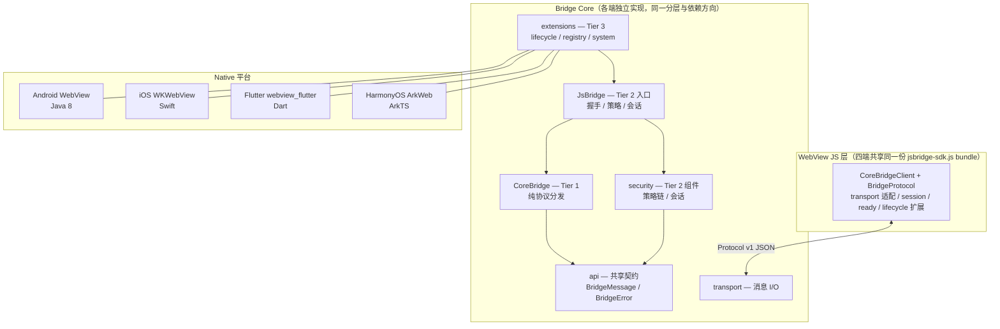

# JsBridge2

[](./LICENSE)

多端 JS-Native 桥接库，同一协议、同一会话模型、同一套 WebAssets，运行在 Android / iOS / Flutter / HarmonyOS 四端。

> **核心目标不是复用同一套运行时代码，而是让各端遵循同一套协议边界、会话模型和共享 WebAssets。**

## 项目定位

WebView 内嵌 H5 是跨平台业务的常见模式，但各平台原生提供的 JS-Native 通信接口差异显著（Android 的 `WebMessagePort`、iOS 的 `WKScriptMessageHandler`、Flutter 的 JS channel、HarmonyOS 的 ArkWeb bridge），导致：

| 问题 | JsBridge2 的解法 |
|------|-----------------|
| 各端 JS 接口不统一 | 共享 WebAssets：同一份 `jsbridge-sdk.js` 跨四端运行 |
| 缺乏会话与握手机制 | Protocol v1：规定消息信封格式、握手方法、会话生命周期 |
| 安全策略分散 | 固定评估顺序的安全策略链，宿主只扩展不覆盖 |
| Native 多端重复实现 | 分层内核：各平台独立实现，但遵循同一协议契约 |

## 仓库结构

| 目录 | 内容 |
|------|------|
| `docs/` | 统一设计文档：协议 / 架构 / 跨端约束 / 验收用例 / 评审 |
| `js_bridge_android/` | Android 实现（参考实现）：`js-bridge-core` + `js-bridge-example` |
| `js_bridge_ios/` | iOS 实现：`js-bridge-core-swift`（Swift Package）+ `js-bridge-example` |
| `js_bridge_flutter/` | Flutter 实现：`packages/js_bridge_core` + 宿主示例 App |
| `js_bridge_harmony/` | HarmonyOS 实现：`js-bridge-core`（HAR）+ `js-bridge-example` |
| `web-assets/` | Web 侧独立工程：`jsbridge-sdk` 源码 + demo，四端 WebAssets 唯一正本 |
| `build-jsbridge-from-0-to-1/` | 《从 0 到 1 写一个 JsBridge》系列教程 |
| `scripts/` | 各端测试脚本（`test_all.sh` / `test_android.sh` / …） |

## 快速开始

**前置要求**：Android 构建 JDK 17+（AGP 8.5 / Gradle 8.7；库产物为 Java 8 语言级别）· iOS Xcode 16+ / Swift 6 · Flutter SDK（Dart 3.11+）· HarmonyOS DevEco Studio 4.0+（可选——无 DevEco SDK 时 HarmonyOS 相关项自动跳过）

```bash
git clone https://github.com/xesam/JsBridge2.git
cd JsBridge2

# ⚠️ 必须先执行：构建 JS SDK 并同步到四端（四端 WebAssets 不纳入版本控制）
cd web-assets && pnpm install && pnpm sync && cd ..
```

随后选择任一平台运行 Demo（完整命令见对应平台 README）：

| 平台 | 运行方式 | 文档 |
|------|---------|------|
| Android | `cd js_bridge_android && ./gradlew :js-bridge-example:installDebug` | [README](js_bridge_android/README.md) |
| iOS | 在 Xcode 打开 `js-bridge-example/JsBridgeExample.xcodeproj` 运行 | [README](js_bridge_ios/README.md) |
| Flutter | `cd js_bridge_flutter && flutter run` | [README](js_bridge_flutter/README.md) |
| HarmonyOS | 在 DevEco Studio 打开 `js-bridge-example` 运行 | [README](js_bridge_harmony/README.md) |

JS 侧的接入方式（IIFE bundle / npm 包）与完整 API 见 [web-assets/packages/sdk/README.md](web-assets/packages/sdk/README.md)：

```html
<script src="./jsbridge-sdk.js"></script>
<script>
  const { CoreBridgeClient, BridgeProtocol, createNativeTransport, registerWebEntry,
          createJsBridgeClient, createReadyExtension } = window.JsBridgeSDK

  const transport = createNativeTransport()
  const client = new CoreBridgeClient(transport)
  registerWebEntry(client, transport)

  const jsBridgeClient = createJsBridgeClient(client, { readyMethod: BridgeProtocol.METHOD_HANDSHAKE })
  createReadyExtension(jsBridgeClient, { readyMethod: BridgeProtocol.METHOD_HANDSHAKE })
    .bootstrapReady({
      onSuccess(res) { jsBridgeClient.callNativeApi('getUser', { userId: '001' }) },
      onFail(err)    { console.error('handshake failed', err) },
    })
</script>
```

## 架构概览



**消息模型：纯异步（不支持同步调用）**。详见 [docs/03-protocol.md §1](docs/03-protocol.md)。

**安全分级模型**（渐进增强，默认 Level 0；分级与 `SecurityConfig` 的对应关系正本见 [docs/01-design-principles.md](docs/01-design-principles.md)）：

| Level | 策略启用 | 适用场景 |
|-------|---------|---------|
| **Level 0** | 仅 `RequestShapePolicy` | 开发/测试、可信本地页面，`resetPageInstance()` 后立即可用 |
| **Level 1** | + `HandshakeGatePolicy` + `SessionPolicy` | 需要握手与 session 校验，不限来源与方法 |
| **Level 2** | + `OriginPolicy` + `MethodGatePolicy` | 生产环境：origin 白名单 + 方法白名单 |

**协议统一保证**：同一 JSON 请求在四端产生同语义响应——相同的跨端错误码（`E_POLICY_DENY` / `E_NOT_READY` / `E_METHOD_NOT_FOUND` / `E_SESSION_INVALID` 等）、相同的握手响应结构、相同的会话生命周期语义，由 C01–C65 conformance 用例覆盖（`E_CHANNEL_CLOSED` 等建链错误由 JS 客户端本地产生、不跨端传输，见 [docs/03-protocol.md §8](docs/03-protocol.md)）；信道建立为 pull 模型（详见 [docs/06-channel-establishment.md](docs/06-channel-establishment.md)）。

## 运行测试

```bash
scripts/test_all.sh            # 四端 + WebAssets + JS conformance 一键验证
                                # （无 DevEco SDK / pnpm 时自动跳过对应项，退出码 125 = SKIP）

# 单独运行：
scripts/test_android.sh         # Android 单元测试
scripts/test_ios.sh             # iOS Swift 包测试
scripts/test_flutter.sh        # Flutter core 测试 + 宿主 analyze
scripts/test_harmony.sh        # HarmonyOS 构建（需 DevEco SDK）
scripts/test_web_assets.sh      # pnpm sync：构建 + 同步四端 + SHA-256 校验
scripts/test_js_conformance.sh # JS 客户端 conformance 四端副本

# JS 客户端 conformance（依赖 WebAssets 已同步）
node js_bridge_android/js-bridge-example/src/test/js/bridge-client-conformance.cases.js
```

各端的单元测试与构建命令见对应平台 README。

## 文档

### 统一设计文档（docs/）

| 文档 | 说明 |
|------|------|
| [01-design-principles.md](docs/01-design-principles.md) | 五条设计原则、安全分级模型、配置决策 |
| [02-architecture.md](docs/02-architecture.md) | 分层结构、策略链、安全配置 |
| [03-protocol.md](docs/03-protocol.md) | Protocol v1：消息信封、握手/会话、流式、错误码、策略链 |
| [04-cross-platform.md](docs/04-cross-platform.md) | 四端契约、入口签名、安全边界 |
| [05-lifecycle-layers.md](docs/05-lifecycle-layers.md) | 三层生命周期模型：Native 能力 / Session / Scope |
| [06-channel-establishment.md](docs/06-channel-establishment.md) | 信道建立 pull 模型与 reqId 往返 |
| [07-transport-bridge-design.md](docs/07-transport-bridge-design.md) | Transport 入站闭环设计（`bindTransport()` / `WKWebViewBridgeTransport`） |
| [08-handler-interface-contract.md](docs/08-handler-interface-contract.md) | Handler 接口契约（Simple/Async，四端实现规范） |
| [09-conformance.md](docs/09-conformance.md) | 一致性验收用例（C01–C65） |

### 社区与项目治理

| 文档 | 说明 |
|------|------|
| [CONTRIBUTING.md](CONTRIBUTING.md) | 贡献指南：开发工作流、跨端同步规则、提交规范、PR 检查清单 |
| [AGENTS.md](AGENTS.md) | 工程约定总纲（模块结构 / 构建命令 / 编码规范） |

### 各端使用文档（README，含集成教程与测试/构建命令）

- [Android](js_bridge_android/README.md) · [iOS](js_bridge_ios/README.md) · [Flutter](js_bridge_flutter/README.md) · [HarmonyOS](js_bridge_harmony/README.md)

### Web 侧（web-assets/，独立子项目）

- [web-assets/README.md](web-assets/README.md) — 概览与命令（构建 / 同步 / 发布）
- [web-assets/docs/01-js-sdk-design.md](web-assets/docs/01-js-sdk-design.md) — JS SDK 设计（分层 / 传输检测 / 构建产物）
- [web-assets/packages/sdk/README.md](web-assets/packages/sdk/README.md) — jsbridge-sdk 使用与 API 参考

### 教程

- [build-jsbridge-from-0-to-1/README.md](build-jsbridge-from-0-to-1/README.md) — 《从 0 到 1 写一个 JsBridge》分章节教程

### 衔接项目

- 打通Web与本地资源的访问： [local-asset](https://github.com/xesam/local-asset)

## 开源协议

本项目采用 [MIT License](LICENSE) 开源协议。
