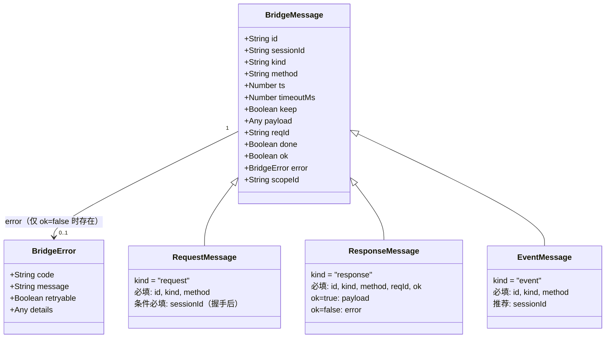
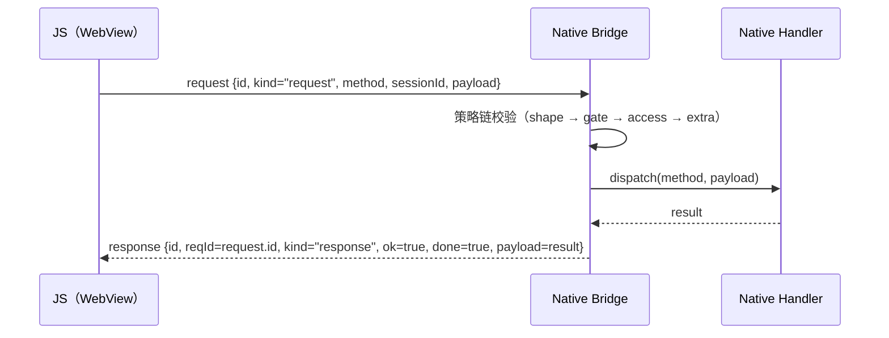
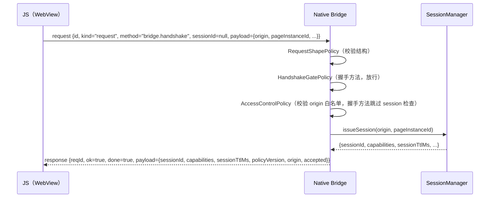
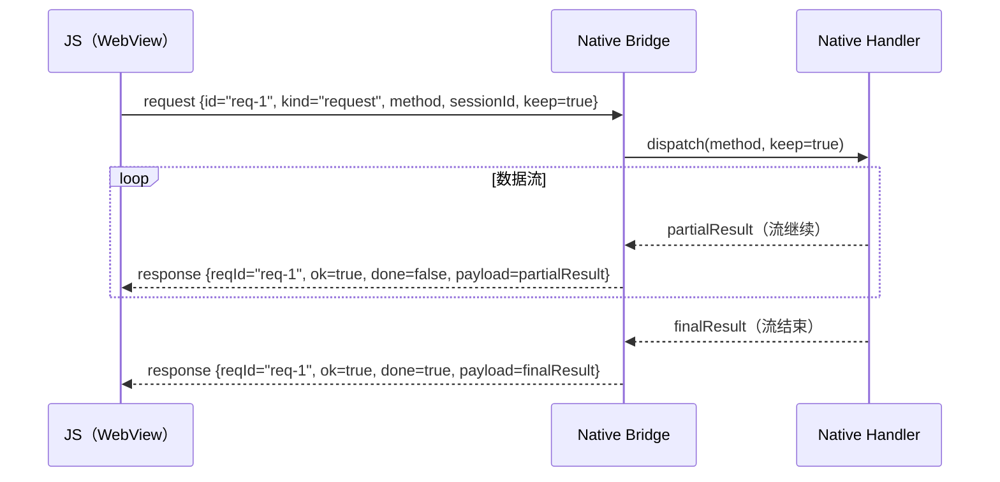
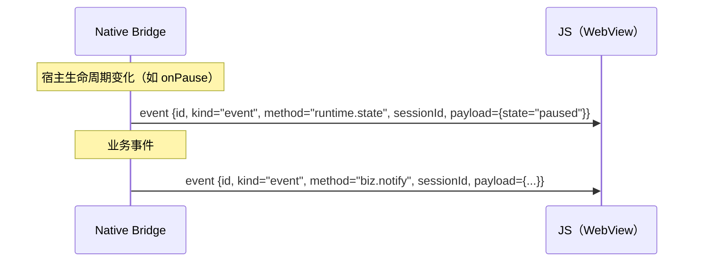
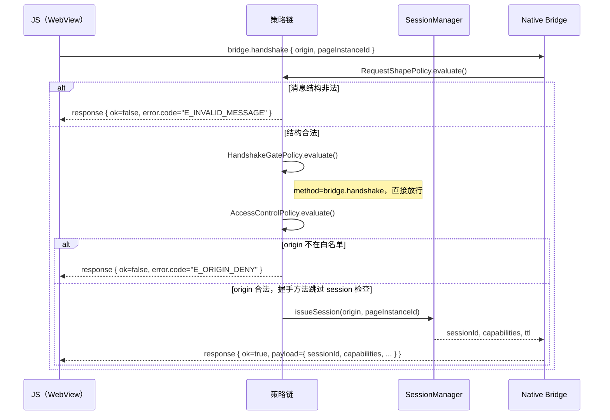
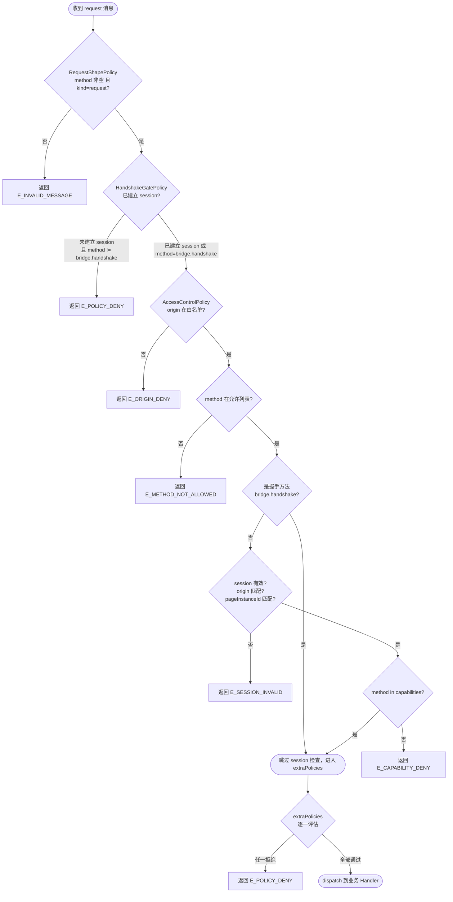
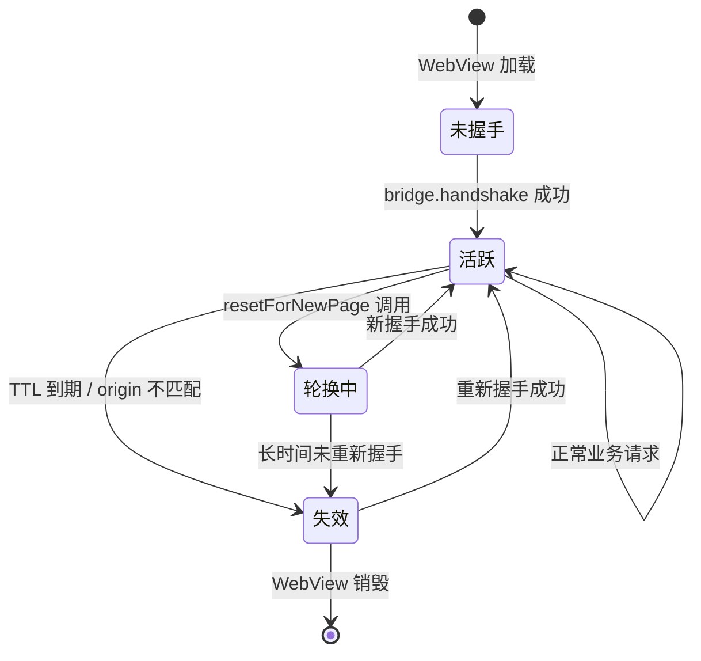

# 01 Bridge 协议设计

> 版本：v1  
> 更新日期：2026-05-21  
> 适用平台：Android · iOS · Flutter · HarmonyOS

---

## 目录

1. [协议概述](#1-协议概述)
2. [消息信封](#2-消息信封)
3. [消息类型详解](#3-消息类型详解)
4. [消息交互时序](#4-消息交互时序)
5. [握手协议](#5-握手协议)
6. [流式响应语义](#6-流式响应语义)
7. [保留方法](#7-保留方法)
8. [错误模型](#8-错误模型)
9. [策略链](#9-策略链)
10. [会话模型](#10-会话模型)
11. [兼容性规则](#11-兼容性规则)

---

## 1 协议概述

### 目标

JsBridge 协议定义了 **WebView 内 JS 代码与宿主 Native 代码之间的通信契约**。协议的核心目标是：

- **跨平台一致性**：同一套协议规范在 Android、iOS、Flutter、HarmonyOS 四个平台上得到完全一致的实现，任何一端发出的消息在另一端均可被无歧义地解析。
- **安全隔离**：通过握手建立会话（Session），结合策略链（Policy Chain）对每一条消息进行多层校验，阻止非授权调用。
- **可扩展性**：消息字段仅做增量演进，现有字段不删不改，新能力通过新字段引入，保证前向兼容。

### 版本

当前版本为 **v1**。版本标识通过握手响应中的 `policyVersion` 字段透出，供 JS 端感知并按需降级。

### 适用平台

| 平台 | 实现语言 | 核心模块路径 |
|------|----------|-------------|
| Android | Java 8 | `js_bridge_android/js-bridge-core` |
| iOS | Swift | `js_bridge_ios/js-bridge-core-swift/Sources/Bridge/` |
| Flutter | Dart | `js_bridge_flutter/packages/js_bridge_core/lib/src/` |
| HarmonyOS | ArkTS | `js_bridge_hm/js-bridge-core/src/main/ets/` |

协议由 Android 作为参考实现，其余平台严格对齐。

---

## 2 消息信封

所有消息均使用统一的 JSON 信封（Envelope），字段集如下。

### 字段说明表

| 字段 | 类型 | 必要性 | 所属方向 | 说明 |
|------|------|--------|----------|------|
| `id` | string | 必填 | request / response / event | 消息唯一标识，由发送方生成（推荐 UUID v4 或递增序号） |
| `sessionId` | string | 条件必填 | 所有 | 会话 ID；握手请求发送时可为空，握手成功后后续请求必须携带 |
| `kind` | string | 必填 | 所有 | 消息类型：`request` / `response` / `event` |
| `method` | string | 必填 | 所有 | 调用的方法名，格式建议为 `domain.action` |
| `ts` | number | 推荐 | 所有 | 消息发送时间戳（Unix 毫秒），用于超时计算和日志追踪 |
| `timeoutMs` | number | 可选 | request | 请求超时时间（毫秒），0 或不填表示不超时 |
| `keep` | boolean | 可选 | request | `true` 表示持续回调意图（流式/订阅场景），默认 `false` |
| `payload` | any | 条件可选 | request / response(ok) | 请求参数或成功响应数据，`ok=false` 时忽略 |
| `reqId` | string | response 必填 | response | 对应 request 的 `id`，用于客户端匹配回调 |
| `done` | boolean | 条件必填 | response | 流式响应帧标志：`false` 表示流继续，`true` 表示最终帧；非流场景默认 `true` |
| `ok` | boolean | response 必填 | response | `true` 表示成功，`false` 表示失败 |
| `error` | object | 条件必填 | response(失败) | `ok=false` 时的错误对象，结构见[错误模型](#8-错误模型) |
| `scopeId` | string | 可选 | request | 标识请求所属的逻辑页面 scope，用于 SPA 场景的 scope 生命周期管理。详见 [06-lifecycle-layers.md](06-lifecycle-layers.md) |

### 消息结构图



---

## 3 消息类型详解

### 3.1 request（JS → Native）

`request` 由 JS 端发出，表达对 Native 端某个方法的调用意图。

**必填字段**：`id`、`kind`、`method`

**条件必填**：
- `sessionId`：握手成功后所有非握手请求必须携带有效的 `sessionId`；握手请求（`bridge.handshake`）本身发送时 `sessionId` 可为空。

**可选字段**：
- `keep=true`：向 Native 声明"本次请求期望持续收到回调"，用于流式数据或事件订阅场景。
- `timeoutMs`：设定本次请求的超时，超时后 Native 应返回 `E_CANCELED` 错误响应。
- `payload`：调用参数，类型由具体方法约定。

**流向**：JS → Native（单向发起）

---

### 3.2 response（Native → JS）

`response` 由 Native 端回复，与 `request` 通过 `reqId == request.id` 一一对应。

**必填字段**：`id`、`kind`、`method`、`reqId`、`ok`

**条件字段**：
- `ok=true`：`payload` 为返回数据（可为 null）。
- `ok=false`：`error` 为标准化错误对象，`payload` 忽略。
- `done`：流式场景下控制帧序列，`done=false` 表示本帧是中间帧（流继续），`done=true` 表示最终帧（流结束）。非流场景隐含 `done=true`。

**流向**：Native → JS（被动回复）

---

### 3.3 event（Native → JS push）

`event` 由 Native 端主动推送，不依赖任何 `request`，无需 `reqId`。

**必填字段**：`id`、`kind`、`method`

**推荐字段**：
- `sessionId`：建议携带，供 JS 端做会话绑定过滤。

**流向**：Native → JS（主动推送）

典型用途：页面生命周期变化通知（通过 `runtime.state` 方法）、业务事件广播等。

---

## 4 消息交互时序

以下四个 `sequenceDiagram` 分别描述协议中最核心的四种交互模式。

### 4.1 普通调用（一次请求 → 一次响应）



### 4.2 握手时序



### 4.3 流式回调（keep=true）



### 4.4 事件推送（event）



---

## 5 握手协议

握手是建立可信会话的前置步骤。启用 `HandshakeGatePolicy`（即 Level 1 或 Level 2 安全模式）时，握手完成前所有非握手方法调用均被拦截并返回 `E_POLICY_DENY`；Level 0 模式下不启用此门控，`resetForNewPage()` 后 JsBridge 即可直接接受业务调用。

### 握手请求

JS 端构造如下消息发起握手：

```json
{
  "id": "<唯一 ID>",
  "kind": "request",
  "method": "bridge.handshake",
  "ts": 1716300000000,
  "payload": {
    "origin": "https://example.com",
    "pageInstanceId": "<页面唯一实例 ID>"
  }
}
```

- `sessionId` 此时可不携带（或传 `null`）。
- `payload.origin` 为 WebView 当前页面来源，由 JS 端读取后上报。
- `payload.pageInstanceId` 为页面实例唯一标识，用于区分同一 origin 下的多个标签页/WebView 实例。

### 握手响应

握手成功后，Native 返回：

```json
{
  "id": "<响应 ID>",
  "reqId": "<握手请求 id>",
  "kind": "response",
  "method": "bridge.handshake",
  "ok": true,
  "done": true,
  "payload": {
    "sessionId": "<签发的 session ID>",
    "capabilities": ["method.a", "method.b"],
    "sessionTtlMs": 3600000,
    "policyVersion": "v1",
    "origin": "https://example.com",
    "accepted": true
  }
}
```

握手响应 payload 字段说明：

| 字段 | 类型 | 说明 |
|------|------|------|
| `sessionId` | string | 签发的会话 ID，后续请求必须携带 |
| `capabilities` | string[] | 当前 session 允许调用的方法白名单 |
| `sessionTtlMs` | number | 会话有效时长（毫秒），0 表示永不过期 |
| `policyVersion` | string | 当前策略版本，供 JS 端感知协议能力 |
| `origin` | string | 服务端确认的 origin，JS 端可比对自验证 |
| `accepted` | boolean | `true` 表示握手被接受，`false` 表示被拒绝（但 ok 仍为 true） |

### 握手完整流程图



---

## 6 流式响应语义

### done 标志

`done` 字段仅在 `response` 消息中有意义，控制流帧的生命周期：

| `done` 值 | 含义 |
|-----------|------|
| `false` | 当前帧为中间帧，流仍在继续，JS 端应继续等待后续帧 |
| `true` | 当前帧为最终帧，流已结束，JS 端可释放相关资源 |
| 未携带 | 等同于 `true`，用于普通单次响应场景 |

### keep 标志

`keep` 字段由 JS 端在 `request` 中携带，向 Native 声明调用意图：

| `keep` 值 | 含义 |
|-----------|------|
| `true` | JS 端希望持续收到回调（流式数据、订阅场景） |
| `false` / 未携带 | 普通一次性调用，Native 只需回复一次 |

### 流式交互规则

1. JS 端发送 `keep=true` 的请求后，Native 可多次发出 `done=false` 的响应帧。
2. 流式最终帧必须携带 `done=true`，告知 JS 端流已结束。
3. 若中途发生错误，Native 应发送 `ok=false` 且 `done=true` 的响应帧终止流。
4. JS 端在收到 `done=true` 后，应不再接受同 `reqId` 的后续帧。

### 示例：进度上报流

```
← response { reqId="r1", ok=true, done=false, payload={progress: 10} }
← response { reqId="r1", ok=true, done=false, payload={progress: 50} }
← response { reqId="r1", ok=true, done=false, payload={progress: 80} }
← response { reqId="r1", ok=true, done=true,  payload={progress: 100, result: "done"} }
```

---

## 7 保留方法

协议层面保留两个特殊方法名，所有平台实现必须遵循其语义边界。

### 7.1 bridge.handshake

**方向**：JS → Native（`request`）  
**语义**：建立可信会话的唯一入口。

| 约束 | 说明 |
|------|------|
| 执行时机 | WebView 加载页面后、任何业务方法调用前 |
| sessionId | 请求时可为空，响应后必须保存 |
| 幂等性 | 同一 pageInstanceId 重复握手，Native 应刷新会话（而非报错） |
| 方法白名单 | 此方法必须通过 AccessControlPolicy 的 origin 白名单检查，但跳过 session 有效性检查 |

`bridge.handshake` 的 `payload` 结构和握手响应 `payload` 结构由协议固定，不允许宿主自定义核心字段。

### 7.2 runtime.state

**方向**：Native → JS（`event`）  
**语义**：宿主生命周期状态变化的推送通道。

| 约束 | 说明 |
|------|------|
| 执行时机 | 由宿主决定（如 Activity.onResume、App 进入后台等） |
| state 枚举 | 由宿主自定义，协议不约束具体值 |
| payload 结构 | 固定为 `{ "state": string, "seq": number }` |
| seq 语义 | 由 lifecycle 发布者维护，从 1 单调递增；跟随发布者实例（Layer 1 / WebView）生命周期，不随 `resetForNewPage()` 重置 |
| 未 ready 排队 | 握手前事件进入 FIFO 队列（默认上限 32，可配；超限丢弃最旧），每次握手成功后按序补发；flush 中途失败则剩余事件保留。队列不随页面重置清空 |
| 补发顺序保证 | 补发事件与握手响应可能经由不同通道送达，两者先后顺序不作协议保证；client 对 sessionId 为空串的 event 无条件派发（见 C22），两种顺序均可正确处理 |
| 强制要求 | 使用 `kind="event"`，`method="runtime.state"`，携带 `sessionId`（推荐） |

`runtime.state` 的触发时机与 state 取值集合由宿主平台定义，但 payload 结构与补发语义由协议固定。协议规定其消息类型为 `event` 和方法名 `runtime.state`，以保证 JS 端可统一监听该方法名进行生命周期处理。

### 7.3 bridge.cancelScope

**方向**：JS → Native（`request`）
**语义**：通知 Native 侧某个逻辑页面 scope 已销毁。

| 约束 | 说明 |
|------|------|
| 执行时机 | SPA 逻辑页面销毁时，由 JS 侧主动调用 |
| payload | `{ "scopeId": "<scope 标识>" }` |
| 响应 | `{ "scopeId": "<scope 标识>", "accepted": true }` |
| 当前实现 | Native 侧为空壳 ack，不执行实际取消逻辑。为未来 Native 侧 scope 感知（终止 scope 内进行中的处理）预留 |

此方法与消息信封中的可选字段 `scopeId` 配合使用，共同构成协议层对 scope 的基础设施支持。详见 [06-lifecycle-layers.md](06-lifecycle-layers.md)。

---

## 8 错误模型

### 错误对象结构

所有错误均通过 `response.error` 字段返回，结构如下：

```json
{
  "code": "E_METHOD_NOT_FOUND",
  "message": "method 'foo.bar' is not registered",
  "retryable": false,
  "details": { "method": "foo.bar" }
}
```

| 字段 | 类型 | 说明 |
|------|------|------|
| `code` | string | 错误码，见下表 |
| `message` | string | 人类可读的错误描述 |
| `retryable` | boolean | `true` 表示调用方可以重试；`false` 表示重试无意义 |
| `details` | any | 可选的附加调试信息，格式由具体错误码约定 |

平台原生未被捕获的异常必须归一化为 `E_INTERNAL`，不得将平台异常栈直接透传给 JS 端。

### 错误码分类表

#### 协议 / 消息形状类

| 错误码 | 触发条件 | retryable |
|--------|----------|-----------|
| `E_INVALID_MESSAGE` | 消息结构不合法（缺少必填字段、kind 非法等） | false |

#### 策略拒绝类

| 错误码 | 触发条件 | retryable |
|--------|----------|-----------|
| `E_POLICY_DENY` | 通用策略拒绝（宿主 extraPolicies 返回拒绝） | false |
| `E_ORIGIN_DENY` | origin 不在白名单 | false |
| `E_METHOD_NOT_ALLOWED` | method 不在允许列表 | false |
| `E_CAPABILITY_DENY` | 当前 session 的 capabilities 不包含该 method | false |
| `E_SESSION_INVALID` | session 不存在、已过期、或 origin/pageInstanceId 不匹配 | true（重新握手后） |

#### 分发 / 运行时类

| 错误码 | 触发条件 | retryable |
|--------|----------|-----------|
| `E_METHOD_NOT_FOUND` | method 已通过策略链但无对应 Handler 注册 | false |
| `E_INTERNAL` | Handler 内部未捕获异常，或平台原生异常 | false |

#### 启动 / 生命周期类

| 错误码 | 触发条件 | retryable |
|--------|----------|-----------|
| `E_BUSY` | Bridge 正在初始化，暂时无法处理请求 | true |
| `E_CANCELED` | 请求因超时或主动取消被终止 | true |
| `E_RESULT_EMPTY` | Handler 正常执行但未返回任何结果 | false |
| `E_LAUNCH_FAILED` | Bridge 启动失败，无法建立连接 | false |

---

## 9 策略链

### 概述

每一条 `request` 消息在被 dispatch 到业务 Handler 之前，必须按固定顺序通过策略链的全部校验。策略链是协议安全的核心保障，任何一层拒绝均立即返回错误响应，不再继续向后传递。

### 固定顺序

| 顺序 | 策略名 | 核心职责 | 拒绝错误码 |
|------|--------|----------|-----------|
| 1 | `RequestShapePolicy` | 校验消息结构：`method` 非空，`kind` 必须为 `request` | `E_INVALID_MESSAGE` |
| 2 | `HandshakeGatePolicy` | 若尚未建立会话，则阻断所有非 `bridge.handshake` 调用（Level 1/2 启用，Level 0 不加入链） | `E_POLICY_DENY` |
| 3 | `AccessControlPolicy` | origin 白名单 + session 有效性 + capabilities 校验（Level 2 启用，Level 0/1 不加入链） | 见下节 |
| 4 | `extraPolicies` | 宿主注入的自定义策略，按注入顺序依次执行 | `E_POLICY_DENY`（默认） |

### AccessControlPolicy 细则

1. **origin 检查**：请求的 origin 不在白名单 → 返回 `E_ORIGIN_DENY`。
2. **method 白名单检查**：method 不在全局允许列表 → 返回 `E_METHOD_NOT_ALLOWED`。
3. **握手方法豁免**：`bridge.handshake` 通过前两步后，**跳过** session 检查（因为握手本身就是为了建立 session）。
4. **非握手方法的 session 检查**：
   - session 必须存在且未过期。
   - `session.origin` 必须等于当前请求的 `ctx.origin`。
   - `session.pageInstanceId` 必须等于当前请求的 `ctx.pageInstanceId`。
   - 请求的 `method` 必须在 `session.capabilities` 列表中。
   - 任一不满足 → 返回 `E_SESSION_INVALID` 或 `E_CAPABILITY_DENY`。

### 策略链求值流程图



---

## 10 会话模型

### 会话的生命周期

```
握手请求 → 签发 session → 绑定 origin + pageInstanceId
     ↓
  后续请求携带 sessionId → 校验通过 → 正常处理
     ↓
  resetForNewPage（页面导航）→ 轮换 pageInstanceId → 旧 session 失效
     ↓
  session 超时 / 主动销毁 → session 失效
```

### 签发（Issue）

握手成功后，`SessionManager` 创建一个新的 session，绑定：
- `origin`：WebView 页面的来源域，由握手请求的 `payload.origin` 提供。
- `pageInstanceId`：页面实例标识，由握手请求的 `payload.pageInstanceId` 提供。
- `capabilities`：当前 session 允许调用的方法列表，由宿主策略决定。
- `sessionTtlMs`：有效时长，0 表示永不过期。

### 绑定与轮换（Bind & Rotate）

`resetForNewPage` 用于**真实页面导航**——即触发 WebView `onPageStarted` / `onPageBegin` 等原生回调的场景（`location.href` 跳转、链接点击、页面刷新等）。宿主在原生回调中调用 `resetForNewPage`，轮换 `pageInstanceId`：

1. 旧的 `pageInstanceId` 对应的 session 立即失效（后续请求将返回 `E_SESSION_INVALID`）。
2. 新的 `pageInstanceId` 等待下一次握手后才建立新 session。

**不允许**在不重新握手的情况下复用旧 session 于新页面实例。

> **SPA 路由跳转不触发 `resetForNewPage`**：SPA 通过 `pushState` / `replaceState` / `hashchange` 实现的路由跳转不触发 WebView 原生回调，JS 执行上下文不变，session 自然延续，**不应**调用 `resetForNewPage`。SPA 逻辑页面销毁时的回调清理属于 Scope 层（Layer 3）职责，详见 [06-lifecycle-layers.md](06-lifecycle-layers.md)。

### 失效（Invalidation）

以下任一条件成立时，session 视为失效：

| 条件 | 说明 |
|------|------|
| TTL 到期 | `sessionTtlMs > 0` 且当前时间超过签发时间 + TTL |
| origin 不匹配 | 请求携带的 origin 与 session 绑定的 origin 不一致 |
| pageInstanceId 不匹配 | resetForNewPage 轮换后，旧 pageInstanceId 对应 session 失效 |
| 主动销毁 | 宿主调用 SessionManager 的销毁接口 |

### 会话状态图



---

## 11 兼容性规则

### v1 演进约定

v1 协议遵循**只增不改不删**原则，确保新旧客户端均能正常交互。

| 规则 | 说明 |
|------|------|
| 增量字段 | 新版本可新增字段，但所有新字段必须是**可选字段** |
| 不删除字段 | 已在 v1 规范中定义的字段不得在后续版本中移除 |
| 不更改语义 | 现有字段的语义不得发生破坏性变更（如 `ok` 的布尔语义不可更改） |
| 忽略未知字段 | 接收方（JS 端或 Native 端）在解析消息时，必须忽略不认识的字段，不得报错 |
| 版本感知 | JS 端可通过握手响应中的 `policyVersion` 感知 Native 端的协议能力，按需做降级处理 |

### 新增字段示例

合法的 v1 演进（新增可选字段）：

```json
{
  "id": "...",
  "kind": "request",
  "method": "some.method",
  "sessionId": "...",
  "payload": {},
  "priority": "high"
}
```

`priority` 为新增字段，旧版本 Native 忽略之，新版本 Native 按需处理。

### 禁止的演进操作

- 将现有**可选字段**改为**必填字段**（会导致旧客户端发出的消息被新服务端拒绝）。
- 更改现有字段的**类型**（如 `ok` 从 boolean 改为 string）。
- 删除已有字段（即使某字段已不推荐使用，也只能标记为 deprecated，不得删除）。
- 更改保留方法名（`bridge.handshake`、`runtime.state`）的核心语义。

---

*本文档描述的是 Bridge 协议 v1 规范，由 Android 参考实现承载，iOS / Flutter / HarmonyOS 严格对齐。任何平台实现的偏差均视为实现 Bug，需以本文档为准进行修正。*
