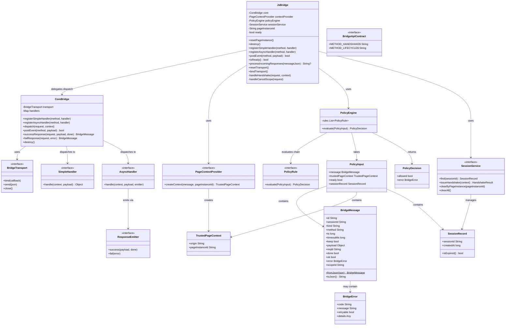
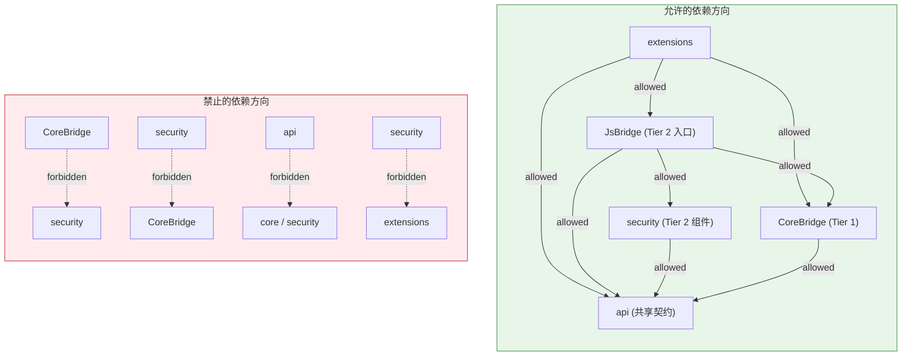
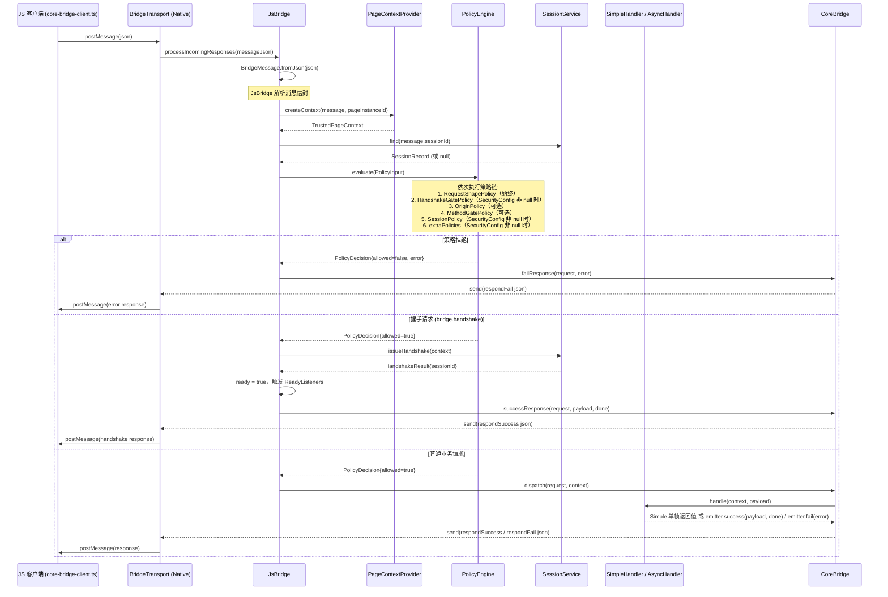
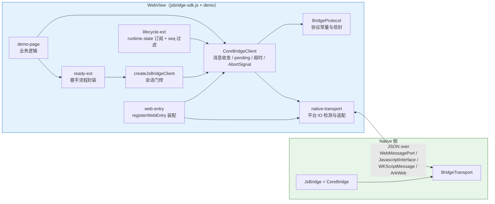

# 02 架构设计

> 更新日期：2026-09  
> 适用平台：Android · iOS · Flutter · HarmonyOS

## 1. 架构概述

JsBridge2 采用 **Protocol-first（协议优先）** 的设计哲学：先定义平台无关的消息协议与安全模型，再在各端独立实现内核，而非共享同一套运行时。这样做的核心收益是：

- **协议一致性**：Android、iOS、Flutter、HarmonyOS 四端共用同一份消息信封格式（`id/sessionId/kind/method/ts/timeoutMs/keep/payload/reqId/done/ok/error/scopeId`，13 字段正本见 [03-protocol.md §2](03-protocol.md)）和同一套安全策略语义，互通无需额外转换。
- **实现自由度**：每端用最贴近宿主平台的语言（Java/Swift/Dart/ArkTS）实现内核，可充分利用平台原生能力，不受公共运行时约束。
- **可测试性**：协议层、安全层、传输层互相隔离，每层均可独立单测；WebAssets（JS 侧）通过 `bridge-client-conformance.cases.js` 对四端统一做行为验证。

### 三层叠加架构

所有平台的 Native 侧内核遵循统一的三层叠加结构：

```
┌─────────────────────────────────────────────┐
│                  extensions                  │  Tier 3: 可选适配（lifecycle / registry / system）
├─────────────────────────────────────────────┤
│                security / JsBridge            │  Tier 2: 会话/策略/握手，叠加在 CoreBridge 之上
├─────────────────────────────────────────────┤
│                   core                       │  Tier 1: 纯协议分发（CoreBridge + handler 接口 + transport）
├─────────────────────────────────────────────┤
│                    api                       │  共享契约（BridgeMessage, BridgeError, TrustedPageContext）
└─────────────────────────────────────────────┘
```

依赖方向严格单向，反映三层叠加：
- `CoreBridge → api`（Tier 1，零 security 依赖）
- `JsBridge → CoreBridge + security + api`（Tier 2，叠加在 Tier 1 之上）
- `extensions → JsBridge + CoreBridge + api`（Tier 3，可选）
- `security → api`（Tier 2 组件，不依赖 core）
- transport 与 security 不得互相引用

---

## 2. Native 侧分层架构

### 2.1 核心类关系图



> **图示说明**：图中方法签名为跨端语义简写，各端语言实形以 [08-handler-interface-contract.md §4](08-handler-interface-contract.md) 为准——如 `dispatch` 的返回形态四端不同（Android `void`、iOS 同步返回 `[String]`、Flutter / HarmonyOS 异步 `Future` / `Promise`）；入站处理入口由各端闭环机制承载（`resetTransport()` / `bindTransport()` 均定义于 `JsBridge` 而非 CoreBridge，见 §6.3），Android 端实为无 origin 形参的内部处理函数。`successResponse`/`failResponse` 亦为简写：iOS / Flutter / HarmonyOS 的 CoreBridge 实名即此（返回 `BridgeMessage`），Android CoreBridge 实为 `respondSuccess`/`respondFail`（返回 `void`，构造响应帧后直接经 transport 发送）。`BridgeApiContract` 常量命名各端风格不同（Android/HarmonyOS 为 `METHOD_LIFECYCLE`、`ERR_*`；iOS/Flutter 为 `methodLifecycle`、`errorXxx`；值为统一字符串）。策略链返回形态四端亦有差异：Android / iOS 的 `PolicyRule.evaluate` 返回 `PolicyDecision`（`allowed`/`error`），Flutter / HarmonyOS 直接返回 `BridgeError`（null = 放行，非 null = 拒绝）；HarmonyOS 的 `PolicyDecision` 仅用于 extraPolicy 回执适配。

### 2.2 层间依赖规则



**规则汇总：**

| 方向 | 是否允许 |
|------|---------|
| `CoreBridge → api` | 允许 |
| `JsBridge → CoreBridge` | 允许（Tier 2 → Tier 1） |
| `JsBridge → security` | 允许（同层） |
| `JsBridge → api` | 允许 |
| `security → api` | 允许 |
| `security → CoreBridge` | **禁止**（不可反向依赖） |
| `extensions → JsBridge / CoreBridge / api` | 允许 |
| `CoreBridge → security` | **禁止**（零 security 依赖） |
| `api → 任何内层` | **禁止** |
| `transport ↔ security` | **禁止**（互相隔离） |

---

## 3. 消息处理流程

以 JS 发起一次普通业务请求为例，完整生命周期如下：



### 关键说明

- **消息模型为纯异步**：整个流程中没有任何环节阻塞等待跨层返回值——`postMessage` 发出即返回，Native handler 结果以独立 `response` 消息回传，JS 侧按 `reqId` 异步匹配回调。四端传输通道（`WebMessagePort` / `WKScriptMessageHandler` / JS channel / `javaScriptProxy`）均为单向异步管道，无同步取值能力。这是跨端一致协议的硬约束：iOS WKWebView 无同步通道，四端通道能力的交集只有异步（详见 [03-protocol.md §1 消息模型](03-protocol.md)）。
- `JsBridge` 是 Tier 2 入口，拦截消息后执行策略链，策略通过后委托 `CoreBridge.dispatch()` 分发到业务 handler。`CoreBridge` 是 Tier 1 纯分发层，零 security 依赖。
- `resetPageInstance()` 仅做 Layer 2 会话轮换（轮换 `pageInstanceId` + 清理旧 session + 重置 ready），不触碰传输信道。Android 的信道重建由 `resetTransport()` 单独处理（`WebMessageChannel` 随页面销毁）。详见 [05-lifecycle-layers.md](05-lifecycle-layers.md)。
- `postEvent()` 仅在 `isReady() == true` 后生效，用于 Native 主动向 JS 推送事件（`kind=event`）。事件帧的 `sessionId` 恒为空串 `""`——v1 事件投放的唯一形态为广播，四端 API 均为两参 `postEvent(method, payload)`，无定向投送入口（见 [03-protocol.md §3.3](03-protocol.md)）。
- `keep=true` 标志表示该请求为流式/持续响应，handler 可多次推送中间帧，直到 `done=true`；多帧只能由 Async handler（`ResponseEmitter`）表达，Simple handler 恰好产生一帧。

---

## 4. 安全层设计

### 4.1 TrustedPageContext

`TrustedPageContext` 位于 `api` 层，是跨层共享的纯数据模型（`origin` + `pageInstanceId`）。由 `PageContextProvider`（security 层 SPI）在每条消息到达时动态创建，封装了消息来源的可信上下文：

- **origin**：WebView 当前加载页面的 URL origin，用于 origin 白名单校验。
- **pageInstanceId**：每次 `resetPageInstance()` 时生成的页面实例 ID，与 session 绑定，防止跨页面会话复用。生成形态各端不同：Android / iOS 为 UUID4（不可猜测）；HarmonyOS 为毫秒时间戳 + 随机十六进制后缀；Flutter 初值为微秒时间戳、`resetPageInstance()` 轮换后为毫秒时间戳 + 32 位随机数。

Android 平台通过 `AndroidWebViewPageContextProvider` 从 WebView 实例中提取真实 origin，宿主不可伪造。

### 4.2 PolicyEngine 求值链

`PolicyEngine` 按固定顺序依次调用 `PolicyRule`，任意一条规则返回 `allowed=false` 即终止链，返回拒绝决策：

```
1. RequestShapePolicy      — 始终启用：校验消息结构完整性（必填字段、kind 合法性）
2. HandshakeGatePolicy     — SecurityConfig 非 null 时：握手完成前拒绝所有非 bridge.handshake 请求
3. OriginPolicy            — allowedOrigins 含 `*` 时跳过（不进链）；否则校验 origin 白名单
4. MethodGatePolicy        — methodWhitelist 含 `*` 时跳过（不进链）；否则校验业务方法白名单（协议方法由框架装配期自动并入放行集）
5. SessionPolicy           — SecurityConfig 非 null 时：校验 sessionId 有效性、origin/pageInstanceId 匹配
6. extraPolicies           — 宿主注入的自定义规则（通过 SecurityConfig 传入）
```

`PolicyInput` 将消息、上下文、会话记录打包传入，确保每条规则能获取完整的决策依据，同时各规则间互相隔离，不共享可变状态。

#### 安全配置模型

> **设计原理：安全机制进协议，安全策略归宿主**——策略链固定求值顺序、拒绝码语义、握手/会话模型是协议内容（保证四端可预测、conformance 可测）；启用哪些检查、白名单内容是宿主对其资产的同意权（协议不可代答）。协议只能约束守约方，而页面可以绕过任何 JS 侧约定（裸 `CoreBridgeClient`，见 [03-protocol.md §5 握手协议](03-protocol.md) 的无配置场景叙述），故唯一可信执行点在 Native 策略链；通道建立层不具备识别请求者的信息（origin/页面实例/方法在消息处理时才齐备），不承载信任决策（入口保持哑，仅资源守卫，见 [04-cross-platform.md §3.1 通道建立入口](04-cross-platform.md)）——协议首条保留消息 `bridge.handshake` 即"协议之前"的信任闸门，协议自举安全。

`SecurityConfig` 采用**渐进增强**设计，宿主根据场景选择：

**无配置场景（`SecurityConfig == null`）**
- 适用：可信本地页面、单元测试、原型开发
- 启用规则：仅 `RequestShapePolicy`（消息结构校验）
- 行为：`resetPageInstance()` 后立即 ready，无需握手

**有配置场景（`SecurityConfig` 非 null）**
- 适用：生产环境、需要访问控制的场景
- 启用规则：
  - `HandshakeGatePolicy`：握手前拒绝业务请求
  - `SessionPolicy`：校验 session 有效性、origin/pageInstanceId 匹配
  - `OriginPolicy`：`allowedOrigins` 不含 `*` 时校验来源白名单
  - `MethodGatePolicy`：`methodWhitelist` 不含 `*` 时校验业务方法白名单（协议方法 `bridge.handshake` / `bridge.cancelScope` 由框架装配期自动并入放行集）
  - `extraPolicies`：宿主自定义规则
- 行为：`resetPageInstance()` 后 ready 为 false，等待握手完成

**配置示例**

```java
// 无配置：完全信任
JsBridge bridge = new JsBridge(transport, provider, null);

// 启用安全检查：握手 + 访问控制（Java 8：Set.of 为 Java 9+ API，不可使用）
JsBridge bridge = new JsBridge(
    transport,
    provider,
    new SecurityConfig()
        .allowedOrigins(new HashSet<>(Arrays.asList("https://example.com")))   // 必填：具体域名或 {"*"}
        .methodWhitelist(new HashSet<>(Arrays.asList("getUser")))             // 必填：业务方法或 {"*"}；协议方法自动并入，无需列入
        .extraPolicies(Arrays.asList(...))                                    // 可选：自定义策略
);
```

> **配置校验**：`SecurityConfig` 非 null 时，`allowedOrigins` 和 `methodWhitelist` 均不可为 `null`，否则构造期抛出 `IllegalArgumentException`。传入包含 `"*"` 的集合（如 `{"*"}`）表示"不限制该维度"（对应策略节点不进链；四端实现为 `contains("*")`，`{"*"}` 与具体值混入的集合整体按"不限制"处理），传入不含 `"*"` 的具体值集合则启用白名单校验。`methodWhitelist` 语义为**业务方法白名单**：协议方法（`BridgeApiContract` 定义的 `bridge.handshake` / `bridge.cancelScope`）由框架在装配期自动并入放行集，宿主无需显式列入（显式列入亦合法，冗余无副作用）。
>
> **动态授权**：需要根据 origin/用户角色动态控制访问时，使用 `extraPolicies` 注入自定义规则——Android / iOS 为 `PolicyRule` 类型（实现 `evaluate(PolicyInput)`），可访问完整的 `PolicyInput`（`BridgeMessage`、`TrustedPageContext`、ready 标志、`SessionRecord`）；Flutter / HarmonyOS 为轻量函数类型 `ExtraPolicy`，形参仅见 `BridgeMessage` 与 `TrustedPageContext`，拿不到 sessionRecord——Flutter 回执 `BridgeError?`（null = 放行），HarmonyOS 回执 `BridgeError | PolicyDecision | null`（`PolicyDecision` 仅为拒绝的显式形态，语义见 §2.1 图注）。

业务 handler 有两个注册入口，**两者的第一个形参都是 `TrustedPageContext`**：`registerSimpleHandler`（单返回值，通信在 handler 返回时结束，恰好产生一帧，`done` 恒为 true）与 `registerAsyncHandler`（0..n 帧，经 `ResponseEmitter` 推送，由 `emitter.success(payload, done)` / `emitter.fail(error)` 控制帧序列）。上下文是普通形参而非独立注册形态，因此不存在"带上下文版本"的第二个入口；多帧（流式）只能由 Async handler 表达。Tier 1 的 `CoreBridge` 独立使用时（无 security 层）没有 `PageContextProvider` 产出上下文，四端接线形态不同：Android 经 `CoreBridge.bind()` 由内核直接注入空上下文 `new TrustedPageContext("", "")`；iOS / Flutter / HarmonyOS 经构造期注入 / `attachTransport` + 宿主手动 `dispatch`，上下文由宿主自声明（信任边界不高于 null 配置，见 [04-cross-platform.md §3.1](04-cross-platform.md)；`origin` 仍须为归一化形态，见 [03-protocol.md §9 细则 5](03-protocol.md)）。错误码基线固化在四端 `BridgeApiContract`（`E_INVALID_MESSAGE` / `E_POLICY_DENY` / `E_ORIGIN_DENY` / `E_METHOD_NOT_ALLOWED` / `E_SESSION_INVALID` / `E_METHOD_NOT_FOUND` / `E_INTERNAL`；transport 层两码 `E_CHANNEL_CLOSED` / `E_NOT_READY` 作为契约对齐声明——`E_CHANNEL_CLOSED` 仅由 JS 客户端本地产生，不跨端传输，层标注见 [03-protocol.md §8](03-protocol.md) 传输层类），策略与 handler 中禁止使用内联字面量。

### 4.3 SessionService 职责

`SessionService` 负责管理会话全生命周期，职责与各端实名方法（四端方法名不完全一致，语义等价）：

| 职责 | 说明 | Android | iOS | Flutter / HarmonyOS |
|------|------|---------|-----|---------------------|
| 签发 | 握手通过后生成 sessionId，绑定 origin + pageInstanceId，写入 session 存储；签发时顺带清扫过期记录并使同 `pageInstanceId` 旧 session 失效（见 [03-protocol.md §10](03-protocol.md)） | `issueHandshake(context)` | `issue(context, ttlMs)` | `issue(context, ttlMs)` |
| 查找 | 按 sessionId 查找 `SessionRecord`，含过期检查（`sessionTtlMs`） | `find(sessionId)` | `find(sessionId)` | `find(sessionId)` |
| 按页面实例失效 | 使某个 `pageInstanceId` 对应的 session 失效（导航轮换时清理旧页 session） | `clearByPageInstance(pageInstanceId)` | `clear(pageInstanceId:)` | `clearByPageInstance(pageInstanceId)` |
| 全部失效 | 使所有 session 失效（如 `resetPageInstance()` / 宿主主动清理） | `clearAll()` | `clearAll()` | `clearAll()` |

`InMemorySessionStore`（Android）是默认的内存存储实现，不持久化，随进程生命周期存在。

`TrustedPageContext` 位于 `api` 层（非 `security` 层），因为它被 `core`（handler 接口）和 `security`（策略/会话）同时使用，属于跨层共享契约。`PageContextProvider`（工厂接口）是 security 的 SPI，由 `extensions` 实现（Android 的 `AndroidWebViewPageContextProvider` 即属 `extensions/system`）；其定义位置各端随包形态略有差异——Android/iOS/HarmonyOS 定义于 security 层，Flutter 因 security 不得依赖 core 的包结构，定义于 Tier 2 入口（`lib/src/js_bridge.dart`）——依赖方向语义四端一致。

---

## 5. Extensions 层设计

Extensions 层提供可选的平台适配能力，核心层不依赖 Extensions，宿主按需组装。

### 5.1 registry 子模块

负责宿主经 `launchForResult(Intent, callback)` 发起 Android Activity 结果流程的回调登记与结果回执（扩展能力，非内核必需；当前仅 Android 提供，其余端无对应实现，现状对比见 [04-cross-platform.md §4.5](04-cross-platform.md)）：

| 类 | 职责 |
|----|------|
| `BridgeResultRegistry` | 接口：`launchForResult(Intent, BridgeResultCallback)` / `destroy()` |
| `DefaultBridgeResultRegistry` | 标准实现，每次 launch 经 `SingleOccupyingLaunches.start` 生成唯一 `launchId`（UUID，非协议消息 reqId） |
| `SingleOccupyingLaunches` | **单占用互斥（single-occupy）**：全局单占用（无 method 维度）——任意 launch 在途期间，新 launch 一律立即以 busy 回调拒绝——不排队、不共享结果（见下） |
| `BridgeLaunchResult` | 封装 launch 结果（launchId/intent/success/error） |

**单占用互斥（single-occupy）语义**：  
当某个 launch 正在进行中，新的 launch **不会再次发起，也不会排队等待**——立即以 `busy` 结果回调拒绝。防的是并发重复副作用（在途 launch 未完成前的重复发起，由调用方自行重试实现串行化），不承诺去重或结果共享。「在途请求排队、完成时所有等待者收到同一结果」的去重共享形态**不属于 v1 能力**——如未来引入，属契约级变更，须先按 [09-conformance.md §6](09-conformance.md) 登记验收用例。

### 5.2 lifecycle 子模块

`LifecycleExtension` 是**纯 `runtime.state` 事件发布器**，不接管页面实例管理：宿主在自身生命周期回调（Activity/Fragment/ViewController 等）中调用 `onHostEvent(state)`，由扩展负责经 `postEvent("runtime.state", payload)` 向 JS 侧推送事件，payload 结构协议固定为 `{ state, seq }`（state 取值集合由宿主定义，见 [03-protocol.md §7.2](03-protocol.md)）。未 ready 时事件进入 FIFO 暂存队列（默认上限 32，超限丢最旧），握手 ready 后按序补发；`seq` 跟随本实例生命周期，不随页面重置。四端实现均**不调用 `resetPageInstance()`**——页面实例轮换仍由宿主在原生导航回调中自行调用（时机对比见 [04-cross-platform.md §4.3](04-cross-platform.md)，集成步骤 §8.1 第 6 步）；`destroy()` 为 `JsBridge` 的可选清理方法（宿主按需调用，见 §8.1），扩展自身无 destroy。

### 5.3 system 子模块（WebView 适配）

提供 Android WebView 的具体传输实现：

| 类 | 职责 |
|----|------|
| `AndroidWebViewBridgeTransport` | 实现 `BridgeTransport`，封装 WebView 消息通道 |
| `AndroidWebViewPageContextProvider` | 实现 `PageContextProvider`，从 WebView 提取可信 origin |
| `AndroidWebViewTrustedContextFactory` | 辅助创建可信上下文，集中处理安全边界 |
| `WebMessageChannelBootstrapper` | 初始化 WebMessageChannel（现代通道），完成握手前的通道建立 |
| `WebMessagePortMessageChannel` | 基于 `WebMessagePort` 的消息通道实现（Android API 23+） |
| `LegacyJavascriptChannel` | 基于 `addJavascriptInterface` 的兼容通道（旧版 WebView） |
| `ChannelRequestJavascriptInterface` | 通道建立哑入口：注入 `__jsbridge2__.requestBridgeChannel`，JS 主动发起请求后触发建通道并投递 `bridge:channel`（pull 模型控制面原语，含限频，契约正本见 [04-cross-platform.md §3.1 通道建立入口](04-cross-platform.md)） |
| `PendingChannelRequests` | bind 前到达的通道请求暂存队列（超限丢最旧、重复 reqId 幂等），`bind()` 时按 latest-wins 补投（`pollLatest()` 仅补投最新 reqId，被取代的旧请求不补投）；pull 模型建链的防御组件，容量数值见 [04-cross-platform.md §3.1](04-cross-platform.md) |
| `MessageChannel` | 通道抽象接口，统一两种传输实现 |

---

## 6. Transport 抽象

### 6.1 接口语义

`BridgeTransport` 位于 `core` 层（Tier 1），是 CoreBridge 与底层 IO 之间的唯一边界，定义三个操作：

```
bind(callback)        — 绑定消息接收回调；transport 收到 JS 消息后调用 callback(json)
send(json)            — 向 JS 侧发送 JSON 字符串（response 或 event）
close()               — 关闭通道，释放底层资源；close 后 send 应静默丢弃或抛异常
```

**设计约束**：
- Transport 层不感知协议语义，只负责 JSON 字符串的传入/传出。
- Transport 层不持有 session 状态，不做任何策略判断。
- `bind` 与 `close` 须幂等，多次调用不产生副作用。
- 四端 transport 注入形态：Android/iOS/HarmonyOS 为**构造期注入**（Android 经 `resetTransport()` 建立入站绑定与信道，承担页面导航时的 listener 重绑；iOS/HarmonyOS 构造参数携带 transport）；**Flutter 的 `JsBridge` 构造器收可选 transport 形参**（可构造期传入），生产路径为构造后经 `attachTransport(sendFn)` 后置注入（flutter_bridge_controller.dart 即此形态）——两种接线等价，`bindTransport()` 前必须已具备 transport（违反时仅 Flutter fail-fast 抛 `StateError`；iOS / HarmonyOS 的 `bindTransport()` 只校验 PageContextProvider，transport 缺失时不抛错——iOS 为静默 no-op，HarmonyOS 发送失败计入内部计数 `sendFailureCount`——该计数无公开读口，send 失败的公开观测出口为 `postEvent` 返回 `false`，C17）。
- **后置注入入口 `attachTransport`**（四端 `JsBridge`/`CoreBridge` 均提供）：CoreBridge 的 standalone 用法（不经 JsBridge、直接 dispatch，见 C64）与宿主构造后接线场景使用；常规宿主（Android/iOS/HarmonyOS）走构造期注入即可，无需调用。
- **单向异步管道**：`send()` 仅入队发送，返回值（`boolean`）只表示消息是否成功入队，与业务结果无关。四端通道均无同步取值能力，协议不定义同步语义（见 [03-protocol.md §1 消息模型](03-protocol.md)）。

### 6.2 各平台实现

| 平台 | 实现方式 | 底层机制 | bindTransport |
|------|---------|---------|-------------|
| Android | `AndroidWebViewBridgeTransport` | `WebMessagePort`（现代）/ `addJavascriptInterface`（兼容） | `resetTransport()` |
| iOS | `WKWebViewBridgeTransport` | `WKScriptMessageHandler` + `evaluateJavaScript` | `bindTransport()` |
| Flutter | 宿主注入函数 | `WebViewController.runJavaScript` + JS channel | `bindTransport()` |
| HarmonyOS | 宿主注入函数 | ArkWeb `Web` 组件 + `webview.WebviewController`（`.javaScriptProxy` 入站 / `runJavaScript` 出站） | `bindTransport()` |

> **Android 通道安全注记**：端口投递目标为通配（`Uri.parse("*")`，`file://` 页面无法与特定 origin 匹配），通道本身不构成 origin 约束——真正的来源防护完全依赖握手门控与策略链（`HandshakeGatePolicy` / `OriginPolicy` / `SessionPolicy`）。启用 SecurityConfig 的宿主应知悉：不要单独依赖通道投递作为安全边界。v1 起 pull 模型的信道建立细节、宿主 `resetTransport()` 的 invalidate 职责，见 [04-cross-platform.md §3.1](04-cross-platform.md)。

### 6.3 入站闭环：bindTransport()

`bindTransport()` 是 `JsBridge` 上的方法，用于建立入站消息的自动闭环：

```
JS 消息 → transport.bind 回调 → JsBridge.processIncomingResponses → 逐条 transport.send → JS
```

- **Android**：`resetTransport()` 调用 `core.bind(this::onIncomingMessage)`，入站消息经 transport → JsBridge 策略检查 → dispatch → `transport.send()` 全自动。
- **iOS**：`bindTransport()` 调用 `transport.bind { json → processIncomingResponses → transport.send }`，配合 `WKWebViewBridgeTransport` 实现同等闭环。
- **Flutter / HarmonyOS**：`bindTransport()` 以函数式 transport 串联 `processIncomingResponses` 与 `send`，无需独立 transport 类。

各平台传输实现细节（iOS `WKWebViewBridgeTransport` 的 bootstrap 注入与 `removeScriptMessageHandler` 清理、消费者集成代码等）见 [07-transport-bridge-design.md §3](07-transport-bridge-design.md) 与各平台项目 README。

---

## 7. WebAssets 分层

### 7.1 工程结构

WebAssets 唯一正本位于仓库根目录 `web-assets/`（pnpm monorepo，独立工程）：

```
web-assets/
├── packages/sdk/                     ← jsbridge-sdk（发布到 npm）
│   ├── src/core/                      ← protocol.ts（协议常量）/ core-bridge-client.ts（客户端核心）
│   ├── src/platform/                  ← native-transport.ts（传输适配）/ web-entry.ts（装配入口）/ loader.ts（getBridge 官方装载器）
│   ├── src/extensions/               ← ready-ext.ts / lifecycle-ext.ts
│   ├── src/js-bridge-client.ts       ← 会话门控封装（createJsBridgeClient）
│   └── dist/iife/jsbridge-sdk.js      ← IIFE bundle（四端 <script src> 加载；语法转译至 ES5，运行时底线 Chromium 41+，polyfill 由宿主自备，见 web-assets/packages/sdk/README.md）
└── packages/demo/                    ← demo 示例（private，不发布）
    └── src/                           ← index.html / entry.js / api/ / page/
```

四端资产目录内容 = demo 构建产物（6 个文件：`index.html`、`jsbridge-sdk.js`、`entry.js`、`vconsole.min.js`、`api/biz-api.js`、`page/demo-page.js`），逐字节一致，由 `pnpm check`（SHA-256 四端互比）验证。JS SDK 内部设计（传输检测、超时/settled 机制、AbortSignal）详见 [web-assets/docs/01-js-sdk-design.md](../web-assets/docs/01-js-sdk-design.md)。

### 7.2 JS 侧与 Native 侧调用关系



**分层职责说明**：

| 模块 | 职责 |
|------|------|
| `core/core-bridge-client.ts` | 维护 pending map（id → 回调），超时处理，settled 记录（TTL 60s）幂等丢弃迟到帧，AbortSignal 取消，事件分发（sessionId 严格匹配 + 空串兼容） |
| `core/protocol.ts` | 协议常量：kind / 保留方法 / 错误码（与 Native `BridgeApiContract` 对齐） |
| `platform/native-transport.ts` | 出站通道自动检测（`MessagePort` → `NativeBridge.postMessage` → `webkit.messageHandlers`），未就绪自动排队；注册入站入口 `window.__jsbridge2__.receive` |
| `platform/web-entry.ts` | `registerWebEntry(client, transport)`：将 transport 入站回调装配到 client |
| `js-bridge-client.ts` | `createJsBridgeClient`：sessionId 未建立时拦截非握手调用 |
| `extensions/ready-ext.ts` | `createReadyExtension`：封装 `bridge.handshake` 流程，成功后写入 sessionId |
| `extensions/lifecycle-ext.ts` | `createLifecycleBridge`：订阅 `runtime.state` 事件，内置 seq 乱序过滤 |

---

## 8. Host 集成边界

宿主（Host App）的职责是**组装**内核，而非修改内核逻辑。标准集成步骤：

### 8.1 集成步骤

```
1. 提供 BridgeTransport 实现（或使用 extensions/system 中的平台实现）
2. 提供 PageContextProvider 实现（或使用平台默认实现）
3. 决定安全模式：开发/测试传 null（无安全检查）；
   生产构造 SecurityConfig 并配置 origin 白名单、方法白名单
4. 构造 JsBridge 实例（内部创建 CoreBridge）
5. 注册业务 handler（Simple 或 Async，两者第一形参均为 TrustedPageContext）
6. 在页面加载时调用 resetPageInstance()
7. （可选）页面销毁时调用 destroy() 释放资源——未调用不影响协议行为，仅遗留监听与内部状态待宿主进程回收
```

各端集成示例代码（Java / Swift / Dart / ArkTS）见各平台项目 README（`js_bridge_android/README.md` 等）；四端构造口径差异对照见 [04-cross-platform.md §7](04-cross-platform.md)。

### 8.2 宿主可定制边界

| 可定制点 | 方式 | 说明 |
|---------|------|------|
| 安全模式 | `securityConfig` 传 `null` / 传 `SecurityConfig` | null = 完全信任（无握手）；非 null = 握手 + 会话校验 |
| Origin 校验 | `.allowedOrigins(new HashSet<>(Arrays.asList(...)))` — 不含 `*` 值时 `OriginPolicy` 进链 | 生产场景配具体域名集合 |
| Method 白名单 | `.methodWhitelist(new HashSet<>(Arrays.asList(...)))` — 不含 `*` 值时 `MethodGatePolicy` 进链 | 生产场景配允许的**业务方法**集合；协议方法（握手 / cancelScope）由框架自动放行 |
| 自定义策略 | `SecurityConfig.extraPolicies` | 注入业务级自定义规则：Android / iOS 为 `PolicyRule`（完整 `PolicyInput` 可见）；Flutter / HarmonyOS 为函数类型 `ExtraPolicy`（形参仅 request + context，见 §4.2 动态授权） |
| 传输机制 | 实现 `BridgeTransport` | 替换为 WebSocket、自定义 IPC 等 |
| 上下文提供者 | 实现 `PageContextProvider` | 自定义 origin 提取逻辑 |
| 业务处理器 | `registerSimpleHandler()` / `registerAsyncHandler()` | 按 method 注册，随时可动态增删；重复注册同一 method 后者覆盖前者（last wins） |
| 事件推送 | `postEvent(method, payload)` | ready 后主动向 JS 推送任意事件 |
| 生命周期感知 | `LifecycleExtension`（可选） | `runtime.state` 事件发布器：宿主生命周期回调中调用 `onHostEvent(state)`，未 ready 时暂存（FIFO 超限丢最旧）、握手后按序补发；`resetPageInstance()` 不由扩展调用，仍由宿主自行调用 |

**宿主不应**直接操作 `PolicyEngine`、`SessionService` 或 `BridgeTransport.send()` 的原始 JSON，这些均属于内核内部实现，接口可能随版本变化。
