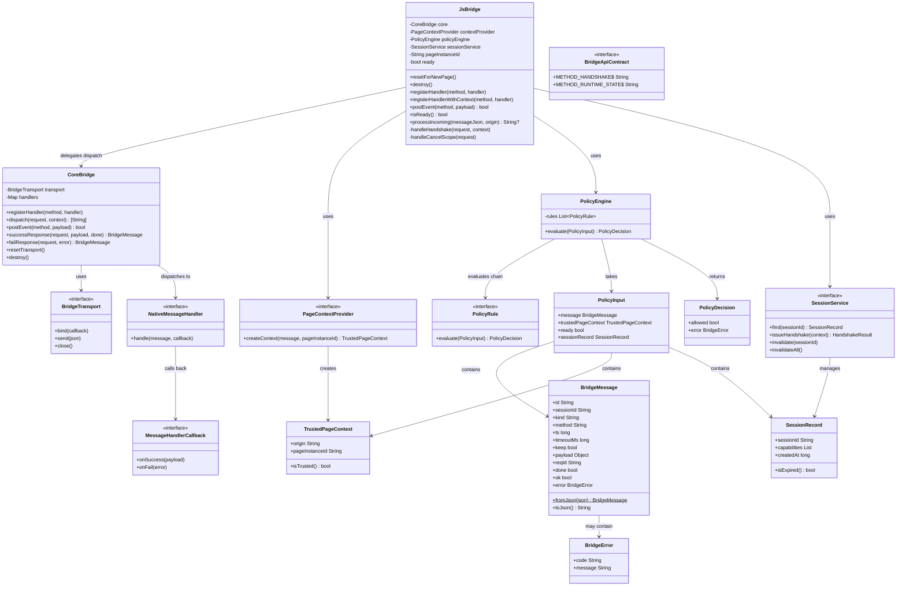
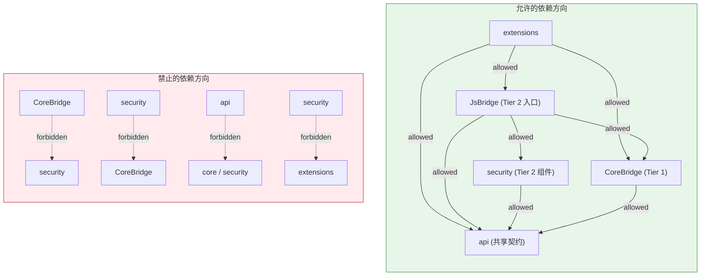
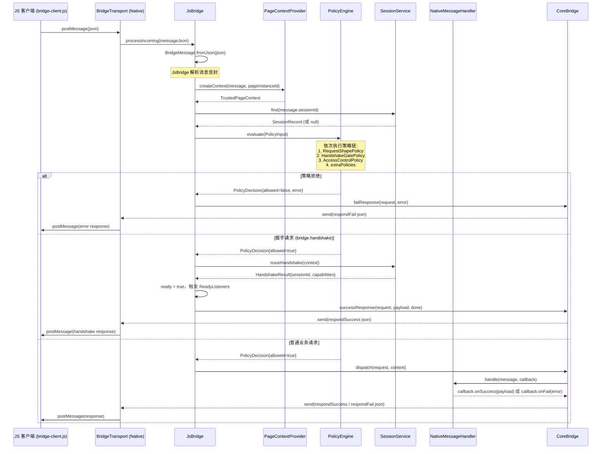
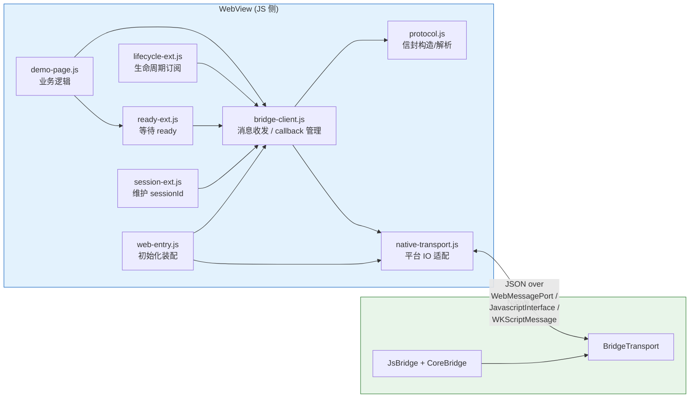

# 03 架构设计

## 1. 架构概述

JsBridge2 采用 **Protocol-first（协议优先）** 的设计哲学：先定义平台无关的消息协议与安全模型，再在各端独立实现内核，而非共享同一套运行时。这样做的核心收益是：

- **协议一致性**：Android、iOS、Flutter、HarmonyOS 四端共用同一份消息信封格式（`id/sessionId/kind/method/ts/timeoutMs/keep/payload/reqId/done/ok/error`）和同一套安全策略语义，互通无需额外转换。
- **实现自由度**：每端用最贴近宿主平台的语言（Java/Swift/Dart/ArkTS）实现内核，可充分利用平台原生能力，不受公共运行时约束。
- **可测试性**：协议层、安全层、传输层互相隔离，每层均可独立单测；WebAssets（JS 侧）通过 `bridge-client-conformance.cases.js` 对四端统一做行为验证。

### 三层叠加架构

所有平台的 Native 侧内核遵循统一的三层叠加结构：

```
┌─────────────────────────────────────────────┐
│                  extensions                  │  Tier 3: 可选适配（lifecycle / registry / system）
├─────────────────────────────────────────────┤
│                security / JsBridge            │  Tier 2: 会话/策略/握手，叠加在 CoreBridge 之上
├─────────────────────────────────────────────┤
│                   core                       │  Tier 1: 纯协议分发（CoreBridge + handler 接口 + transport）
├─────────────────────────────────────────────┤
│                    api                       │  共享契约（BridgeMessage, BridgeError, TrustedPageContext）
└─────────────────────────────────────────────┘
```

依赖方向严格单向，反映三层叠加：
- `CoreBridge → api`（Tier 1，零 security 依赖）
- `JsBridge → CoreBridge + security + api`（Tier 2，叠加在 Tier 1 之上）
- `extensions → JsBridge + CoreBridge + api`（Tier 3，可选）
- `security → api`（Tier 2 组件，不依赖 core）
- transport 与 security 不得互相引用

---

## 2. Native 侧分层架构

### 2.1 核心类关系图



### 2.2 层间依赖规则



**规则汇总：**

| 方向 | 是否允许 |
|------|---------|
| `CoreBridge → api` | 允许 |
| `JsBridge → CoreBridge` | 允许（Tier 2 → Tier 1） |
| `JsBridge → security` | 允许（同层） |
| `JsBridge → api` | 允许 |
| `security → api` | 允许 |
| `security → CoreBridge` | **禁止**（不可反向依赖） |
| `extensions → JsBridge / CoreBridge / api` | 允许 |
| `CoreBridge → security` | **禁止**（零 security 依赖） |
| `api → 任何内层` | **禁止** |
| `transport ↔ security` | **禁止**（互相隔离） |

---

## 3. 消息处理流程

以 JS 发起一次普通业务请求为例，完整生命周期如下：



### 关键说明

- `JsBridge` 是 Tier 2 入口，拦截消息后执行策略链，策略通过后委托 `CoreBridge.dispatch()` 分发到业务 handler。`CoreBridge` 是 Tier 1 纯分发层，零 security 依赖。
- `resetForNewPage()` 仅做 Layer 2 会话轮换（轮换 `pageInstanceId` + 清理旧 session + 重置 ready），不触碰传输信道。Android 的信道重建由 `resetTransport()` 单独处理（`WebMessageChannel` 随页面销毁）。详见 [06-lifecycle-layers.md](06-lifecycle-layers.md)。
- `postEvent()` 仅在 `isReady() == true` 后生效，用于 Native 主动向 JS 推送事件（`kind=event`）。
- `keep=true` 标志表示该请求为流式/持续响应，handler 可多次回调，直到 `done=true`。

---

## 4. 安全层设计

### 4.1 TrustedPageContext

`TrustedPageContext` 位于 `api` 层，是跨层共享的纯数据模型（`origin` + `pageInstanceId`）。由 `PageContextProvider`（security 层 SPI）在每条消息到达时动态创建，封装了消息来源的可信上下文：

- **origin**：WebView 当前加载页面的 URL origin，用于 origin 白名单校验。
- **pageInstanceId**：每次 `resetForNewPage()` 时生成的不可猜测 ID，与 session 绑定，防止跨页面会话复用。

Android 平台通过 `AndroidWebViewPageContextProvider` 从 WebView 实例中提取真实 origin，宿主不可伪造。

### 4.2 PolicyEngine 求值链

`PolicyEngine` 按固定顺序依次调用 `PolicyRule`，任意一条规则返回 `allowed=false` 即终止链，返回拒绝决策：

```
1. RequestShapePolicy      — 始终启用：校验消息结构完整性（必填字段、kind 合法性）
2. HandshakeGatePolicy     — opt-in：握手完成前拒绝所有非 bridge.handshake 请求
3. AccessControlPolicy     — opt-in：校验 origin 白名单、sessionId 有效性、capability 授权
4. extraPolicies           — 宿主注入的自定义规则（通过 SecurityConfig 传入）
```

`PolicyInput` 将消息、上下文、会话记录打包传入，确保每条规则能获取完整的决策依据，同时各规则间互相隔离，不共享可变状态。

#### 安全分级模型

`SecurityConfig` 采用**渐进增强**设计，默认为 Level 0（裸分发），宿主按需显式 opt-in：

| 级别 | 启用的规则 | 适用场景 |
|------|-----------|---------|
| **Level 0**（默认） | RequestShapePolicy | 可信本地页面、单元测试、原型开发；`resetForNewPage()` 后立即 ready |
| **Level 1** | + HandshakeGatePolicy | 需要握手建立会话，但不限制 origin 和 capability |
| **Level 2** | + AccessControlPolicy | 生产环境：origin 白名单 + capability 细粒度授权 |

```java
// Level 0（默认）：无需任何配置
new SecurityConfig()

// Level 1：仅要求握手
new SecurityConfig().withHandshakeGate()

// Level 2：完整安全（生产推荐）
SecurityConfig.secure()
    .allowedOrigins(Set.of("https://your-domain.com"))
    .methodWhitelist(Set.of("getUser", "getCurrentLocation"))
    .defaultCapabilities(Set.of("getUser", "getCurrentLocation"))
```

> **allowedOrigins 通配警示**：`SecurityConfig` 默认 `allowedOrigins = ["*"]`。Level 0/1 不装配 `AccessControlPolicy`，该默认值无实际效果；但启用 `withAccessControl()`（Level 2）后若仍保留 `["*"]`，origin 校验会静默放行所有来源——升了级别却没有获得预期防护。四端因此在构造期拒绝 `requireAccessControl && allowedOrigins.contains("*")` 的组合：必须显式列举 `allowedOrigins`，否则退回 Level 1（仅握手门控）。

`resetForNewPage()` 的 `isReady()` 语义随配置变化：Level 0 下 `resetForNewPage()` 后立即返回 `true`；Level 1/2 下需等待握手完成后 `handleHandshake()` 置为 `true`。

业务 handler 默认签名是 **payload-only**（`registerHandler`），与 Page 实现解耦；需要 `TrustedPageContext` 时改用 `registerHandlerWithContext`（Android 为 `registerNativeHandlerWithContext`）。错误码基线固化在 `BridgeApiContract`（`E_INVALID_MESSAGE` / `E_POLICY_DENY` / `E_ORIGIN_DENY` / `E_METHOD_NOT_ALLOWED` / `E_SESSION_INVALID` / `E_CAPABILITY_DENY` / `E_METHOD_NOT_FOUND` / `E_INTERNAL`），策略与 handler 中禁止使用内联字面量。

### 4.3 SessionService 职责

`SessionService`（默认实现 `DefaultSessionService`）负责管理会话全生命周期：

| 职责 | 说明 |
|------|------|
| `issueHandshake()` | 握手通过后生成 sessionId，颁发 capability 集合，写入 `CapabilitySessionStore` |
| `find()` | 按 sessionId 查找 `SessionRecord`，含过期检查（`sessionTtlMs`） |
| `invalidate()` | 使单个 session 失效（如 transport 断开） |
| `invalidateAll()` | 使所有 session 失效（如 `resetForNewPage()` / `destroy()`） |

`InMemoryCapabilitySessionStore` 是默认的内存存储实现，不持久化，随进程生命周期存在。

`TrustedPageContext` 位于 `api` 层（非 `security` 层），因为它被 `core`（handler 接口）和 `security`（策略/会话）同时使用，属于跨层共享契约。`PageContextProvider`（工厂接口）留在 `security` 层，它是 security 的 SPI，由 `extensions` 实现。

---

## 5. Extensions 层设计

Extensions 层提供可选的平台适配能力，核心层不依赖 Extensions，宿主按需组装。

### 5.1 registry 子模块

负责 Native 主动发起调用（Native→JS→Native 回调）的结果管理：

| 类 | 职责 |
|----|------|
| `BridgeResultRegistry` | 接口：launch / onResult / cancel |
| `DefaultBridgeResultRegistry` | 标准实现，每次 launch 生成唯一 reqId |
| `CompatBridgeResultRegistry` | 兼容旧版本格式的适配实现 |
| `SingleFlightPendingLaunches` | **单飞模式**：对同一 method 的并发 launch，只真正发起一次，其余等待同一结果；避免重复调用 JS |
| `BridgeResultDispatcher` | 根据 reqId 将 JS 侧响应路由到对应的 `BridgeResultCallback` |
| `BridgeLaunchResult` | 封装 launch 结果（ok/error/payload） |

**单飞（SingleFlight）模式**的核心逻辑：  
当 method X 的 launch 正在进行中，新的 launch(X) 请求不会再次发消息，而是将回调加入等待队列；首次 launch 完成后，所有等待者收到同一结果。适用于"加载配置"等幂等场景，防止并发导致的重复副作用。

### 5.2 lifecycle 子模块

`LifecycleExtension` 监听宿主（Activity/Fragment/ViewController 等）的生命周期事件，在合适时机自动调用 `resetForNewPage()` / `destroy()`，减少宿主的样板代码。它通过 `postEvent("runtime.state", payload)` 向 JS 侧推送生命周期状态，payload 格式由宿主自定义，协议不固定。

### 5.3 system 子模块（WebView 适配）

提供 Android WebView 的具体传输实现：

| 类 | 职责 |
|----|------|
| `AndroidWebViewBridgeTransport` | 实现 `BridgeTransport`，封装 WebView 消息通道 |
| `AndroidWebViewPageContextProvider` | 实现 `PageContextProvider`，从 WebView 提取可信 origin |
| `AndroidWebViewTrustedContextFactory` | 辅助创建可信上下文，集中处理安全边界 |
| `WebMessageChannelBootstrapper` | 初始化 WebMessageChannel（现代通道），完成握手前的通道建立 |
| `WebMessagePortMessageChannel` | 基于 `WebMessagePort` 的消息通道实现（Android API 23+） |
| `LegacyJavascriptChannel` | 基于 `addJavascriptInterface` 的兼容通道（旧版 WebView） |
| `MessageChannel` | 通道抽象接口，统一两种传输实现 |

---

## 6. Transport 抽象

### 6.1 接口语义

`BridgeTransport` 位于 `core` 层（Tier 1），是 CoreBridge 与底层 IO 之间的唯一边界，定义三个操作：

```
bind(callback)        — 绑定消息接收回调；transport 收到 JS 消息后调用 callback(json)
send(json)            — 向 JS 侧发送 JSON 字符串（response 或 event）
close()               — 关闭通道，释放底层资源；close 后 send 应静默丢弃或抛异常
attachTransport(t)    — 四端统一支持运行期注入；构造时可不传，运行期为空时 send() 返回 false 并自增 sendFailureCount
```

**设计约束**：
- Transport 层不感知协议语义，只负责 JSON 字符串的传入/传出。
- Transport 层不持有 session 状态，不做任何策略判断。
- `bind` 与 `close` 须幂等，多次调用不产生副作用。
- 四端均采用 strong 持有（非 weak）：Android `volatile` 字段、iOS/Flutter/HM nullable；宿主通过 `attachTransport(null)` 主动解绑。

### 6.2 各平台实现

| 平台 | 实现方式 | 底层机制 | bindTransport |
|------|---------|---------|-------------|
| Android | `AndroidWebViewBridgeTransport` | `WebMessagePort`（现代）/ `addJavascriptInterface`（兼容） | `resetTransport()` |
| iOS | `WKWebViewBridgeTransport` | `WKScriptMessageHandler` + `evaluateJavaScript` | `bindTransport()` |
| Flutter | 宿主注入函数 | `WebViewController.runJavaScript` + JS channel | `bindTransport()` |
| HarmonyOS | 宿主注入函数 | `@webTag` controller + `runJavaScript` | `bindTransport()` |

### 6.3 入站闭环：bindTransport()

`bindTransport()` 是 `JsBridge` 上的方法，用于建立入站消息的自动闭环：

```
JS 消息 → transport.bind 回调 → JsBridge.processIncomingResponses → 逐条 transport.send → JS
```

- **Android**：`resetTransport()` 调用 `core.bind(this::onIncomingMessage)`，入站消息经 transport → JsBridge 策略检查 → dispatch → `transport.send()` 全自动。
- **iOS**：`bindTransport()` 调用 `transport.bind { json → processIncomingResponses → transport.send }`，配合 `WKWebViewBridgeTransport` 实现同等闭环。
- **Flutter / HarmonyOS**：`bindTransport()` 以函数式 transport 串联 `processIncomingResponses` 与 `send`，无需独立 transport 类。

### 6.4 iOS WKWebViewBridgeTransport

iOS 专属传输实现，位于 `BridgeSystem` target（`Sources/BridgeSystem/`），封装以下细节：

- `WKScriptMessageHandler` 注册与消息接收（含 `message.body` 类型转换）
- `evaluateJavaScript` 出站发送（含 JSON 字符串转义）
- bootstrap script 注入（`$__native__.callNativeApi` → `webkit.messageHandlers.NativeBridge.postMessage`）
- `close()` 时 `removeScriptMessageHandler` 清理

消费者集成代码：

```swift
let transport = WKWebViewBridgeTransport(webView: webView)
let bridge = JsBridge(securityConfig: config, pageContextProvider: provider, transport: transport)
bridge.bindTransport()
bridge.resetForNewPage()
```

---

## 7. WebAssets 分层

### 7.1 JS 侧目录结构

```
web/
├── index.html                ← 页面入口
├── js-api.js                 ← 业务 JS API 封装
├── vconsole.min.js           ← 调试工具（第三方，仅 demo 使用）
├── core/
│   ├── bridge-client.js      ← JS 客户端核心：消息收发、callback 管理、超时处理
│   └── protocol.js           ← 消息信封构造与解析（与 Native 侧 BridgeMessage 对称）
├── platform/
│   ├── native-transport.js   ← 平台传输适配：封装调用 Native 接口的差异
│   └── web-entry.js          ← WebView 初始化入口：装配 bridge-client + transport
├── extensions/
│   ├── lifecycle-ext.js      ← 订阅 runtime.state 事件，响应生命周期变化
│   ├── ready-ext.js          ← 等待 bridge ready 后执行业务代码
│   └── session-ext.js        ← 维护 sessionId，随握手刷新
└── business/
    └── demo-page.js          ← 示例页业务逻辑（非框架代码）
```

四端必须携带**完全相同**的 WebAssets 副本，通过 `pnpm check` 验证一致性。`core/` 和 `platform/` 层是协议实现的核心，必须逐字节一致；`extensions/` 和 `business/` 层允许各端按需裁剪，但跨端行为变更须同步。

### 7.2 JS 侧与 Native 侧调用关系



**分层职责说明**：

| 层 | 职责 |
|----|------|
| `core/bridge-client.js` | 维护 pending callback map（reqId → resolve/reject），处理超时，派发响应 |
| `core/protocol.js` | 纯函数：构造 request/event 信封，解析 response 信封 |
| `platform/native-transport.js` | 封装平台差异（Android postMessage / iOS webkit.messageHandlers / Flutter channel） |
| `platform/web-entry.js` | 页面加载时装配 bridge，暴露全局 `window.JsBridge` |
| `extensions/session-ext.js` | 监听握手响应，缓存 sessionId，后续请求自动注入 |
| `extensions/ready-ext.js` | 提供 `onReady(fn)` API，握手完成前缓存回调 |
| `extensions/lifecycle-ext.js` | 监听 `runtime.state` 事件，触发业务侧生命周期钩子 |

---

## 8. Host 集成边界

宿主（Host App）的职责是**组装**内核，而非修改内核逻辑。标准集成步骤：

### 8.1 集成步骤

```
1. 提供 BridgeTransport 实现（或使用 extensions/system 中的平台实现）
2. 提供 PageContextProvider 实现（或使用平台默认实现）
3. 构造 SecurityConfig（按场景选择安全级别：开发/测试用默认 Level 0；
   生产用 SecurityConfig.secure() 并配置 origin 白名单、capability）
4. 构造 JsBridge 实例（内部创建 CoreBridge）
5. 注册业务 NativeMessageHandler
6. 在页面加载时调用 resetForNewPage()
7. 在页面销毁时调用 destroy()
```

### 8.2 Android 集成示意（Java）

#### Level 0：可信本地页面 / 开发调试

```java
// Level 0 无需握手，resetForNewPage() 后立即 ready
JsBridge bridge = new JsBridge(
    new AndroidWebViewBridgeTransport(webView),
    new AndroidWebViewPageContextProvider(webView),
    new KernelConfig(),
    new SecurityConfig()   // 默认 Level 0：无握手门控、无访问控制
);

bridge.registerNativeHandler("getUser", (ctx, payload, callback) -> {
    callback.success(userInfoPayload);
});

webView.setWebViewClient(new WebViewClient() {
    @Override
    public void onPageFinished(WebView view, String url) {
        bridge.resetForNewPage();   // 调用后 isReady() 立即为 true
    }
});
```

#### Level 2：生产环境（完整安全）

```java
// 安全配置：启用握手门控 + 访问控制
SecurityConfig securityConfig = SecurityConfig.secure()
    .allowedOrigins(Set.of("https://your-domain.com"))
    .methodWhitelist(Set.of("getUser", "getCurrentLocation"))
    .defaultCapabilities(Set.of("getUser", "getCurrentLocation"))
    .sessionTtlMs(30 * 60 * 1000L);   // 30 分钟 session 超时

JsBridge bridge = new JsBridge(
    new AndroidWebViewBridgeTransport(webView),
    new AndroidWebViewPageContextProvider(webView),
    new KernelConfig(),
    securityConfig
);

bridge.registerNativeHandler("getUser", (ctx, payload, callback) -> {
    callback.success(userInfoPayload);
    // 或 callback.fail(new BridgeError("NOT_LOGIN", "用户未登录"));
});

bridge.addReadyListener(() -> {
    // 握手完成后触发，此时 isReady() == true
});

webView.setWebViewClient(new WebViewClient() {
    @Override
    public void onPageFinished(WebView view, String url) {
        bridge.resetForNewPage();   // JS 须先发 bridge.handshake 才能调业务接口
    }
});

@Override
protected void onDestroy() {
    bridge.destroy();
    super.onDestroy();
}
```

### 8.3 宿主可定制边界

| 可定制点 | 方式 | 说明 |
|---------|------|------|
| 安全级别 | `new SecurityConfig()`（Level 0）/ `SecurityConfig.secure()`（Level 2） | 开发/测试用 Level 0，生产用 Level 2 |
| 握手门控 | `SecurityConfig.withHandshakeGate()` | 单独启用握手，不加访问控制 |
| 访问控制 | `SecurityConfig.withAccessControl()` | 启用 origin/capability 检查 |
| 自定义策略 | `SecurityConfig.extraPolicies` | 注入业务级自定义 PolicyRule |
| 传输机制 | 实现 `BridgeTransport` | 替换为 WebSocket、自定义 IPC 等 |
| 上下文提供者 | 实现 `PageContextProvider` | 自定义 origin 提取逻辑 |
| 业务处理器 | `registerNativeHandler()` | 按 method 注册，随时可动态增删 |
| 事件推送 | `postEvent(method, payload)` | ready 后主动向 JS 推送任意事件 |
| 生命周期感知 | `LifecycleExtension`（可选） | 自动化 resetForNewPage/destroy 调用 |

**宿主不应**直接操作 `PolicyEngine`、`SessionService` 或 `BridgeTransport.send()` 的原始 JSON，这些均属于内核内部实现，接口可能随版本变化。
