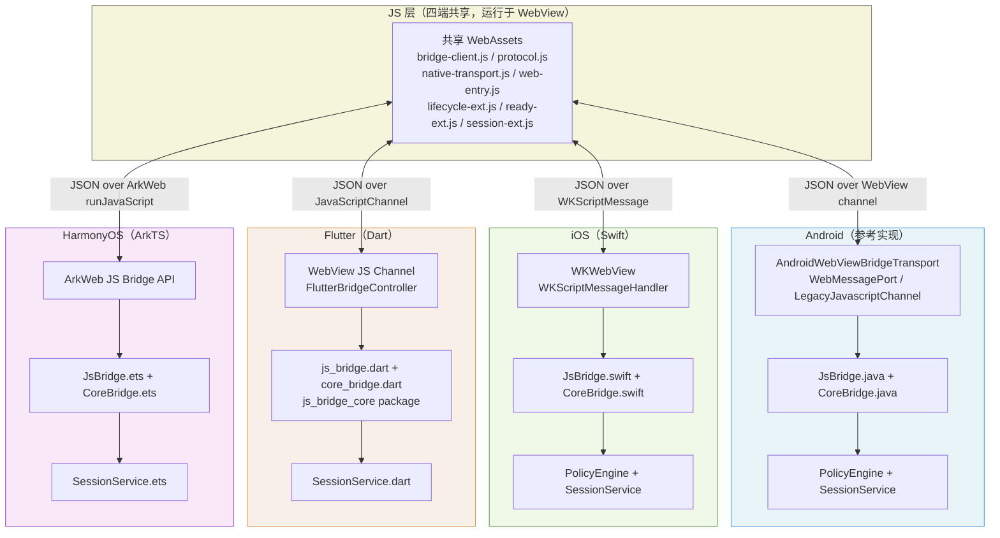
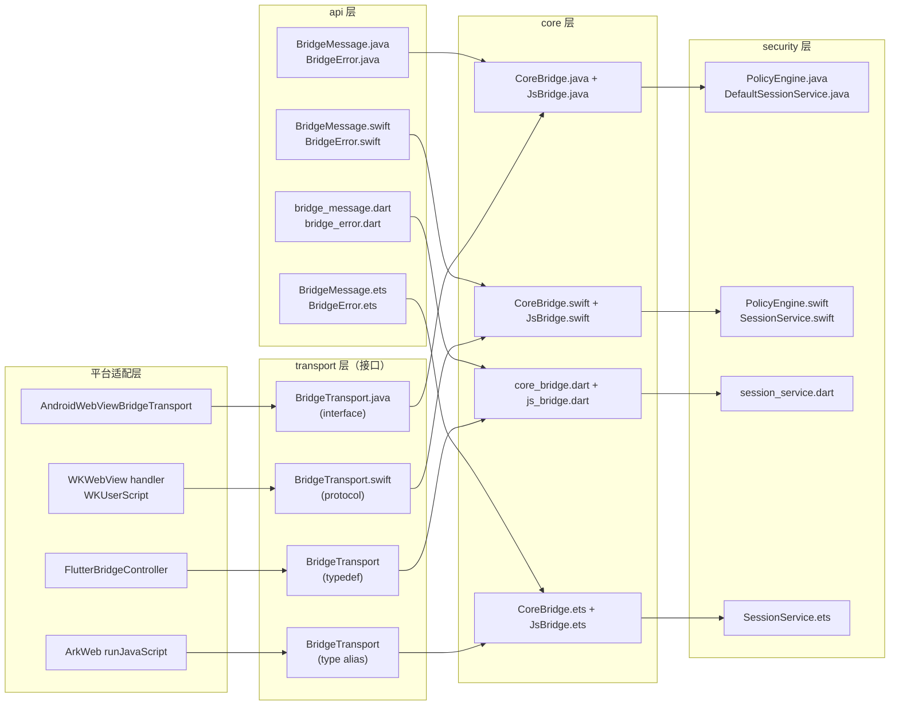
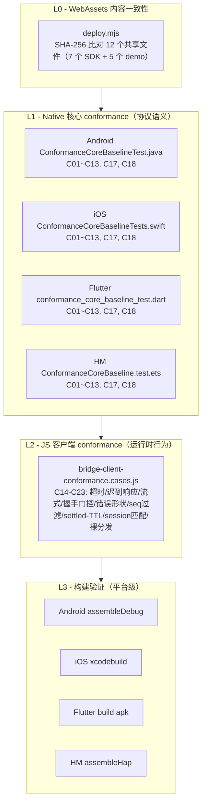

# 03 跨端设计

## 目录

1. [设计目标与原则](#1-设计目标与原则)
2. [整体跨端架构](#2-整体跨端架构)
3. [协议一致性边界](#3-协议一致性边界)
4. [各端实现差异对比](#4-各端实现差异对比)
5. [共享 WebAssets 机制](#5-共享-webassets-机制)
6. [一致性保障机制](#6-一致性保障机制)
7. [各端集成指南](#7-各端集成指南)
8. [新增平台扩展指南](#8-新增平台扩展指南)
9. [跨端变更影响评估](#9-跨端变更影响评估)

---

## 1 设计目标与原则

### 1.1 核心命题：协议一致 vs 共享运行时

JsBridge2 不追求"write once, run anywhere"，而是追求"same protocol, same semantics"。

| 取舍项 | 选择 | 理由 |
|--------|------|------|
| 运行时 | 各端独立实现（Java / Swift / Dart / ArkTS） | 适配各平台语言生态，无跨语言 FFI 复杂度 |
| 传输层 | 各端使用平台原生 WebView API | 性能最优，符合各端系统限制 |
| 协议信封 | 跨端完全统一的 JSON 字段集 | 保证 JS 侧 `bridge-client.js` 无需感知平台差异 |
| 安全策略链 | 跨端固定求值顺序 | 保证同一请求在四端得到同语义安全决策 |
| WebAssets | 四端携带完全相同的二进制副本 | JS 侧行为无歧义，conformance 可跨端复用 |

### 1.2 五条设计原则

**Protocol-first（协议优先）**
先冻结协议规范（消息信封、握手契约、策略链、错误码），再启动各端实现。任何平台实现都不得扩展或收窄协议字段的语义。

**Behavior-consistent（行为一致）**
同一 JSON 输入在四端必须产生同语义输出——相同的错误码、相同的握手响应结构、相同的会话生命周期语义。

**Layered kernel（三层叠加内核）**
每端都遵循三层叠加结构，依赖方向自上而下：

```
extensions → JsBridge → CoreBridge → api
                  ↓
              security → api
```

- `CoreBridge`（Tier 1）：纯协议分发，零 security 依赖
- `JsBridge`（Tier 2）：会话/策略/握手，叠加在 CoreBridge 之上
- `extensions`（Tier 3）：可选适配器
- `api`：共享契约（含 `TrustedPageContext`，跨层使用）
- `security`：策略链 + 会话管理（Tier 2 组件，不依赖 core）
- transport 归入 core（Tier 1 组件），security 与 transport 互相隔离

**Additive evolution（累加演进）**
协议 v1 只允许向后兼容的累加变更：可新增可选字段，不可重命名或删除已有字段。新字段必须能被旧客户端安全忽略。

**Progressive enhancement（渐进增强）**
只有核心协议（消息信封、`kind` 语义、握手契约）是不可省略的基座，**其余所有特性都是可插拔的**：宿主不显式开启就不生效。这条原则统一解释了以下设计——

| 可插拔项 | 默认状态 | 开启方式 |
|---------|---------|---------|
| `HandshakeGatePolicy` / `AccessControlPolicy` | 关闭（Level 0） | `SecurityConfig.withHandshakeGate()` / `.withAccessControl()` / `.secure()` |
| `extraPolicies` | 空 | 宿主注入自定义 `PolicyRule` |
| `extensions` 层（lifecycle / registry / system） | 不装配 | 宿主按需组装，core 不依赖 extensions |
| 平台 extensions 实现程度 | 各端可不同 | 各端按需实现，不影响协议一致性 |

因此新增特性时，默认形态应当是"关闭且可选"，而不是"默认启用再提供开关关掉"。若某特性无法做成可插拔，须显式论证它为何属于核心协议。

---

## 2 整体跨端架构

### 2.1 四端与共享 WebAssets 关系



### 2.2 核心分层横向对比



---

## 3 协议一致性边界

### 3.1 必须跨端统一的内容

#### 消息信封（Protocol v1）

所有消息使用统一 JSON 对象，字段语义在四端完全相同：

| 字段 | 类型 | 说明 |
|------|------|------|
| `id` | string | 消息唯一 ID |
| `sessionId` | string | 握手前为空，正常请求必填 |
| `kind` | `"request"` \| `"response"` \| `"event"` | 消息方向与类型 |
| `method` | string | 方法名 |
| `ts` | number | Unix 毫秒时间戳 |
| `timeoutMs` | number | 请求超时提示 |
| `keep` | boolean | 流式请求标志 |
| `payload` | any \| null | 业务 payload |
| `reqId` | string \| null | response 对应的 request id |
| `done` | boolean \| null | 流式完成标志 |
| `ok` | boolean \| null | 响应成功标志 |
| `error` | object \| null | 归一化错误对象 |

#### 错误码基线

所有平台必须实现以下错误码，且语义不可更改：

- `E_INVALID_MESSAGE` — 消息结构/类型非法
- `E_POLICY_DENY` — 策略链拒绝（含握手门禁）
- `E_ORIGIN_DENY` — origin 不在白名单
- `E_METHOD_NOT_ALLOWED` — 方法不在白名单
- `E_CAPABILITY_DENY` — 会话能力集未包含该方法
- `E_SESSION_INVALID` — 会话缺失、过期或页面实例不匹配
- `E_METHOD_NOT_FOUND` — 无对应 Native handler
- `E_INTERNAL` — Native 侧未捕获异常
- `E_BUSY` / `E_CANCELED` / `E_RESULT_EMPTY` / `E_LAUNCH_FAILED` — 插件启动相关

错误对象固定形状：

```json
{
  "code": "E_INTERNAL",
  "message": "...",
  "retryable": false,
  "details": {}
}
```

#### 安全策略链（固定求值顺序）

四端必须按以下顺序串行求值，不可跳过或重排：

1. `RequestShapePolicy` — 校验消息结构（`kind`、`method` 非空）
2. `HandshakeGatePolicy` — 非握手请求在会话建立前一律拒绝（`E_POLICY_DENY`）
3. `AccessControlPolicy` — origin 白名单、会话有效性、页面实例匹配、能力集检查
4. `extraPolicies` — 宿主注入的自定义策略（按注入顺序追加）

#### 握手语义

握手方法名固定为 `bridge.handshake`，成功响应 payload 必须包含：

```json
{
  "sessionId": "...",
  "capabilities": ["method1", "method2"],
  "sessionTtlMs": 900000,
  "policyVersion": "v1",
  "origin": "file://",
  "accepted": true
}
```

#### 会话语义

- `resetForNewPage()` 调用时，上一个页面实例的会话立即失效，后续该会话的请求返回 `E_SESSION_INVALID`。
- 会话 TTL 到期后请求同样返回 `E_SESSION_INVALID`。
- 每次 `resetForNewPage()` 生成新的 `pageInstanceId`，跨实例请求被拒绝。

#### 流式语义

- `keep=true` 请求允许连续帧响应。
- 中间帧：`done=false`。
- 最终帧：`done=true`。
- 客户端在收到 `done=true` 或超时前保持回调注册。

### 3.2 允许各端自定义的内容

| 自定义项 | 说明 |
|---------|------|
| 传输实现 | WebMessagePort（Android）/ WKScriptMessageHandler（iOS）/ JavaScriptChannel（Flutter）/ ArkWeb（HM） |
| origin 来源 | 四端均通过 `PageContextProvider` 注入点由内核派生：宿主实现 provider 从 WebView 当前 URL 取 scheme + host，内核在收消息时调用 `createContext(message, pageInstanceId)` 生成 `TrustedPageContext`。未注入 provider 时退化为 `processIncomingResponses(messageJson, origin)` 的宿主声明路径——此时 origin 可信度依赖宿主自律，四端安全强度不等强，生产 Level 2 推荐使用 provider 路径 |
| lifecycle 枚举值 | `runtime.state` 只定义推送机制，状态名（如 `created`/`resumed`/`paused` 等）由各宿主决定 |
| lifecycle 发送时机 | 由宿主根据平台生命周期回调自行决定 |
| lifecycle payload schema | 除信封外，`payload` 字段内容由宿主定义 |
| extraPolicies 业务逻辑 | 完全由宿主注入，协议不约束 |
| extensions 实现 | 各端按需实现（Android 有 lifecycle/registry/system；iOS 有 LifecycleExtension；Flutter/HM 当前无独立扩展模块），extensions 层不影响协议一致性 |
| 产品特定错误码 | 允许新增（如 `E_LOCATION_UNAVAILABLE`），但基线码不可覆盖语义 |

---

## 4 各端实现差异对比

### 4.1 传输层对比

| 平台 | 传输机制 | 发送方向（Native→JS） | 接收方向（JS→Native） | fallback |
|------|---------|---------------------|---------------------|---------|
| Android | `WebMessagePort`（`WebMessageChannel`） | `port.postMessage(json)` | `onMessage` 回调 | `API < M`：`LegacyJavascriptChannel`（`addJavascriptInterface`） |
| iOS | `WKScriptMessageHandler` + `WKUserScript` | `webView.evaluateJavaScript(...)` | `userContentController(_:didReceive:)` | 无，WKWebView 为最低支持 |
| Flutter | `webview_flutter` JS channel | `webViewController.runJavaScriptReturningResult(...)` | `addJavaScriptChannel` 回调 | 无 |
| HarmonyOS | ArkWeb `runJavaScript` + `JavaScriptProxy` | `webviewController.runJavaScript(js)` | `JavaScriptProxy` 注册的 ArkTS 函数 | 无 |

### 4.2 origin 来源对比

四端统一提供 `PageContextProvider` 注入点（Android 为 `PageContextProvider` 接口、iOS 为 `PageContextProvider` protocol、Flutter 为 `PageContextProvider` 抽象类、HM 为 `PageContextProvider` interface）。注入后，`processIncomingResponses(messageJson)` / `processIncomingResponsesFromProvider(messageJson)` 由内核调用 provider 派生 `TrustedPageContext`，origin 不再以裸字符串跨越信任边界。

| 平台 | provider 实现 | origin 来源 |
|------|--------------|-----------|
| Android | `AndroidWebViewPageContextProvider`（extensions） | `WebView.getUrl()` 取 scheme + host |
| iOS | `WKWebViewPageContextProvider`（宿主实现） | `webView.url` 取 scheme + host |
| Flutter | `WebviewPageContextProvider`（宿主实现） | 导航回调缓存的 `_currentUrl` 取 scheme + host |
| HarmonyOS | `FilePageContextProvider`（宿主实现） | 常量 `file://` |

所有平台对 origin 白名单使用**精确匹配**（exact match），不使用 prefix match。

> **allowedOrigins 通配警示**：`AccessControlPolicy` 启用（Level 2）时，若 `allowedOrigins` 仍为默认 `["*"]`，四端均会在构造期拒绝（Android 抛 `IllegalArgumentException`、iOS 触发 `preconditionFailure`、Flutter/HM 抛 `ArgumentError`/`Error`）。`["*"]` 会让 origin 校验静默放行所有来源——升了级别却没有获得预期防护；如需关闭 origin 校验，应退回 Level 1（仅 `withHandshakeGate()`）而非保留通配。Level 0/1 不装配 `AccessControlPolicy`，`["*"]` 无实际效果。

### 4.3 resetForNewPage 时机对比

| 平台 | resetForNewPage 调用时机 | 实现位置 |
|------|-----------------|---------|
| Android | `WebViewClient.onPageStarted()` | `AndroidWebViewBridgeTransport.bind()` 内部 |
| iOS | `BridgeHost.init()` 后立即调用 | `BridgeHost.init()` |
| Flutter | `NavigationDelegate.onPageStarted()` | `FlutterBridgeController` 导航回调 |
| HarmonyOS | Web 组件 `onPageBegin` 事件 | `Index.ets` |

以上回调仅覆盖**真实页面导航**。SPA 路由跳转（`pushState` / `replaceState` / `hashchange`）不触发这些回调，属于预期行为——JS 上下文未变，session 自然延续，无需调用 `resetForNewPage`。SPA 逻辑页面销毁时的回调清理属于 Scope 层职责，详见 [06-lifecycle-layers.md](06-lifecycle-layers.md)。

### 4.4 测试运行方式对比

| 平台 | Native 核心测试 | JS 客户端 conformance | 构建验证 |
|------|---------------|----------------------|---------|
| Android | `./gradlew :js-bridge-core:test` | `node .../bridge-client-conformance.cases.js` | `assembleDebug` |
| iOS | `swift test --package-path js-bridge-core-swift` | `node .../bridge-client-conformance.cases.js` | `xcodebuild ... build` |
| Flutter | `flutter test`（core package + 宿主 app） | `node .../bridge-client-conformance.cases.js` | `flutter build apk --debug` |
| HarmonyOS | Hypium（DevEco Studio，暂无独立 Hvigor task） | `node .../bridge-client-conformance.cases.js` | `hvigorw assembleHap` |

### 4.5 扩展模块对比

| 扩展能力 | Android | iOS | Flutter | HarmonyOS |
|---------|---------|-----|---------|-----------|
| Lifecycle 事件推送 | `LifecycleExtension.java` | `LifecycleExtension.swift` | 宿主内联 `WidgetsBindingObserver` | 宿主内联 ArkUI 生命周期 |
| Handler 注册中心 | `BridgeResultRegistry` | 无独立 registry | 无独立 registry | 无独立 registry |
| Single-flight 防重 | `SingleFlightPendingLaunches` | 无 | 无 | 无 |
| System adapter | `AndroidWebViewBridgeTransport` | `WKWebViewBridgeTransport` | `FlutterBridgeController` | `Index.ets` entry |

---

## 5 共享 WebAssets 机制

### 5.1 工程结构

SDK 和 demo 源码统一在 `web-assets/` 下以 pnpm monorepo 管理：

```
web-assets/
  packages/
    sdk/                     ← jsbridge-sdk 源码（TypeScript）
      src/
        core/                ← protocol.ts, bridge-client.ts
        platform/            ← native-transport.ts, web-entry.ts
        extensions/          ← session-ext.ts, ready-ext.ts, lifecycle-ext.ts
      dist/
        esm/                 ← npm 消费者使用
        iife/jsbridge-sdk.js ← native bundle 用（<script src>）
    demo/                    ← demo 示例（private，不发布）
      src/                   ← index.html, entry.js, api/, page/
      dist/                  ← 同步到四端的产物
  scripts/deploy.mjs         ← 同步与校验
```

各平台目录下的 WebAssets 副本**不纳入版本管理**，由 `pnpm sync` 填充。

### 5.2 四端 Assets 路径

| 平台 | WebAssets 根路径 |
|------|----------------|
| Android | `js_bridge_android/js-bridge-example/src/main/assets/web/` |
| iOS | `js_bridge_ios/js-bridge-example/WebAssets/` |
| Flutter | `js_bridge_flutter/assets/web/` |
| HarmonyOS | `js_bridge_hm/js-bridge-example/entry/src/main/resources/rawfile/web/` |

### 5.3 同步机制

```bash
cd web-assets

# 构建 SDK（ESM + IIFE + .d.ts）+ demo，同步到四端，校验一致性
pnpm sync

# 仅校验（不重新构建）
pnpm check

# 清除四端 native 目录下的 WebAssets 文件
pnpm clean:native
```

校验通过输出：`check passed: 6 files`

任何 `web-assets/packages/` 下的文件变更后必须运行 `pnpm sync`。

**规则：任何 WebAssets 文件变更后必须立即运行 `pnpm sync`，确保四端同步。**

---

## 6 一致性保障机制

### 6.1 三层验证体系



### 6.2 Native 侧 ConformanceCoreBaseline 用例覆盖

| 用例 | 描述 | 覆盖层 |
|------|------|-------|
| C01 | 握手前请求被拒绝（`E_POLICY_DENY`） | Native core |
| C02 | 握手成功返回完整 session payload | Native core |
| C03 | 非白名单方法拒绝（`E_METHOD_NOT_ALLOWED`） | Native core |
| C04 | 非允许 origin 拒绝（`E_ORIGIN_DENY`） | Native core |
| C05 | 握手后合法请求成功 | Native core |
| C06 | 握手后无 sessionId 请求拒绝（`E_SESSION_INVALID`） | Native core |
| C07 | origin 不匹配拒绝（`E_SESSION_INVALID`） | Native core |
| C08 | pageInstanceId 不匹配拒绝（`E_SESSION_INVALID`） | Native core |
| C09 | 能力集外方法拒绝（`E_CAPABILITY_DENY`） | Native core |
| C10 | 无 handler 方法返回（`E_METHOD_NOT_FOUND`） | Native core |
| C11 | handler 抛出异常归一化（`E_INTERNAL`） | Native core |
| C12 | extraPolicy 自定义拒绝 | Native core |
| C13 | 流式响应：多帧 `done=false` + 最终 `done=true` | Native core |
| C14 | 超时触发客户端失败回调 | JS client |
| C15 | 超时后迟到响应被忽略 | JS client |
| C16 | session 不匹配事件被忽略 | JS client |
| C17 | transport send failure 可观测 | Native core |
| C18 | resetForNewPage 旧 session 失效 | Native core |
| C19 | lifecycle seq 乱序过滤 | JS client |
| C20 | policy-deny 错误形状校验 | JS client |
| C21 | settled-map TTL 到期清理 | JS client |
| C22 | event sessionId 严格匹配（含空串兼容） | JS client |
| C23 | Level 0 裸分发（无握手直接调用） | JS client |

### 6.3 各端 conformance 文件路径

| 平台 | Native core 测试 | JS client 测试 |
|------|-----------------|---------------|
| Android | `js_bridge_android/js-bridge-core/src/test/java/.../ConformanceCoreBaselineTest.java` | `js_bridge_android/js-bridge-example/src/test/js/bridge-client-conformance.cases.js` |
| iOS | `js_bridge_ios/js-bridge-core-swift/Tests/BridgeCoreTests/ConformanceCoreBaselineTests.swift` | `js_bridge_ios/js-bridge-example/tests/js/bridge-client-conformance.cases.js` |
| Flutter | `js_bridge_flutter/packages/js_bridge_core/test/conformance_core_baseline_test.dart` | `js_bridge_flutter/tests/js/bridge-client-conformance.cases.js` |
| HarmonyOS | `js_bridge_hm/js-bridge-core/src/test/ConformanceCoreBaseline.test.ets` | `js_bridge_hm/tests/js/bridge-client-conformance.cases.js` |

---

## 7 各端集成指南

### 7.1 Android

**依赖添加**（模块 `js-bridge-core`）：

```gradle
implementation project(':js-bridge-core')
```

**集成步骤**：

Level 0（开发/测试）只需 `new SecurityConfig()`，`resetForNewPage()` 后立即 ready，无须握手。

```java
// Level 2：生产环境完整安全
JsBridge bridge = new JsBridge(
    new AndroidWebViewBridgeTransport(webView),
    new AndroidWebViewPageContextProvider(webView),
    new KernelConfig(),
    SecurityConfig.secure()
        .allowedOrigins(Set.of("file://"))
        .methodWhitelist(Set.of("getUser", "timerLog"))
        .defaultCapabilities(Set.of("getUser", "timerLog"))
);

bridge.registerNativeHandler("getUser", (payload, callback) -> {
    callback.success(responsePayload);
});
// 需要页面上下文时改用 registerNativeHandlerWithContext(method, (context, payload, callback) -> ...)

webView.setWebViewClient(new WebViewClient() {
    @Override
    public void onPageFinished(WebView view, String url) {
        bridge.resetForNewPage();
    }
});
```

Transport 内部通过 `WebMessageChannelBootstrapper` 在 `bind()` 时自动建立 `WebMessagePort` 通道，API < M 时自动 fallback 到 `LegacyJavascriptChannel`。

### 7.2 iOS

**Swift Package 依赖**（`Package.swift`）：

```swift
.package(path: "../js-bridge-core-swift")
```

**集成步骤**（使用 `WKWebViewBridgeTransport`）：

```swift
// Level 2：生产环境完整安全
var config = JsBridge.SecurityConfig.secure()
config.allowedOrigins = ["file://"]
config.methodWhitelist = ["bridge.handshake", "getUser", "timerLog"]
config.defaultCapabilities = ["getUser", "timerLog"]

// 1. 创建 transport（封装 WKScriptMessageHandler + evaluateJavaScript + bootstrap script）
let transport = WKWebViewBridgeTransport(webView: webView)

// 2. 创建 bridge，注入 transport + PageContextProvider
let bridge = JsBridge(
    securityConfig: config,
    pageContextProvider: WKWebViewPageContextProvider(webView: webView),
    transport: transport
)

// 3. 绑定入站闭环（transport 收到 JS 消息 → processIncomingResponses → transport.send 自动发回）
bridge.bindTransport()

// 4. 注册 handler（默认 payload-only，无需感知 Page；需要上下文时用 registerHandlerWithContext）
bridge.registerHandler(method: "getUser") { payload in
    return .success(.object(["name": .string("xesam")]))
}

// 5. resetForNewPage（在 webView 加载后，或 BridgeHost.init() 中）
bridge.resetForNewPage()
```

`WKWebViewBridgeTransport` 位于 `BridgeSystem` target，封装了 `WKScriptMessageHandler` 注册、bootstrap script 注入、`evaluateJavaScript` 出站发送、`message.body` 类型转换等全部传输细节。消费者无需手写 bootstrap script、消息路由循环或 `evaluateJavaScript` 调用。

### 7.3 Flutter

**pubspec.yaml 依赖**（宿主 app 引用本地 package）：

```yaml
dependencies:
  js_bridge_core:
    path: packages/js_bridge_core
```

**集成步骤**：

```dart
// Level 2：生产环境完整安全
final bridge = JsBridge(
  securityConfig: SecurityConfig.secure()
    ..allowedOrigins = {'file://', 'flutter-asset://', 'about:blank'}
    ..methodWhitelist = {'getUser', 'timerLog'}
    ..defaultCapabilities = {'getUser', 'timerLog'},
  pageContextProvider: WebviewPageContextProvider(() => currentUrl),
);

// 2. 注册 handler（默认 payload-only；需要上下文时用 registerHandlerWithContext）
bridge.registerHandler('getUser', (payload) async {
  return BridgeHandlerResult.success(responsePayload);
});

// 3. 注入 transport（函数类型，发送 JSON 到 WebView）
bridge.attachTransport((String messageJson) async {
  await webViewController.runJavaScript(
    "window.__bridgeReceiveFromNative && window.__bridgeReceiveFromNative('${escape(messageJson)}')"
  );
  return true;
});

// 4. 绑定入站闭环（JS channel 消息 → processIncomingResponses → transport.send 自动发回）
final onIncoming = bridge.bindTransport();
webViewController.addJavaScriptChannel('NativeBridge',
  onMessageReceived: (msg) => unawaited(onIncoming(msg.message)),
);

// 5. resetForNewPage（在 onPageStarted 中）
NavigationDelegate(
  onPageStarted: (url) { bridge.resetForNewPage(); },
)
```

Flutter 中 `BridgeTransport` 是函数 typedef（`FutureOr<bool> Function(String)`），不是接口类，更轻量灵活。`bindTransport()` 返回一个处理入站消息的闭包，串联 `processIncomingResponses` 与 `transport.send`，无需手写消息路由循环。

### 7.4 HarmonyOS

**oh-package.json5 本地依赖**：

```json
{
  "dependencies": {
    "@xesam/js_bridge_core": "file:../../js-bridge-core"
  }
}
```

**集成步骤（ArkTS）**：

```typescript
// Level 2：生产环境完整安全
const bridge = JsBridge.secure({
  allowedOrigins: new Set(['file://']),
  methodWhitelist: new Set(['getUser', 'timerLog']),
  defaultCapabilities: new Set(['getUser', 'timerLog']),
  pageContextProvider: new FilePageContextProvider(),
});

// 2. 注册 handler（默认 payload-only；需要上下文时用 registerHandlerWithContext）
bridge.registerHandler('getUser', async (payload) => {
  return BridgeHandlerResult.success({ name: 'xesam' });
});

// 3. 注入 transport（发送 JSON 到 WebView）
bridge.attachTransport((messageJson: string) => {
  const js = `window.__bridgeReceiveFromNative && window.__bridgeReceiveFromNative(${JSON.stringify(messageJson)})`;
  this.webviewController.runJavaScript(js);
  return true;
});

// 4. 绑定入站闭环 + ArkWeb JavaScriptProxy 接收（JS→Native）
const onIncoming = bridge.bindTransport();
// Web 组件配置：
Web({ src: ..., controller: this.webviewController })
  .javaScriptProxy({
    object: { postMessage: (json: string) => { void onIncoming(json); } },
    name: 'NativeBridge',
    methodList: ['postMessage'],
    controller: this.webviewController
  })

// 5. resetForNewPage（在 onPageBegin 中）
  .onPageBegin(() => { this.bridge.resetForNewPage(); })
```

---

## 8 新增平台扩展指南

在协议约束下接入一个新平台，需要完成以下步骤：

### 8.1 核心内核实现

按照分层顺序实现以下模块：

| 步骤 | 模块 | 参照 |
|------|------|------|
| 1 | `BridgeMessage`（消息信封解析/序列化） | `BridgeMessage.java` |
| 2 | `BridgeError`（错误归一化） | `BridgeError.java` |
| 3 | `TrustedPageContext`（页面上下文快照） | `TrustedPageContext.java`（`api` 层） |
| 4 | `SessionRecord` + `SessionService`（会话管理） | `DefaultSessionService.java` |
| 5 | 策略链（`RequestShapePolicy` / `HandshakeGatePolicy` / `AccessControlPolicy`） | `PolicyEngine.java` |
| 6 | `JsBridge` + `CoreBridge`（请求生命周期调度） | `JsBridge.java` + `CoreBridge.java` |
| 7 | `BridgeTransport`（接口定义） | `BridgeTransport.java`（`core/transport`） |

### 8.2 平台适配层实现

实现 `BridgeTransport` 接口，连接平台 WebView API：

- `bind(listener)` — 初始化 WebView channel，将 JS→Native 消息路由到 `listener`
- `send(messageJson)` — 调用 WebView API 将 JSON 推送到 JS 侧（`window.__bridgeReceiveFromNative`）
- `close()` — 释放 channel 资源

### 8.3 WebAssets 部署

将 Android 参考实现中的 WebAssets（`js_bridge_android/js-bridge-example/src/main/assets/web/`）完整复制到新平台的 assets 目录，运行 `pnpm check` 确认一致。

在 `web-assets/scripts/deploy.mjs` 的 `PLATFORM_ROOTS` 字典中新增新平台条目：

```javascript
const PLATFORM_ROOTS = {
  android: join(ROOT, 'js_bridge_android/js-bridge-example/src/main/assets/web'),
  ios:     join(ROOT, 'js_bridge_ios/js-bridge-example/WebAssets'),
  flutter: join(ROOT, 'js_bridge_flutter/assets/web'),
  harmony: join(ROOT, 'js_bridge_hm/js-bridge-example/entry/src/main/resources/rawfile/web'),
  // 新平台：
  // new_platform: join(ROOT, 'js_bridge_new/example/assets/web'),
}
```

### 8.4 conformance 测试落地

按以下模板实现 `ConformanceCoreBaseline` 测试，覆盖 C01~C13、C17、C18：

- 使用平台测试框架（JUnit / XCTest / flutter_test / Hypium）
- 测试逻辑与 Android 参考实现保持逻辑等价
- 通过 `bridge-client-conformance.cases.js` 覆盖 C14~C16

### 8.5 宿主集成验收标准

- `resetForNewPage()` 在页面加载开始时调用（`onPageStarted` 或等价回调）
- `bridge.handshake` 可通过 JS 侧正常完成
- 所有 conformance 用例通过
- `pnpm check` 通过
- 构建产物可正常安装运行 demo

---

## 9 跨端变更影响评估

### 9.1 需要同步四端的变更

以下类型的变更必须在四端同步落地，并同步更新 WebAssets：

| 变更类型 | 典型示例 | 原因 |
|---------|---------|------|
| 消息信封字段增减 | 新增 `version` 字段 | JS 侧 `protocol.js` 依赖信封结构 |
| 消息信封字段语义变更 | 修改 `done` 的语义 | 影响所有端的解析与校验 |
| 策略链顺序或步骤变更 | 调整 `HandshakeGatePolicy` 位置 | 影响各端安全决策结果 |
| 握手响应 payload 结构变更 | 新增 `instanceId` 字段 | JS 侧 `session-ext.js` 依赖握手 payload |
| 错误码基线变更 | 新增基线错误码 | 影响 JS 侧错误处理与 conformance 用例 |
| 流式语义变更 | 修改 `keep`/`done` 约定 | 影响 streaming handler 实现 |
| WebAssets 任意文件变更 | 修改 `bridge-client.js` | 必须同步到四端 assets 目录 |
| conformance 用例新增/修改 | 新增 C19 | 四端均需新增对应测试 |

**操作流程**：先更新 `docs/` 下对应文档（`01-protocol.md` 或 `02-architecture.md`），再同步更新四端实现 + WebAssets，最后验证 `cd web-assets && pnpm sync` 和所有 conformance 测试通过。

### 9.2 只需变更单端的内容

| 变更类型 | 典型示例 | 影响范围 |
|---------|---------|---------|
| 传输层实现优化 | 优化 Android `WebMessagePort` 内存管理 | 仅 Android |
| lifecycle 状态名/时机调整 | 新增 iOS `"willTerminate"` 事件 | 仅 iOS 宿主，protocol 不感知 |
| 宿主 extraPolicy 业务逻辑 | Android 新增权限检查策略 | 仅 Android 宿主 |
| 扩展模块新增 | Android 新增 `AnalyticsExtension` | 仅 Android |
| handler 业务实现 | Flutter `pickImage` 换用新 picker 库 | 仅 Flutter |
| demo UI 调整 | HarmonyOS demo 页面样式修改 | 仅 HarmonyOS |
| 平台构建配置 | Flutter `pubspec.yaml` 依赖升级 | 仅 Flutter |
| 产品特定错误码新增 | 新增 `E_LOCATION_UNAVAILABLE` | 允许各端独立新增，不影响基线码语义 |

### 9.3 变更检查清单

```
[ ] 是否修改了消息信封字段？          → 是：同步四端 + WebAssets
[ ] 是否修改了 web-assets/packages/sdk/src/？ → 是：cd web-assets && pnpm sync
[ ] 是否修改了策略链求值逻辑？         → 是：同步四端，更新 conformance 测试
[ ] 是否修改了错误码基线语义？         → 是：同步四端，更新 conformance 测试
[ ] 是否新增了 conformance 用例？      → 是：四端均需新增对应测试
[ ] 是否修改了握手/会话协议契约？      → 是：更新 spec/protocol-v1.md，同步四端
[ ] 是否仅修改宿主/扩展/transport？   → 是：只需变更对应平台
```
