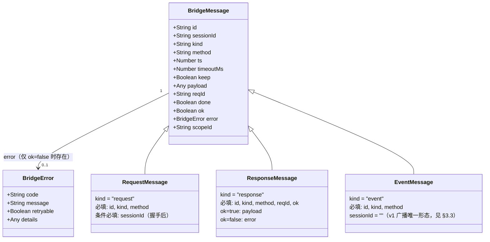
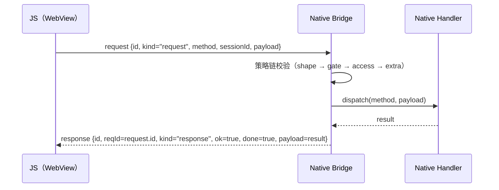
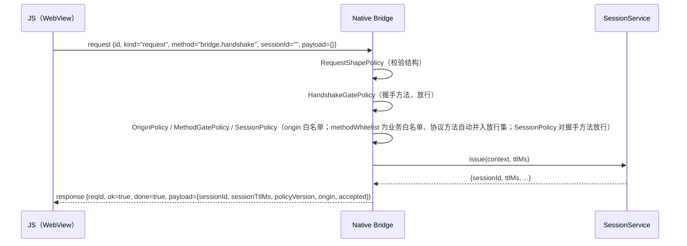
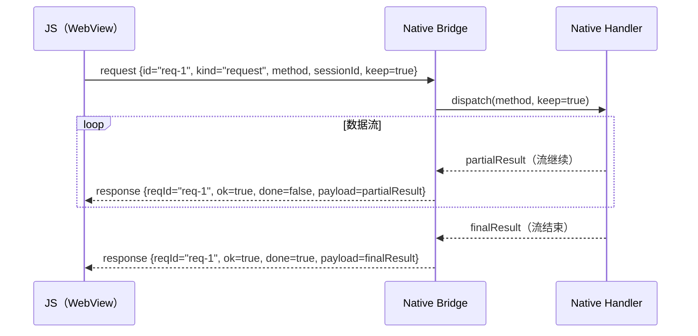
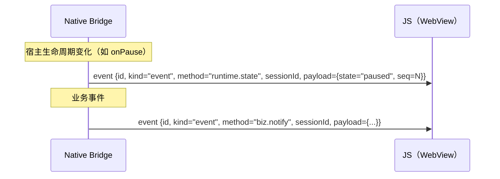
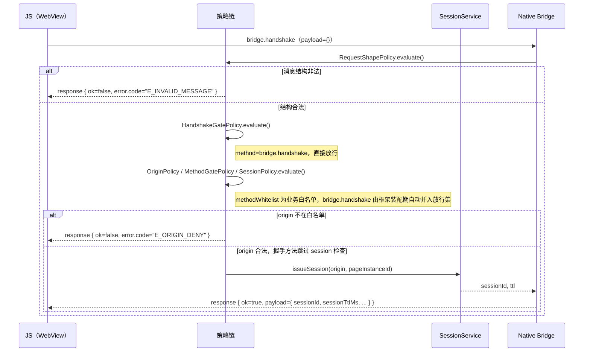
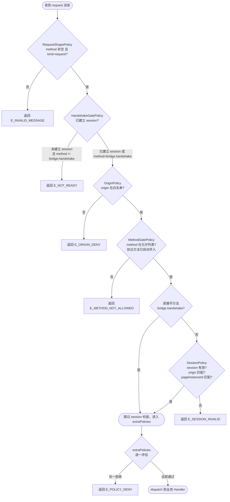
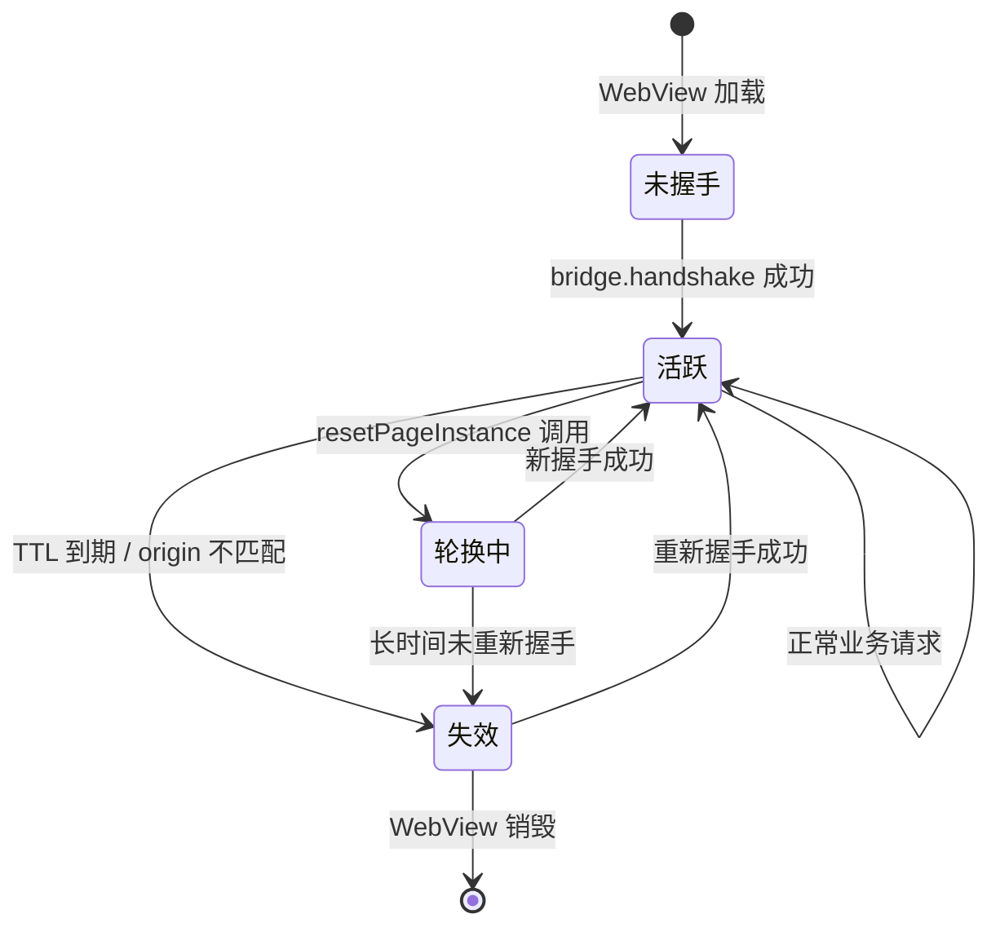

# 03 Bridge 协议设计

> 更新日期：2026-09  
> 适用平台：Android · iOS · Flutter · HarmonyOS

---

## 1 协议概述

### 目标

JsBridge 协议定义了 **WebView 内 JS 代码与宿主 Native 代码之间的通信契约**。协议的核心目标是：

- **跨平台一致性**：同一套协议规范在 Android、iOS、Flutter、HarmonyOS 四个平台上得到完全一致的实现，任何一端发出的消息在另一端均可被无歧义地解析。
- **安全隔离**：通过握手建立会话（Session），结合策略链（Policy Chain）对每一条消息进行多层校验，阻止非授权调用。
- **可扩展性**：消息字段仅做增量演进，现有字段不删不改，新能力通过新字段引入，保证前向兼容。

### 消息模型：纯异步（不支持同步调用）

协议 v1 是**纯异步消息模型**，这是协议的核心设计决策，而非实现局限：**任何方向的调用均不阻塞等待返回值**，所有结果都以独立的响应/事件消息异步送达。协议不定义任何同步调用语义，四端实现也不提供同步 API（唯一豁免是 transport 控制面原语 `requestBridgeChannel` 的同步 ack——它属于信道建立而非数据面调用，详见 [04-cross-platform.md §3.1](04-cross-platform.md)）。

| 方向 | API 形态 | 结果如何送达 |
|------|---------|-------------|
| JS → Native | 回调式（`success` / `fail`），无同步返回值，也不封装 Promise | Native 处理完毕后发送 `kind=response` 消息，JS 按 `reqId` 匹配回调 |
| Native → JS | fire-and-forget（注入无返回值的 JS 函数），不等待 JS 执行结果 | JS 侧通过事件 handler 接收，无回执 |
| Native → JS 推送 | `postEvent()`，发送即返回 | `kind=event` 消息单向送达 |

**为何不支持同步（跨端硬约束）**：四端 WebView 原生通道的同步能力不一致，而协议一致性要求四端交集——

- **iOS 无同步通道**：`WKScriptMessageHandler.postMessage` 无返回值，`evaluateJavaScript` 仅有异步 completion 形式。WKWebView 从平台层面不存在 "JS 同步调用 Native 并取回返回值" 的能力。
- **Android 的同步能力被刻意弃用**：`addJavascriptInterface` 注入的方法技术上可声明非 void 返回值实现 JS 同步调用，但本项目将其签名固定为 `void`（见 `LegacyJavascriptChannel`），仅作为单向入站管道；这是为了与 iOS 对齐协议语义，而非能力缺口。
- **Flutter / HarmonyOS**：`JavaScriptChannel` 与 `javaScriptProxy` 均为 `void postMessage` 形态，无同步返回。

因此**即使某一平台可以实现同步，跨端一致协议也无法提供同步 API**。若业务需要"同步感"，协议提供的正确姿势是异步编排：通过 ready 扩展（`bootstrapReady`）完成握手、在 `onSuccess` 回调中发起后续调用，用回调链替代阻塞。

### 版本

当前版本为 **v1**。版本标识通过握手响应中的 `policyVersion` 字段透出，供 JS 端感知并按需降级。

### 适用平台

| 平台 | 实现语言 | 核心模块路径 |
|------|----------|-------------|
| Android | Java 8 | `js_bridge_android/js-bridge-core` |
| iOS | Swift | `js_bridge_ios/js-bridge-core-swift/Sources/Bridge/` |
| Flutter | Dart | `js_bridge_flutter/packages/js_bridge_core/lib/src/` |
| HarmonyOS | ArkTS | `js_bridge_harmony/js-bridge-core/src/main/ets/` |

协议由 Android 作为参考实现，其余平台严格对齐。

---

## 2 消息信封

所有消息均使用统一的 JSON 信封（Envelope），字段集如下。

### 字段说明表

| 字段 | 类型 | 必要性 | 所属方向 | 说明 |
|------|------|--------|----------|------|
| `id` | string | 必填 | request / response / event | 消息唯一标识，由发送方生成（推荐 UUID v4 或递增序号） |
| `sessionId` | string | 条件必填 | 所有 | 会话 ID；握手请求发送时可为空，握手成功后后续请求必须携带 |
| `kind` | string | 必填 | 所有 | 消息类型：`request` / `response` / `event` |
| `method` | string | 必填 | 所有 | 调用的方法名，格式建议为 `domain.action` |
| `ts` | number | 推荐 | 所有 | 消息发送时间戳（Unix 毫秒），用于超时计算和日志追踪 |
| `timeoutMs` | number | 可选 | request | 请求超时时间（毫秒），`0` 表示不超时；缺省时的超时策略由客户端实现定义（jsbridge-sdk 默认 10000ms，`0` 或负数禁用超时） |
| `keep` | boolean | 可选 | request | `true` 表示持续回调意图（流式/订阅场景），默认 `false` |
| `payload` | any | 条件可选 | request / response(ok) | 请求参数或成功响应数据，`ok=false` 时忽略 |
| `reqId` | string | response 必填 | response | 对应 request 的 `id`，用于客户端匹配回调 |
| `done` | boolean | 条件必填 | response | 流式响应帧标志：`false` 表示流继续，`true` 表示最终帧；非流场景默认 `true` |
| `ok` | boolean | response 必填 | response | `true` 表示成功，`false` 表示失败 |
| `error` | object | 条件必填 | response(失败) | `ok=false` 时的错误对象，结构见[错误模型](#8-错误模型) |
| `scopeId` | string | 可选 | request | 标识请求所属的逻辑页面 scope，用于 SPA 场景的 scope 生命周期管理。详见 [05-lifecycle-layers.md](05-lifecycle-layers.md) |

### 消息结构图



### 无值字段的 wire 形态

无值的可选字段（`payload` / `reqId` / `done` / `ok` / `error`）在 wire 上存在两种合法形态：**显式 `null`** 与**键缺失**，两形态**语义等同**——解析端必须同时接受，不得假设某一端只会发出某一形态。四端序列化实然：

| 端 | 无值时的序列化形态 |
|----|------------------|
| JS SDK | 显式 `null`（`JSON.stringify` 固定写入信封全部字段） |
| Android | 显式 `null`（`BridgeMessage.toJson` 写 `JSONObject.NULL`） |
| iOS | 键缺失（`Codable` 合成编码对 `nil` 可选省略键） |
| Flutter | 显式 `null`（`jsonEncode` 对 null 值保留键） |
| HarmonyOS | 显式 `null`（`BridgeMessage.toJson` 写 `null`） |

（`scopeId` 例外于上表惯例：JS SDK 请求信封不携带该字段；Android / iOS / Flutter 仅在有值时写入键；HarmonyOS 与信封其余字段统一，无值时写显式 `null`。）

---

## 3 消息类型详解

### 3.1 request（JS → Native）

`request` 由 JS 端发出，表达对 Native 端某个方法的调用意图。

**必填字段**：`id`、`kind`、`method`

**条件必填**：
- `sessionId`：握手成功后所有非握手请求必须携带有效的 `sessionId`；握手请求（`bridge.handshake`）本身发送时 `sessionId` 可为空。

**可选字段**：
- `keep=true`：向 Native 声明"本次请求期望持续收到回调"，用于流式数据或事件订阅场景。
- `timeoutMs`：向客户端声明本次请求的超时预期。**v1 中超时由 JS 客户端本地执行**：超时触发客户端本地 `fail(E_TIMEOUT)` 并将请求标记为 settled（迟到响应被丢弃）；Native 不强制执行超时，`timeoutMs` 仅随信封传递与回显，供宿主观测。`0` 表示不超时。
- `payload`：调用参数，类型由具体方法约定。

**流向**：JS → Native（单向发起）

---

### 3.2 response（Native → JS）

`response` 由 Native 端回复，与 `request` 通过 `reqId == request.id` 一一对应。

**必填字段**：`id`、`kind`、`method`、`reqId`、`ok`

**条件字段**：
- `ok=true`：`payload` 为返回数据（可为 null）。
- `ok=false`：`error` 为标准化错误对象，`payload` 忽略。
- `done`：流式场景下控制帧序列，`done=false` 表示本帧是中间帧（流继续），`done=true` 表示最终帧（流结束）。非流场景隐含 `done=true`。

**回显字段**：响应信封回显请求的 `sessionId`、`method`、`timeoutMs`、`keep` 四个字段（`keep` 回显使流式意图可被响应链路观测；JS 客户端匹配流式帧时以请求侧本地值为准，不依赖响应回显值）。此回显规则在四端 Native 实现中行为一致。

**流向**：Native → JS（被动回复）

---

### 3.3 event（Native → JS push）

`event` 由 Native 端主动推送，不依赖任何 `request`，无需 `reqId`。

**必填字段**：`id`、`kind`、`method`

**sessionId：v1 事件投放的唯一形态为广播**——事件帧的 `sessionId` 恒为空串 `""`（四端统一；`postEvent` API 为两参形态 `postEvent(method, payload)`，**无显式传 sessionId 的入口**）。JS 客户端对空串事件无条件派发（见 [09-conformance.md](09-conformance.md) C22/C55）；任何端不得默认以"最近一次握手的 session"作为事件归属。定向投送（事件仅派发给指定 session）**不属于 v1 能力面**——如未来引入，须作为契约变更先登记验收用例（[09-conformance.md §6](09-conformance.md)），四端同步新增 API 形参。

**流向**：Native → JS（主动推送）

典型用途：页面生命周期变化通知（通过 `runtime.state` 方法）、业务事件广播等。

---

### 3.4 畸形消息处理（四端统一）

Native 端接收到无法解析为合法请求信封的消息时，处理方式如下表——除明确标注"四端分叉"的登记差异行外，其余各行四端统一：

| 输入形态 | 处理 | 说明 |
|----------|------|------|
| JSON 语法错误 / 非 JSON 对象 | **静默丢弃**，不产生任何响应 | 解析层失败 |
| `id` 缺失或非字符串 | **静默丢弃** | 必填字段缺失 |
| `kind` 缺失、非字符串或非 `request`/`response`/`event` 之一 | **静默丢弃** | 必填字段缺失或非法；**任何端不得对缺失 `kind` 做默认值兜底** |
| `method` 非字符串 | **静默丢弃** | 必填字段类型非法 |
| `sessionId` 存在但非字符串 | **静默丢弃** | 条件必填字段类型非法 |
| `method` 为空字符串（其余字段合法） | 返回 `E_INVALID_MESSAGE` 错误响应 | 由 RequestShapePolicy 拦截，可观测拒绝 |
| `sessionId`/`ts`/`timeoutMs`/`keep` 缺失 | 取默认值（`""` / `0` / `0` / `false`），四端一致 | 可选字段省略是 v1 演进约定（"新增字段必须能被旧客户端安全忽略"）的兼容路径 |
| `method` 为纯空白字符串（如 `"  "`，其余字段合法） | **四端分叉（已登记实现差异，见下注）** | Android / iOS 判空前先 trim（`trim().isEmpty()` / `trimmingCharacters(in:)`）→ `E_INVALID_MESSAGE`；Flutter / HarmonyOS 仅判空串（`isEmpty` / `length === 0`）→ 放行进入后续策略链 |
| 其余可选字段（`done`/`ok`/`error` 等）类型不匹配 | 行为未定义（不承诺跨端一致） | JS SDK 正常发送的信封不会触发此类输入 |

前七行为协议一致性验收范围（见 [09-conformance.md](09-conformance.md) C33/C34/C38；其中必填字段类型非法的静默丢弃四行为 C51）；最后一行为实现自由裁量，消费方不应依赖。**纯空白 `method` 一行为已登记的四端实现差异**（Flutter / HarmonyOS 放行后，后续走向由白名单与 handler 注册表决定——命中则 `E_METHOD_NOT_ALLOWED` / `E_METHOD_NOT_FOUND`），不属于上述任何验收边界，消费方不应发送纯空白 `method`。

---

## 4 消息交互时序

以下四个 `sequenceDiagram` 分别描述协议中最核心的四种交互模式。

### 4.1 普通调用（一次请求 → 一次响应）



### 4.2 握手时序



### 4.3 流式回调（keep=true）



**流中错误帧的落定语义（fail-closed，验收锚点 JS-client C63）**：流中错误必须以
`ok=false, done=true` 发出（§4.3 表格即此语义）。`ok=false 且 done=false` 属协议
违例形态，本协议将其裁决为**终帧行为**：SDK 侧收到即落定该请求——fail 回调至多
触发一次，流不得续存，后续同 reqId 帧按迟到帧丢弃（不再二次失败、不再补发
E_TIMEOUT）。Native handler 侧不得依赖"发出非终结失败帧后流仍可用"的形态——
四端 `ResponseEmitter` 的 `fail` 语义即终结。

**会话错配响应的 fail-fast 语义（验收锚点 JS-client C63）**：reqId 匹配到挂起
请求但 `sessionId` 与请求不一致的响应（跨会话串扰特征）不再被静默丢弃——SDK
立即以 `E_SESSION_INVALID` 落定该请求（快速失败，对齐 C50 精神；静默丢弃会把这个
真实故障伪装成 E_TIMEOUT 且不可观测）。

### 4.4 事件推送（event）



---

## 5 握手协议

握手是建立可信会话的前置步骤。启用 `HandshakeGatePolicy`（宿主配置 `SecurityConfig` 非 null，对应 [02-architecture.md §4.2 安全配置模型](02-architecture.md) 的有配置场景）时，握手完成前所有非握手方法调用均被拦截并返回 `E_NOT_READY`（与 `E_POLICY_DENY` 分立，见错误码表传输层类）；无配置场景（`SecurityConfig == null`）下不启用此门控，`resetPageInstance()` 后 JsBridge 即可直接接受业务调用。

### 握手请求

JS 端构造如下消息发起握手：

```json
{
  "id": "<唯一 ID>",
  "kind": "request",
  "method": "bridge.handshake",
  "ts": 1716300000000,
  "payload": {}
}
```

- `payload` 为空对象 `{}`。官方 SDK（`bootstrapReady`）构造的握手请求不携带任何业务字段：注入的 `success` / `fail` 回调与可选 `timeoutMs` 在构造信封前被剥离，不进入 wire。
- `sessionId` 此时可为空串（官方 SDK 序列化为 `""`）。
- origin 与 pageInstanceId **不由 JS 上报**：Native 侧以 `TrustedPageContext`（宿主 `PageContextProvider` 从 WebView 派生）为唯一判定来源，见 [§9 细则 3](#9-策略链)与 [§10 签发](#10-会话模型)。若消费方绕过官方 SDK、自行在 payload 中附带 `origin` / `pageInstanceId`，仅为信息性字段，不参与任何策略求值。

### 握手响应

握手成功后，Native 返回：

```json
{
  "id": "<响应 ID>",
  "reqId": "<握手请求 id>",
  "kind": "response",
  "method": "bridge.handshake",
  "ok": true,
  "done": true,
  "payload": {
    "sessionId": "<签发的 session ID>",
    "sessionTtlMs": 900000,
    "policyVersion": "v1",
    "origin": "https://example.com",
    "accepted": true
  }
}
```

握手响应 payload 字段说明：

| 字段 | 类型 | 说明 |
|------|------|------|
| `sessionId` | string | 签发的会话 ID，后续请求必须携带 |
| `sessionTtlMs` | number | 会话有效时长（毫秒），0 表示永不过期；上例取四端默认值 `900000`（15 分钟），实际取值由宿主配置覆盖 |
| `policyVersion` | string | 当前策略版本，供 JS 端感知协议能力；四端默认值统一为 `"v1"`，可由宿主覆盖 |
| `origin` | string | 服务端确认的 origin，JS 端可比对自验证 |
| `accepted` | boolean | `true` 表示握手被接受，`false` 表示被拒绝（但 ok 仍为 true） |

### 握手完整流程图



---

## 6 流式响应语义

### done 标志

`done` 字段仅在 `response` 消息中有意义，控制流帧的生命周期：

| `done` 值 | 含义 |
|-----------|------|
| `false` | 当前帧为中间帧，流仍在继续，JS 端应继续等待后续帧 |
| `true` | 当前帧为最终帧，流已结束，JS 端可释放相关资源 |
| 未携带 | 等同于 `true`，用于普通单次响应场景 |

> **无数据成功的终止帧必须发出（C52）**：handler 以"无数据"成功收尾（如 `success(null)` / 返回 `null` payload）时，四端必须照常发出 `ok=true`、`payload=null`、`done=true` 的终止帧——**禁止以 null 守卫为由静默吞帧**，否则 JS 端将挂死至超时（`E_TIMEOUT` 会伪装真实故障类别）。

### keep 标志

`keep` 字段由 JS 端在 `request` 中携带，向 Native 声明调用意图：

| `keep` 值 | 含义 |
|-----------|------|
| `true` | JS 端希望持续收到回调（流式数据、订阅场景） |
| `false` / 未携带 | 普通一次性调用，Native 只需回复一次 |

### 流式交互规则

1. JS 端发送 `keep=true` 的请求后，Native 可多次发出 `done=false` 的响应帧。
2. 流式最终帧必须携带 `done=true`，告知 JS 端流已结束。
3. 若中途发生错误，Native 应发送 `ok=false` 且 `done=true` 的响应帧终止流。
4. JS 端在收到 `done=true` 后，应不再接受同 `reqId` 的后续帧。

### 示例：进度上报流

```
← response { reqId="r1", ok=true, done=false, payload={progress: 10} }
← response { reqId="r1", ok=true, done=false, payload={progress: 50} }
← response { reqId="r1", ok=true, done=false, payload={progress: 80} }
← response { reqId="r1", ok=true, done=true,  payload={progress: 100, result: "done"} }
```

---

## 7 保留方法

协议层面保留三个特殊方法名，所有平台实现必须遵循其语义边界。

各端 `BridgeApiContract` 的协议方法集（Android `PROTOCOL_METHODS` / iOS `protocolMethods` / Flutter `protocolMethods` / HarmonyOS `getProtocolMethods()`）登记了 **JS → Native request 方向**的全部协议方法（当前为 `bridge.handshake` / `bridge.cancelScope`），由框架在装配期自动并入 `methodWhitelist` 放行集（见 [§9 策略链](#9-策略链)）。`runtime.state` 为 Native → JS event，不经过 `MethodGatePolicy`，不入该集合。**新增协议 request 方法时，必须同步将方法常量加入四端的协议方法集**——否则该方法在配置了白名单的宿主上会被 `MethodGatePolicy` 静默拒绝。

### 7.1 bridge.handshake

**方向**：JS → Native（`request`）  
**语义**：建立可信会话的唯一入口。

| 约束 | 说明 |
|------|------|
| 执行时机 | WebView 加载页面后、任何业务方法调用前 |
| sessionId | 请求时可为空，响应后必须保存 |
| 幂等性 | 同一 pageInstanceId 重复握手，Native 应刷新会话（而非报错）——新签发生效即旧 session 失效（验收锚点 C61，见 §10 刷新语义） |
| 方法白名单 | `methodWhitelist` 为**业务方法白名单**：协议方法（`bridge.handshake`）由框架在装配期自动并入放行集，宿主无需显式列入（显式列入亦合法，冗余无副作用）；仍须通过 `OriginPolicy` 检查，再被 `SessionPolicy` 豁免、跳过 session 有效性检查 |

`bridge.handshake` 的 `payload` 结构和握手响应 `payload` 结构由协议固定，不允许宿主自定义核心字段。

### 7.2 runtime.state

**方向**：Native → JS（`event`）  
**语义**：宿主生命周期状态变化的推送通道。

| 约束 | 说明 |
|------|------|
| 执行时机 | 由宿主决定（如 Activity.onResume、App 进入后台等） |
| state 枚举 | 由宿主自定义，协议不约束具体值 |
| payload 结构 | 固定为 `{ "state": string, "seq": number }` |
| seq 语义 | 由 lifecycle 发布者维护，从 1 单调递增；跟随发布者实例（Layer 1 / WebView）生命周期，不随 `resetPageInstance()` 重置 |
| 未 ready 排队 | 握手前事件进入 FIFO 队列（默认上限 32，可配；超限丢弃最旧），每次握手成功后按序补发；flush 中途失败则剩余事件保留，**保留事件之间（含失败事件的重试）的相对顺序不作协议保证**（四端实现可将失败帧重新入队，重试时可能排至剩余事件之后）。队列不随页面重置清空 |
| 补发顺序保证 | 补发事件与握手响应可能经由不同通道送达，两者先后顺序不作协议保证；client 对 sessionId 为空串的 event 无条件派发（见 C22），两种顺序均可正确处理 |
| 强制要求 | 使用 `kind="event"`，`method="runtime.state"`；`sessionId` 恒为空串 `""`（事件投放唯一形态为广播，见 §3.3——不存在"推荐携带真实 sessionId"的形态） |

`runtime.state` 的触发时机与 state 取值集合由宿主平台定义，但 payload 结构与补发语义由协议固定。协议规定其消息类型为 `event` 和方法名 `runtime.state`，以保证 JS 端可统一监听该方法名进行生命周期处理。

### 7.3 bridge.cancelScope

**方向**：JS → Native（`request`）
**语义**：通知 Native 侧某个逻辑页面 scope 已销毁。

| 约束 | 说明 |
|------|------|
| 执行时机 | SPA 逻辑页面销毁时，由 JS 侧主动调用 |
| payload | `{ "scopeId": "<scope 标识>" }` |
| 响应 | `{ "scopeId": "<scope 标识>", "accepted": true }` |
| Native 现状 | Native 侧为空壳 ack，不执行实际取消逻辑。为未来 Native 侧 scope 感知（终止 scope 内进行中的处理）预留 |
| JS 侧现状 | **JS SDK 尚未发送该方法**（`BridgeRequest` 不携带 `scopeId`，SDK 源码无 `cancelScope` 调用点）——端到端 scope 通知当前不可用；该能力为协议预留，落地需先登记验收用例（[09-conformance.md §6](09-conformance.md)） |

此方法与消息信封中的可选字段 `scopeId` 配合使用，共同构成协议层对 scope 的基础设施支持。详见 [05-lifecycle-layers.md](05-lifecycle-layers.md)。

---

## 8 错误模型

### 错误对象结构

所有错误均通过 `response.error` 字段返回，结构如下：

```json
{
  "code": "E_METHOD_NOT_FOUND",
  "message": "method 'foo.bar' is not registered",
  "retryable": false,
  "details": { "method": "foo.bar" }
}
```

| 字段 | 类型 | 说明 |
|------|------|------|
| `code` | string | 错误码，见下表 |
| `message` | string | 人类可读的错误描述 |
| `retryable` | boolean | `true` 表示调用方可以重试；`false` 表示重试无意义。**四端 Native 实现现状：跨端错误帧中该字段恒为 `false`**（Native 侧不按码区分）。`true` 仅由 JS 客户端的**本地**错误兑现（`E_TIMEOUT` / `E_CANCELED` / `E_CHANNEL_CLOSED` / 出网前的 `E_NOT_READY` 本地门控），见下表相应的行 |
| `details` | any | 可选的附加调试信息，格式由具体错误码约定 |

平台原生未被捕获的异常必须归一化为 `E_INTERNAL`，不得将平台异常栈直接透传给 JS 端。

### 错误码分类表

> **层标注列**：下表各分类增"层"标注列——协议层词汇默认跨端传输；非协议层词汇（JS 客户端本地、registry 约定、transport 层）必须显式标注。transport 层词汇（信道建立 / 就绪门控）登记于下方"传输层类"，此即 transport 层词汇的登记入口，未来 transport 演进（轮换、QoS、多通道）的新错误码均登记于此，不入方法表。

#### 协议 / 消息形状类

| 错误码 | 触发条件 | retryable | 层 |
|--------|----------|-----------|-----|
| `E_INVALID_MESSAGE` | 消息结构不合法（缺少必填字段、kind 非法等） | false | 协议层 |

#### 策略拒绝类

| 错误码 | 触发条件 | retryable | 层 |
|--------|----------|-----------|-----|
| `E_POLICY_DENY` | 通用策略拒绝（宿主 extraPolicies 返回拒绝），不承担握手门禁语义——握手门禁拒绝改用 `E_NOT_READY`（见传输层类） | false | 协议层 |
| `E_ORIGIN_DENY` | origin 不在白名单 | false | 协议层 |
| `E_METHOD_NOT_ALLOWED` | method 不在允许列表 | false | 协议层 |
| `E_SESSION_INVALID` | session 不存在、已过期、或 origin/pageInstanceId 不匹配 | false（Native 侧恒 `false`，见错误对象结构；「重新握手后可重试」为语义建议，非线上字段值） | 协议层 |

#### 分发 / 运行时类

| 错误码 | 触发条件 | retryable | 层 |
|--------|----------|-----------|-----|
| `E_METHOD_NOT_FOUND` | method 已通过策略链但无对应 Handler 注册 | false | 协议层 |
| `E_INTERNAL` | Handler 内部未捕获异常，或平台原生异常 | false | 协议层 |

#### 客户端本地类（JS 客户端产生，不跨端传输）

| 错误码 | 触发条件 | retryable | 层 |
|--------|----------|-----------|-----|
| `E_TIMEOUT` | 客户端本地超时（`timeoutMs > 0` 且在超时窗口内未收到响应） | true | JS 客户端本地 |
| `E_CANCELED` | 客户端 AbortSignal 取消（含预中止、流式取消、事件监听注销） | true | JS 客户端本地 |

> 超时与取消均为 JS 客户端本地行为，不会以 `error` 响应跨端传输；客户端超时/取消后，Native 侧后续送达的响应将被 settled 机制丢弃。

#### 启动 / 生命周期类（registry 扩展约定，核心不产生）

| 错误码 | 触发条件 | retryable | 层 |
|--------|----------|-----------|-----|
| `E_BUSY` | Bridge 正在初始化，暂时无法处理请求 | true | registry 约定 |
| `E_RESULT_EMPTY` | Handler 正常执行但未返回任何结果 | false | registry 约定 |
| `E_LAUNCH_FAILED` | Bridge 启动失败，无法建立连接 | false | registry 约定 |

> 以上三个码由 `extensions/registry`（Native 主动发起调用）及宿主插件约定使用，核心内核从不主动产生；产品可自行决定是否采用。

#### 传输层类（transport 层——transport 层词汇登记入口）

| 错误码 | 触发条件 | retryable | 层 |
|--------|----------|-----------|-----|
| `E_CHANNEL_CLOSED` | 信道建立失败：reqId 重试耗尽、宿主明确拒绝（限频/入口不存在）、或陈旧投递全部被丢弃后仍无可用端口（JS 客户端本地产生，不跨端传输） | true（退避后重新发起 requestBridgeChannel） | transport（JS 本地） |
| `E_NOT_READY` | 会话未建立即调用非握手方法——JS 侧门控出网前本地拦截（本地码置 `true`）与 Native `HandshakeGatePolicy` 跨端拒绝（恒 `false`，见错误对象结构）**双侧同码**（与 `E_POLICY_DENY` 分立，"策略拒绝"与"未握手"不混码） | JS 本地 `true`；Native 跨端 `false` | transport（跨端） |

> 传输层词汇的规格细节（哑入口签名、reqId 往返、`bridge:channel` 投递事件）见 [04-cross-platform.md §3.1 通道建立入口](04-cross-platform.md)与 [06-channel-establishment.md](06-channel-establishment.md)；验收断言见 [09-conformance.md](09-conformance.md) C40/C41。**会话过期不设独立错误码**：复用 `E_SESSION_INVALID`（"session 不存在、已过期、或 origin/pageInstanceId 不匹配"已完整覆盖该义项），不新造 `E_SESSION_EXPIRED`。

---

## 9 策略链

### 概述

每一条 `request` 消息在被 dispatch 到业务 Handler 之前，必须按固定顺序通过策略链的全部校验。策略链是协议安全的核心保障，任何一层拒绝均立即返回错误响应，不再继续向后传递。

### 固定顺序

| 顺序 | 策略名 | 核心职责 | 拒绝错误码 |
|------|--------|----------|-----------|
| 1 | `RequestShapePolicy` | 校验消息结构：`method` 非空，`kind` 必须为 `request` | `E_INVALID_MESSAGE` |
| 2 | `HandshakeGatePolicy` | 若尚未建立会话，则阻断所有非 `bridge.handshake` 调用（`SecurityConfig` 非 null 时进链；传 null 不加入链） | `E_NOT_READY`（与 `E_POLICY_DENY` 分立） |
| 3 | `OriginPolicy` | origin 白名单校验（opt-in：`allowedOrigins` 显式配置且不含 `*` 时进链） | `E_ORIGIN_DENY` |
| 4 | `MethodGatePolicy` | method 白名单校验（opt-in：`methodWhitelist` 显式配置且不含 `*` 时进链）。`methodWhitelist` 为业务方法白名单，协议方法（`bridge.handshake` / `bridge.cancelScope`）由框架装配期自动并入放行集 | `E_METHOD_NOT_ALLOWED` |
| 5 | `SessionPolicy` | session 有效性 + origin/pageInstanceId 匹配（`SecurityConfig` 非 null 时进链；握手方法豁免） | `E_SESSION_INVALID` |
| 6 | `extraPolicies` | 宿主注入的自定义策略，按注入顺序依次执行 | `E_POLICY_DENY`（默认） |

### OriginPolicy / MethodGatePolicy / SessionPolicy 细则

1. **origin 检查**：请求的 origin 不在白名单 → 返回 `E_ORIGIN_DENY`。
2. **method 白名单检查**：method 不在放行集（语义见上表第 4 行）→ 返回 `E_METHOD_NOT_ALLOWED`。`MethodGatePolicy` 组件本身为纯集合成员检查，自动并入发生在 `JsBridge` 装配期（`BridgeApiContract` 定义协议方法集）。
3. **握手方法豁免**：`bridge.handshake` 通过 origin/method 检查后，被 `SessionPolicy` **豁免**、跳过 session 检查（因为握手本身就是为了建立 session）。握手签发的 session 绑定 `TrustedPageContext.origin`（宿主 provider 从 WebView 派生），而非 JS 上报的 `payload.origin`——后者仅为信息性字段，不参与任何策略求值。**任何策略拒绝都必须返回错误响应**（fail-closed）：策略结果未携带 error 时以 `E_POLICY_DENY` 兜底，禁止静默放行继续 dispatch。
4. **非握手方法的 session 检查**：
   - session 必须存在且未过期。
   - `session.origin` 必须等于当前请求的 `ctx.origin`。
   - `session.pageInstanceId` 必须等于当前请求的 `ctx.pageInstanceId`。
   - 任一不满足 → 返回 `E_SESSION_INVALID`。
5. **origin 序列化归一化**（`TrustedPageContext.origin` 的唯一合法形态，四端共用同一规则，由各端核心层提供归一化实现，宿主 provider 必须使用，验收锚点 C54）：
   - 四端实现为**同一套手写字符串算法**（不依赖各平台 URL 解析器——`URL`/`Uri` 在 IPv6 方括号、前导零端口、空 authority 等形态上行为各异，构成跨端漂移源），全量校验向量正本见 [origin-normalizer-vectors.json](origin-normalizer-vectors.json)，由 `scripts/check_origin_vectors.sh`（接入 `test_all.sh`）强制四端 C54 测试内嵌同一向量集。
   - 输入 URL 缺失（null / 空串 / 纯空白）时 origin 为空串 `""`（不用 `"about:blank"` 等占位值），空串 origin 永远不会命中任何白名单——fail-closed。
   - scheme 段必须满足 RFC 3986 词法的 ASCII 子集（首字符 ASCII 字母，其余为 ASCII 字母 / 数字 / `+` / `-` / `.`，四端逐一校验——不信任平台解析器的宽窄差异），否则 → `""`。
   - `scheme` 与 `host` 小写；host 保留 IPv6 字面量方括号（`http://[::1]:8443` → `http://[::1]:8443`）。
   - `file:` 无论 authority 形态（`file:///path`、`file://media/x`），一律归一化为 `file://`。
   - 层级形态（scheme 后余段以 `//` 开头）但 authority 为空（`content://`、`asset://`、`flutter-asset:///...`）→ `scheme://`——本地内容协议保留 scheme 语义，是否放行由宿主白名单决定；非层级形态（scheme 后无 `//`，如 `about:` / `data:` / `mailto:` / `javascript:`）→ `""` fail-closed。
   - authority 段取首个 `/`、`?`、`#` 之前；剥离 userinfo（最后一个 `@` 之前）；端口分隔冒号取最后一个 `]` 之后的最后一个 `:`（IPv6 字面量内部冒号不作端口分隔）。
   - 端口段须为纯 ASCII 数字（至多 5 位）且整数值在 1..65535，否则整个 origin → `""`（fail-closed——`http://host:0`、`http://host:99999`、`http://host:+80`、`http://host:`（空端口段）均归一化为 `""`，畸形端口不得回退成可命中的 origin；Java 的 `parseInt` 与 Swift 的 `Int()` 会静默接受 `+80` 等带符号形态，故必须先做纯数字校验）；端口按**整数值**与默认端口比较（`https:443` / `http:80`），命中则省略，非默认端口以整数值保留（`https://host:0443` → `https://host`）。
   - `allowedOrigins` 白名单条目必须已是归一化后的形态（如 `https://example.com`、`file://`、`flutter-asset://`）——OriginPolicy 比较的是归一化串与条目的直接相等，不做二次归一化。
   - 建链信任边界：origin 白名单只约束 Native 侧入站点——iOS 的 script message 必须校验 `frameInfo.isMainFrame`（仅主 frame 可作为消息来源），Android pull 信道只将 MessagePort 投递至主 frame JS 环境；JS 侧采纳投递端口前必须校验 MessageEvent 的来源（`event.origin` / `event.source`）。宿主接入套件的落点断言见 [09-conformance.md](09-conformance.md) C58/C59。

### 策略链求值流程图



---

## 10 会话模型

### 会话的生命周期

```
握手请求 → 签发 session → 绑定 origin + pageInstanceId
     ↓
  后续请求携带 sessionId → 校验通过 → 正常处理
     ↓
  resetPageInstance（页面导航）→ 轮换 pageInstanceId → 旧 session 失效
     ↓
  session 超时 / 主动销毁 → session 失效
```

### 签发（Issue）

握手成功后，`SessionService` 创建一个新的 session，绑定：
- `origin`：`TrustedPageContext.origin`（宿主 provider 从 WebView URL 归一化派生，见 §9 细则 5）。握手请求 `payload.origin` 为 JS 上报的**信息性字段，不参与 session 绑定与任何策略求值**。
- `pageInstanceId`：页面实例标识，取自 `TrustedPageContext`（宿主在页面导航回调中轮换）。
- `sessionTtlMs`：有效时长，三态语义（四端统一，验收锚点 C60）：**正值**=有限期；**0**=永不过期（存储以 -1 哨兵表达，find 与签发清扫均豁免）；**负值**=无协议意义，各端实现为立即过期（仅供测试驱动）。
- **过期清扫时机**（四端统一）：签发（issue）时顺带清扫存储中已过期的 session 记录，防止长期运行进程中过期而不再被查询的记录无界累积（验收锚点 C56）。
- **刷新语义**（四端统一，验收锚点 C61）：签发新 session 时，同 `pageInstanceId` 的既有 session **立即失效**（重复握手 = 刷新而非并存，见 §7.1 幂等性）——异常页面循环握手不会造成同页 session 无界累积，存储内每个 pageInstanceId 至多存活 1 条。

### 绑定与轮换（Bind & Rotate）

`resetPageInstance` 用于**真实页面导航**——即触发 WebView `onPageStarted` / `onPageBegin` 等原生回调的场景（`location.href` 跳转、链接点击、页面刷新等）。宿主在原生回调中调用 `resetPageInstance`，轮换 `pageInstanceId`：

1. 旧的 `pageInstanceId` 对应的 session 立即失效（后续请求将返回 `E_SESSION_INVALID`）。
2. 新的 `pageInstanceId` 等待下一次握手后才建立新 session。

**不允许**在不重新握手的情况下复用旧 session 于新页面实例。

> **SPA 路由跳转不触发 `resetPageInstance`**：SPA 通过 `pushState` / `replaceState` / `hashchange` 实现的路由跳转不触发 WebView 原生回调，JS 执行上下文不变，session 自然延续，**不应**调用 `resetPageInstance`。SPA 逻辑页面销毁时的回调清理属于 Scope 层（Layer 3）职责，详见 [05-lifecycle-layers.md](05-lifecycle-layers.md)。

### 失效（Invalidation）

以下任一条件成立时，session 视为失效：

| 条件 | 说明 |
|------|------|
| TTL 到期 | `sessionTtlMs > 0` 且当前时间超过签发时间 + TTL |
| origin 不匹配 | 请求携带的 origin 与 session 绑定的 origin 不一致 |
| pageInstanceId 不匹配 | resetPageInstance 轮换后，旧 pageInstanceId 对应 session 失效 |
| 主动销毁 | 宿主调用 SessionService 的销毁接口 |

### 会话状态图



---

## 11 兼容性规则

### v1 演进约定

v1 协议遵循**只增不改不删**原则，确保新旧客户端均能正常交互。

| 规则 | 说明 |
|------|------|
| 增量字段 | 新版本可新增字段，但所有新字段必须是**可选字段** |
| 不删除字段 | 已在 v1 规范中定义的字段不得在后续版本中移除 |
| 不更改语义 | 现有字段的语义不得发生破坏性变更（如 `ok` 的布尔语义不可更改） |
| 忽略未知字段 | 接收方（JS 端或 Native 端）在解析消息时，必须忽略不认识的字段，不得报错 |
| 版本感知 | JS 端可通过握手响应中的 `policyVersion` 感知 Native 端的协议能力，按需做降级处理 |

### 新增字段示例

合法的 v1 演进（新增可选字段）：

```json
{
  "id": "...",
  "kind": "request",
  "method": "some.method",
  "sessionId": "...",
  "payload": {},
  "priority": "high"
}
```

`priority` 为新增字段，旧版本 Native 忽略之，新版本 Native 按需处理。

### 禁止的演进操作

- 将现有**可选字段**改为**必填字段**（会导致旧客户端发出的消息被新服务端拒绝）。
- 更改现有字段的**类型**（如 `ok` 从 boolean 改为 string）。
- 删除已有字段（即使某字段已不推荐使用，也只能标记为 deprecated，不得删除）。
- 更改保留方法名（`bridge.handshake`、`runtime.state`、`bridge.cancelScope`）的核心语义。
- **引入任何同步调用语义**（如 "JS 同步调用 Native 并阻塞取回返回值"、"Native 同步执行 JS 并等待结果"）——协议 v1 为纯异步模型（见 [§1 消息模型](#1-协议概述)），同步语义无法在四端（尤其 iOS）落地，任何平台实现亦不得单方面提供同步 API 破坏协议一致性（唯一豁免即 §1 所述 `requestBridgeChannel` 同步 ack）。

---

*本文档描述的是 Bridge 协议 v1 规范，由 Android 参考实现承载，iOS / Flutter / HarmonyOS 严格对齐。任何平台实现的偏差均视为实现 Bug，需以本文档为准进行修正。*
