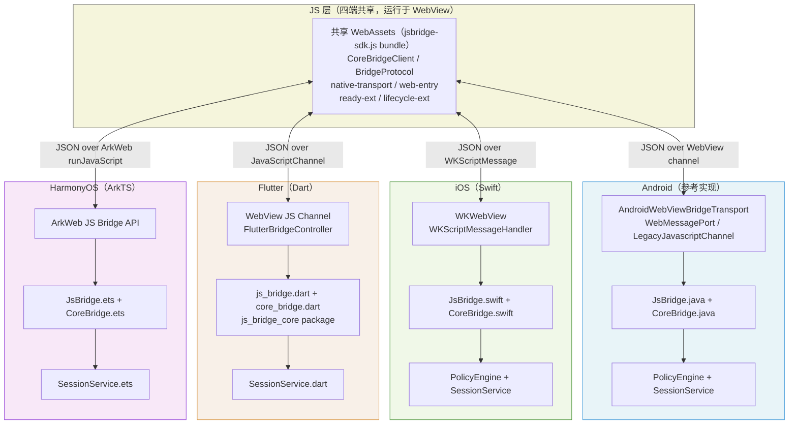
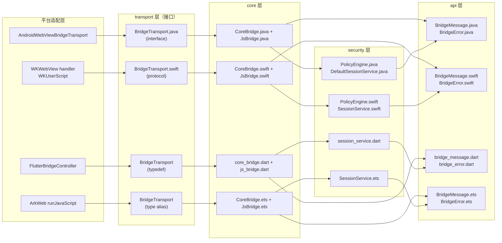
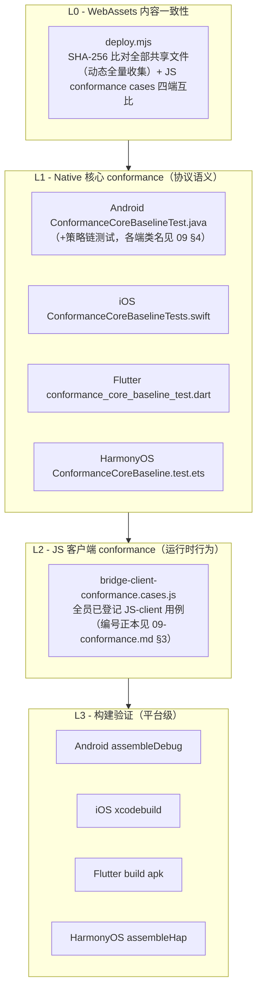

# 04 跨端设计

> 更新日期：2026-09  
> 适用平台：Android · iOS · Flutter · HarmonyOS

---

## 1 设计目标与原则

### 1.1 核心命题：协议一致 vs 共享运行时

JsBridge2 不追求"write once, run anywhere"，而是追求"same protocol, same semantics"。

| 取舍项 | 选择 | 理由 |
|--------|------|------|
| 运行时 | 各端独立实现（Java / Swift / Dart / ArkTS） | 适配各平台语言生态，无跨语言 FFI 复杂度 |
| 传输层 | 各端使用平台原生 WebView API | 性能最优，符合各端系统限制 |
| 协议信封 | 跨端完全统一的 JSON 字段集 | 保证 JS 侧 `core-bridge-client.ts` 无需感知平台差异 |
| 安全策略链 | 跨端固定求值顺序 | 保证同一请求在四端得到同语义安全决策 |
| WebAssets | 四端携带完全相同的二进制副本 | JS 侧行为无歧义，conformance 可跨端复用 |

### 1.2 五条设计原则

> **本节为五条设计原则正本**——`docs/01 §1` 等处引用本节，不复述清单；命名与排序出现分歧时以本节为准。

**Protocol-first（协议优先）**
先冻结协议规范（消息信封、握手契约、策略链、错误码），再启动各端实现。任何平台实现都不得扩展或收窄协议字段的语义。

**Behavior-consistent（行为一致）**
同一 JSON 输入在四端必须产生同语义输出——相同的错误码、相同的握手响应结构、相同的会话生命周期语义。

**Layered kernel（三层叠加内核）**
每端都遵循三层叠加结构，依赖方向自上而下：

```
extensions → JsBridge → CoreBridge → api
                  ↓
              security → api
```

- `CoreBridge`（Tier 1）：纯协议分发，零 security 依赖
- `JsBridge`（Tier 2）：会话/策略/握手，叠加在 CoreBridge 之上
- `extensions`（Tier 3）：可选适配器
- `api`：共享契约（含 `TrustedPageContext`，跨层使用）
- `security`：策略链 + 会话管理（Tier 2 组件，不依赖 core）
- transport 归入 core（Tier 1 组件），security 与 transport 互相隔离

**Additive evolution（累加演进）**
协议 v1 只允许向后兼容的累加变更：可新增可选字段，不可重命名或删除已有字段。新字段必须能被旧客户端安全忽略。

**Progressive enhancement（渐进增强）**
只有核心协议（消息信封、`kind` 语义、握手契约）是不可省略的基座，**其余所有特性都是可插拔的**：宿主不显式开启就不生效。这条原则统一解释了以下设计——

| 可插拔项 | 默认状态 | 开启方式 |
|---------|---------|---------|
| `HandshakeGatePolicy` / `OriginPolicy` / `MethodGatePolicy` / `SessionPolicy` | 关闭（`securityConfig` 传 `null`） | 传入 `SecurityConfig`（两个白名单字段显式配置） |
| `extraPolicies` | 空 | 宿主注入自定义 `PolicyRule` |
| `extensions` 层（lifecycle / registry / system） | 不装配 | 宿主按需组装，core 不依赖 extensions |
| 平台 extensions 实现程度 | 各端可不同 | 各端按需实现，不影响协议一致性 |

因此新增特性时，默认形态应当是"关闭且可选"，而不是"默认启用再提供开关关掉"。若某特性无法做成可插拔，须显式论证它为何属于核心协议。

---

## 2 整体跨端架构

### 2.1 四端与共享 WebAssets 关系



### 2.2 核心分层横向对比



> 除 transport 接线外，箭头语义统一为「X → Y = X 依赖 Y」：core 依赖 api（Tier-2 入口 JsBridge 另依赖 security），security 依赖 api；transport 接口位于 core 内部——T → C 表示 CoreBridge 持有 transport 句柄的接驳，P → T 表示平台适配器实现该接口。依赖规则与 [02-architecture.md §2.2](02-architecture.md) 一致。

---

## 3 协议一致性边界

### 3.1 必须跨端统一的内容

#### 消息信封（Protocol v1）

所有消息使用统一 JSON 对象，字段语义在四端完全相同：

| 字段 | 类型 | 说明 |
|------|------|------|
| `id` | string | 消息唯一 ID |
| `sessionId` | string | 握手前为空，正常请求必填 |
| `kind` | `"request"` \| `"response"` \| `"event"` | 消息方向与类型 |
| `method` | string | 方法名 |
| `ts` | number | Unix 毫秒时间戳 |
| `timeoutMs` | number | 请求超时提示 |
| `keep` | boolean | 流式请求标志 |
| `payload` | any \| null | 业务 payload |
| `reqId` | string \| null | response 对应的 request id |
| `done` | boolean \| null | 流式完成标志 |
| `ok` | boolean \| null | 响应成功标志 |
| `error` | object \| null | 归一化错误对象 |
| `scopeId` | string \| null | 可选 request 字段：标识请求所属逻辑页面 scope（见 [03-protocol.md §2 / §7.3](03-protocol.md)）；四端解析存储但 v1 不消费（协议预留） |

#### 消息模型（纯异步）

协议为纯异步消息模型，**不支持同步调用**，这是必须四端统一的内容：

- JS → Native 调用为回调式（`success` / `fail`），无同步返回值；Native 处理结果以独立 `response` 消息回传。
- Native → JS 为 fire-and-forget 注入，不等待 JS 执行结果。
- **任何一端不得单方面提供同步 API**（如利用 Android `addJavascriptInterface` 的同步返回能力），否则破坏协议一致性。**唯一豁免**：transport 控制面原语 `requestBridgeChannel`（见下方"通道建立入口"）——其同步返回值是信道建立 ack，不是协议数据面同步调用，不在本约束范围内。

该约束源于四端原生通道能力的不对称：iOS WKWebView 无同步通道（`WKScriptMessageHandler` / `evaluateJavaScript` 均为异步），四端交集只有异步。详见 [03-protocol.md §1 消息模型](03-protocol.md)。

#### 通道建立入口（`requestBridgeChannel`，transport 控制面）

> 本节为 transport 层入口的正式契约，**不入 [03-protocol.md §7 保留方法表](03-protocol.md)**。

**定位与分层**：`requestBridgeChannel` 是注入层/transport 控制面原语，**只做一件事**（触发建通道），不承载数据、不暴露能力——协议定义"消息在已建立信道上流动"，而它是"让信道存在"的原语；其"响应"是 `bridge:channel` 端口投递事件而非 reqId 配对的协议 response。真正的信任边界仍是握手门控（策略链），入口爆炸半径仅资源消耗，由资源守卫约束。

**签名与前向兼容**：入口收**可选 JSON 参数**（opts），约定**忽略未知字段**——reqId 为 opts 的第一个正式字段（由 JS transport 生成，入口只透传回显，页面不可注入）。未来 transport 演进（轮换参数、按 frame 供通道、QoS）均落在"给请求加参数"上，四端旧实现天然前向兼容。入口名与 `bridge:channel` 事件词汇在 v1 定死，为公共 API。

**入口调用的平台约束（实锤案例，任何重实现 JS 侧消费方必须遵守）**：Android 注入对象的包装层校验方法调用的 this 绑定——**必须以方法调用形式在注入对象上调用（`window.__jsbridge2__.requestBridgeChannel(opts)`），不得解构引用后调用（`const f = obj.requestBridgeChannel; f(opts)`）**，后者抛 `Java bridge method can't be invoked on a non-injected object`，且该异常在 JS 侧可能被消费方的 try/catch 静默吞掉、表象退化为信道超时（真机验证过的失败模式）。

**宿主 bind 时序与首个请求的暂存补投**：哑入口随 transport 构造注入（早于 loadUrl），`pendingListener` 要到首次 `bind()`（宿主 `resetTransport()`，通常在 onPageFinished）才存在——bind 前到达的通道请求由 `PendingChannelRequests` **暂存**（容量 64、超限丢最旧、重复 reqId 幂等、随 epoch 轮换清空），`bind()` 时按 latest-wins 补投给 listener（仅补投最新 reqId，被取代的旧请求不补投）建立通道，首个请求无需等待 T+退避重试（真机验证：首轮握手 ~67ms 达成；验收锚点 C47）。

**同步 ack 的平台分层**：

| 平台 | 同步注入面 | 同步 ack 义务 |
|------|-----------|--------------|
| Android（`@JavascriptInterface`） | 有（v1 唯一注入 pull 入口的平台） | **必须**同步返回 ack |
| iOS（WKWebView） | 平台层面无同步通道 | **豁免**——JS 侧统一发送请求，iOS 不等待 ack，依赖常驻通道（`WKScriptMessageHandler`）直接进握手；"resident 确认"由 JS 侧同步探测 `window.webkit.messageHandlers` 达成，而非 Native 回执 |
| Flutter / HarmonyOS | HarmonyOS 具备同步注入面（`JavaScriptProxy`）但 v1 未注入该入口；Flutter 的 JS→Native 通道（`addJavaScriptChannel`）为异步、无同步面 | 义务空置——两平台为常驻通道平台（见下注） |

> **常驻通道注记**（与 [06-channel-establishment.md §2.1](06-channel-establishment.md) 一致）：pull 入口**仅 Android 注入**；iOS / Flutter / HarmonyOS 为常驻通道平台，JS SDK 构造期探测（`isResidentChannel()`，`native-transport.ts`）后跳过 pull 请求，不存在 `requestBridgeChannel` 调用与 ack 义务。上表对各端同步注入面有无的区分仅为平台能力分层声明——若未来某端引入该入口，须遵守本 ack 契约。

**ack 四态**（同步面平台，禁止静默——JS 重试退避逻辑须区分三种失败）：①匹配 → 回显 reqId；②限频 → 错误标识 `rate_limited`（JS 侧退避重试）；③入口不存在 → 无调用对象（老宿主，JS 侧退避重试跨宿主 bind 时机，耗尽 fail `E_CHANNEL_CLOSED`）；④请求畸形 → 错误标识 `malformed`（JS SDK 防御路径同②处理）。JS 侧四态完整消费语义正本见 [06-channel-establishment.md §2.1](06-channel-establishment.md)。

**资源守卫**：重复/恶意调用的限频与按页面实例限量数值由宿主自定；契约只约束拒绝语义 = 同步返回错误标识，不得静默。

**frame 归因能力差异（已登记平台限制）**：建链哑入口层拿不到 origin/页面实例信息，部分平台连调用方 frame 也无法归因——Android 的 `addJavascriptInterface` 对页面内**所有 frame** 可见（跨域 iframe 与主 frame 共享同一入口与额度）；iOS 经 `WKScriptMessageHandler` 可得主 frame 归因（C58）。Android 的缓解：(a) `postWebMessage` 目标为主 frame，跨域 iframe 拿不走端口（身份伪造不可行，残留危害仅为额度消耗）；(b) 限频 per-bind + **空闲复充窗口**（静默超过 windowMs 即额度归位），一次性烧光额度只造成 windowMs 级暂时不可用而非"直到下次导航"。持续洪泛期间主 frame 仍受限，为 Android 平台能力边界、v1 接受的残余（docs/09-conformance.md §4）。

**宿主 invalidate 职责**：pull 模式下 `onPageFinished` 的宿主义务从"bind"变为"**invalidate/轮换**"——导航时宿主必须清理 per-WebView 通道记录并关闭旧端口；"忘记 invalidate"的故障（通道陈旧、旧 session 残留）比"忘记 bind"更隐蔽。可测断言见 [09-conformance.md](09-conformance.md) C42（测试桩在导航 / `pageshow(persisted)` 后断言旧 port 已关闭）；JS 侧 reqId 超时自愈为最终兜底，自愈路径 console.warn，不静默掩盖宿主 bug。

**投递与采纳规则**：Native 建通道后以 `postWebMessage` 投递 `bridge:channel` 信封 `{"type":"bridge:channel","reqId":"..."}` + port（投递目标 `Uri.parse("*")` 约束不变，见 02 §6.2 通道安全注记）；JS 侧采纳/丢弃规则、reqId 往返全规则、轮换粗语义（含 in-flight 下行丢弃语义）见 [06-channel-establishment.md](06-channel-establishment.md)；验收断言见 [09-conformance.md](09-conformance.md) C40/C41。

#### 错误码基线

所有平台必须实现以下错误码，且语义不可更改：

- `E_INVALID_MESSAGE` — 消息结构/类型非法
- `E_POLICY_DENY` — 策略链拒绝（v1 起语义收缩：握手门禁拒绝改用 `E_NOT_READY`，不再混码）
- `E_ORIGIN_DENY` — origin 不在白名单
- `E_METHOD_NOT_ALLOWED` — 方法不在白名单
- `E_SESSION_INVALID` — 会话缺失、过期或页面实例不匹配
- `E_METHOD_NOT_FOUND` — 无对应 Native handler
- `E_INTERNAL` — Native 侧未捕获异常
- `E_CHANNEL_CLOSED` — 信道建立失败（transport 层，JS 本地产生）
- `E_NOT_READY` — 会话未建立即调用非握手方法（transport 层，JS 门控与 Native HandshakeGate 双侧同码）
- `E_BUSY` / `E_RESULT_EMPTY` / `E_LAUNCH_FAILED` — registry 扩展及宿主插件约定使用（核心不产生）
- `E_TIMEOUT` / `E_CANCELED` — JS 客户端本地产生（超时/AbortSignal 取消），不跨端传输；详见 [03-protocol.md §8 错误模型](03-protocol.md)

错误对象固定形状：

```json
{
  "code": "E_INTERNAL",
  "message": "...",
  "retryable": false,
  "details": {}
}
```

#### 安全策略链（固定求值顺序）

四端必须按以下顺序串行求值，不可跳过或重排：

1. `RequestShapePolicy` — 校验消息结构（`kind`、`method` 非空）
2. `HandshakeGatePolicy` — 非握手请求在会话建立前一律拒绝（`E_NOT_READY`，与 `E_POLICY_DENY` 分立；`SecurityConfig` 非 null 时进链）
3. `OriginPolicy` — origin 白名单校验（opt-in：`allowedOrigins` 显式配置且不含 `*` 时进链）
4. `MethodGatePolicy` — 业务方法白名单校验（opt-in：`methodWhitelist` 显式配置且不含 `*` 时进链；协议方法由框架装配期自动并入放行集）
5. `SessionPolicy` — 会话有效性、页面实例匹配（`SecurityConfig` 非 null 时进链）
6. `extraPolicies` — 宿主注入的自定义策略（按注入顺序追加）

#### null 配置安全边界声明（配置模型定义见 [02-architecture.md §4.2 安全配置模型](02-architecture.md)）

`securityConfig == null` 宿主（不启用握手门控，页面重置后立即可用）下，Native 侧无会话门控，**安全边界仅由 JS 侧门控承担**——而 JS 侧门控可被直接使用 `CoreBridgeClient` 的代码绕开（渐进增强的代价）。宿主须知：

- null 配置仅适用于**全部业务方法均为低危**的宿主；
- 不应在 null 配置下暴露高危方法（如任意文件读写、拨号）——此类方法必须传入 `SecurityConfig`（握手 + 方法白名单）；
- origin 防护在传入 `SecurityConfig` 且 `allowedOrigins` 不含 `*` 时生效。

#### 握手语义

握手方法名固定为 `bridge.handshake`，成功响应 payload 必须包含以下**五个字段**（字段集合为契约，数值为示例——`sessionTtlMs` 具体取值由宿主决定，如 demo 默认 15 分钟）：

```json
{
  "sessionId": "...",
  "sessionTtlMs": 900000,
  "policyVersion": "v1",
  "origin": "file://",
  "accepted": true
}
```

#### 畸形消息处理

必填字段（`id`/`kind`/`method`）的解析语义四端统一（详见 [03-protocol.md §3.4](03-protocol.md#34-畸形消息处理四端统一)）：

- JSON 语法错、非对象、必填字段缺失/类型非法（含 `kind` 非法枚举、`method` 非字符串）→ **静默丢弃**，无响应；任何端不得对缺失 `kind` 做默认值兜底。
- `method` 为空字符串（信封其余部分合法）→ `RequestShapePolicy` 拦截，返回 `E_INVALID_MESSAGE` 响应。
- `method` 为纯空白字符串（如 `"  "`）为**已登记四端差异**：Android / iOS 判空前先 trim → `E_INVALID_MESSAGE`；Flutter / HarmonyOS 仅判空串 → 放行进入后续链路（详见 [03-protocol.md §3.4](03-protocol.md)）。

#### 响应信封回显

响应回显请求的 `sessionId`/`method`/`timeoutMs`/`keep` 四字段，四端行为一致。

#### 握手与白名单的相对顺序

`methodWhitelist` 语义为**业务方法白名单**——协议方法（`bridge.handshake` / `bridge.cancelScope`）由框架在装配期自动并入放行集（`BridgeApiContract` 定义协议方法集），白名单未含 `bridge.handshake` 时握手请求仍 `ok=true`（四端一致，含 Flutter；conformance C35/C48）。`MethodGatePolicy` 组件本身保持纯集合成员检查，自动并入发生在 `JsBridge` 装配期。

#### 握手响应与 ready listener 次序

握手响应先于 ready listener 副作用（如 lifecycle 补发事件）写入 transport——Android 由即时发送架构天然保证；iOS / Flutter / HarmonyOS 在 `bindTransport()` 闭环内保证（响应数组发送完毕后才触发 listeners）。宿主不经 `bindTransport` 直调 processIncoming 系列方法时，listener 在方法返回前触发，此时响应发送次序由宿主自行管理，协议不承诺。

#### 会话语义

- `resetPageInstance()` 调用时，上一个页面实例的会话立即失效，后续该会话的请求返回 `E_SESSION_INVALID`。
- 会话 TTL 到期后请求同样返回 `E_SESSION_INVALID`。
- 每次 `resetPageInstance()` 生成新的 `pageInstanceId`，跨实例请求被拒绝。
- 策略链会话校验必须按请求消息中的 `sessionId` 查找会话记录（`sessionService.find`），不得使用握手指针等旁路引用——后者会使错误 `sessionId` 与 TTL 校验双双失效。

#### 流式语义

- `keep=true` 请求允许连续帧响应。
- 中间帧：`done=false`。
- 最终帧：`done=true`。
- 客户端在收到 `done=true` 或超时前保持回调注册。

### 3.2 允许各端自定义的内容

| 自定义项 | 说明 |
|---------|------|
| 传输实现 | WebMessagePort（Android）/ WKScriptMessageHandler（iOS）/ JavaScriptChannel（Flutter）/ ArkWeb（HarmonyOS） |
| origin 来源 | 四端均通过 `PageContextProvider` 注入点由内核派生：宿主实现 provider 从 WebView 当前 URL 取 scheme + host（经内核 `OriginNormalizer` 归一化，C54），内核在收消息时调用 `createContext(message, pageInstanceId)` 生成 `TrustedPageContext`。provider 为必备依赖——未注入时四端在装配/绑定期即 fail-fast 报错，不存在退化为宿主声明裸 origin 字符串的路径 |
| lifecycle 枚举值 | `runtime.state` 只定义推送机制，状态名（如 `created`/`resumed`/`paused` 等）由各宿主决定 |
| lifecycle 发送时机 | 由宿主根据平台生命周期回调自行决定 |
| lifecycle payload schema | payload 结构协议固定为 `{ "state": string, "seq": number }`（见 [03-protocol.md §7.2](03-protocol.md)）；state 的取值集合由宿主定义 |
| extraPolicies 业务逻辑 | 完全由宿主注入，协议不约束 |
| extensions 实现 | 各端按需实现（Android 有 lifecycle/registry/system；iOS / Flutter / HarmonyOS 有与 Android 对齐的 LifecycleExtension，registry 仅 Android 保留），extensions 层不影响协议一致性 |
| 产品特定错误码 | 允许新增（如 `E_LOCATION_UNAVAILABLE`），但基线码不可覆盖语义 |

---

## 4 各端实现差异对比

### 4.1 传输层对比

| 平台 | 传输机制 | 发送方向（Native→JS） | 接收方向（JS→Native） | fallback |
|------|---------|---------------------|---------------------|---------|
| Android | `WebMessagePort`（`WebMessageChannel`） | `port.postMessage(json)` | `onMessage` 回调 | `API < M`：`LegacyJavascriptChannel`（`addJavascriptInterface`） |
| iOS | `WKScriptMessageHandler` + `WKUserScript` | `webView.evaluateJavaScript(...)` | `userContentController(_:didReceive:)` | 无，WKWebView 为最低支持 |
| Flutter | `webview_flutter` JS channel | `webViewController.runJavaScript(...)` | `addJavaScriptChannel` 回调 | 无 |
| HarmonyOS | ArkWeb `runJavaScript` + `JavaScriptProxy` | `webviewController.runJavaScript(js)` | `JavaScriptProxy` 注册的 ArkTS 函数 | 无 |

> **四端通道均为单向异步管道**：上表所有通道的调用均不阻塞等待跨端返回值——这是协议纯异步模型的传输层基础（iOS 从平台层面无同步通道；Android `addJavascriptInterface` 技术上支持 JS 同步调用，但本项目的 `LegacyJavascriptChannel` 将其签名固定为 `void`，刻意弃用该能力以对齐四端语义，见 [§3.1 消息模型](#31-必须跨端统一的内容)）。

### 4.2 origin 来源对比

四端统一提供 `PageContextProvider` 注入点（Android 为 `PageContextProvider` 接口、iOS 为 `PageContextProvider` protocol、Flutter 为 `PageContextProvider` 抽象类、HarmonyOS 为 `PageContextProvider` interface）。注入后，入站处理由内核调用 provider 派生 `TrustedPageContext`，origin 不再以裸字符串跨越信任边界。

| 平台 | provider 实现 | origin 来源 |
|------|--------------|-----------|
| Android | `AndroidWebViewPageContextProvider`（extensions） | `WebView.getUrl()` 取 scheme + host |
| iOS | `PageContextProvider` 协议由宿主实现（示例 `WebViewPageContextProvider`，见 `js_bridge_ios/README.md`） | `webView.url` 取 scheme + host |
| Flutter | `PageContextProvider` 抽象类由宿主实现（示例 App 为私有类 `_WebviewPageContextProvider`，经 `attachPageContextProvider` 注入） | 导航回调缓存的 `_currentUrl` 取 scheme + host |
| HarmonyOS | `FilePageContextProvider`（宿主实现） | 常量 `file://` |

所有平台对 origin 白名单使用**精确匹配**（exact match），不使用 prefix match。

> **allowedOrigins / methodWhitelist 配置校验**：`SecurityConfig` 非 null 时两者必须显式设置（不可为 `null`），否则构造期直接报错（Android 抛 `IllegalArgumentException`、iOS 触发 `preconditionFailure`、Flutter/HarmonyOS 抛 `ArgumentError` / `Error`）——消除“升级却未获防护”的静默失败。`{"*"}` 是合法的显式“不限制该维度”声明，对应策略节点不进链；`methodWhitelist` 为**业务方法白名单**，协议方法（`bridge.handshake` / `bridge.cancelScope`）由框架装配期自动并入放行集；`securityConfig` 传 `null` 时不启用握手，无需配置这两个字段。详见 [02-architecture.md §4.2](02-architecture.md)。
>
> **已接受的 API 形态分叉**：协议方法集聚合常量在 Android/iOS/Flutter 为不可变常量（`PROTOCOL_METHODS` / `protocolMethods`），在 HarmonyOS 因 ArkTS 的 `static readonly` 不禁止 `add`/`clear`，改为静态方法 `getProtocolMethods()` 每次返回防御性拷贝——防篡改语义四端一致，调用方式不同。

### 4.3 resetPageInstance 时机对比

| 平台 | resetPageInstance 调用时机 | 实现位置 |
|------|-----------------|---------|
| Android | 宿主在 `WebViewClient` 回调中调用（示例为 `onPageFinished`，先 `resetTransport()` 再 `resetPageInstance()`） | 示例 `WebActivity` / `CompatWebActivity` |
| iOS | `BridgeHost.init()` 后立即调用 | `BridgeHost.init()` |
| Flutter | `NavigationDelegate.onPageStarted()` | `FlutterBridgeController` 导航回调 |
| HarmonyOS | Web 组件 `onPageBegin` 事件 | `Index.ets` |

以上回调仅覆盖**真实页面导航**。SPA 路由跳转（`pushState` / `replaceState` / `hashchange`）不触发这些回调，属于预期行为——JS 上下文未变，session 自然延续，无需调用 `resetPageInstance`。SPA 逻辑页面销毁时的回调清理属于 Scope 层职责，详见 [05-lifecycle-layers.md](05-lifecycle-layers.md)。

### 4.4 测试运行方式对比

| 平台 | Native 核心测试 | JS 客户端 conformance | 构建验证 |
|------|---------------|----------------------|---------|
| Android | `./gradlew :js-bridge-core:test` | `node .../bridge-client-conformance.cases.js` | `assembleDebug` |
| iOS | `swift test --package-path js-bridge-core-swift` | `node .../bridge-client-conformance.cases.js` | `xcodebuild ... build` |
| Flutter | `flutter test`（core package） | `node .../bridge-client-conformance.cases.js` | `flutter build apk --debug` |
| HarmonyOS | `bash scripts/test_harmony.sh`（hypium 真机执行：同步 src/test 到 ohosTest 副本 → assembleHap → hdc 安装 → `aa test`；无设备时退化为编译验证） | `node .../bridge-client-conformance.cases.js` | `hvigorw assembleHap` |

### 4.5 扩展模块对比

| 扩展能力 | Android | iOS | Flutter | HarmonyOS |
|---------|---------|-----|---------|-----------|
| Lifecycle 事件推送 | `LifecycleExtension.java` | `LifecycleExtension.swift` | `lifecycle_extension.dart` | `LifecycleExtension.ets` |
| Handler 注册中心 | `BridgeResultRegistry` | 无独立 registry | 无独立 registry | 无独立 registry |
| Single-occupy 并发防重 | `SingleOccupyingLaunches` | 无 | 无 | 无 |
| System adapter | `AndroidWebViewBridgeTransport` | `WKWebViewBridgeTransport` | `FlutterBridgeController` | `Index.ets` entry |

---

## 5 共享 WebAssets 机制

### 5.1 工程结构

SDK 和 demo 源码统一在 `web-assets/` 下以 pnpm monorepo 管理：

```
web-assets/
  packages/
    sdk/                     ← jsbridge-sdk 源码（TypeScript）
      src/
        index.ts             ← 包出口，重导出各模块
        core/                ← protocol.ts, core-bridge-client.ts
        platform/            ← native-transport.ts, web-entry.ts, loader.ts（getBridge）
        extensions/          ← ready-ext.ts, lifecycle-ext.ts
        js-bridge-client.ts  ← 会话门控封装（createJsBridgeClient）
      dist/
        esm/                 ← npm 消费者使用
        iife/jsbridge-sdk.js ← native bundle 用（<script src>）
    demo/                    ← demo 示例（private，不发布）
      src/                   ← index.html, entry.js, api/, page/
      dist/                  ← 同步到四端的产物
  scripts/deploy.mjs         ← 同步与校验
```

各平台目录下的 WebAssets 副本**不纳入版本管理**，由 `pnpm sync` 填充。JS SDK 内部设计（传输检测、超时/settled 机制、AbortSignal）详见 [web-assets/docs/01-js-sdk-design.md](../web-assets/docs/01-js-sdk-design.md)。

### 5.2 四端 Assets 路径

| 平台 | WebAssets 根路径 |
|------|----------------|
| Android | `js_bridge_android/js-bridge-example/src/main/assets/web/` |
| iOS | `js_bridge_ios/js-bridge-example/WebAssets/` |
| Flutter | `js_bridge_flutter/assets/web/` |
| HarmonyOS | `js_bridge_harmony/js-bridge-example/entry/src/main/resources/rawfile/web/` |

### 5.3 同步机制

```bash
cd web-assets

# 构建 SDK（ESM + IIFE + .d.ts）+ demo，同步到四端，校验一致性
pnpm sync

# 仅校验（不重新构建）
pnpm check

# 清除四端 native 目录下的 WebAssets 文件
pnpm clean:native
```

校验通过输出 `check passed: <N> files`（N 由 `deploy.mjs` 动态收集当前共享文件数，6 个 demo 产物文件时即 `check passed: 6 files`）。

任何 `web-assets/packages/` 下的文件变更后必须运行 `pnpm sync`。

**规则：任何 WebAssets 文件变更后必须立即运行 `pnpm sync`，确保四端同步。**

---

## 6 一致性保障机制

### 6.1 三层验证体系



### 6.2 Native 侧用例覆盖

**用例清单不在本文维护副本**——编号登记正本见 [09-conformance.md §3](09-conformance.md)，各端覆盖与承载测试见其 §4，由 `scripts/check_conformance_ids.sh` 程序化校验（未登记编号、四端漂移、登记未实现、自称最大编号不一致四类问题）。此处保留副本清单已被证明是漂移源（两轮用例扩张 C43–C64 未同步到本节）。

### 6.3 各端 conformance 文件路径

| 平台 | Native core 测试 | JS client 测试 |
|------|-----------------|---------------|
| Android | `js_bridge_android/js-bridge-core/src/test/java/.../ConformanceCoreBaselineTest.java` | `js_bridge_android/js-bridge-example/src/test/js/bridge-client-conformance.cases.js` |
| iOS | `js_bridge_ios/js-bridge-core-swift/Tests/BridgeCoreTests/ConformanceCoreBaselineTests.swift` | `js_bridge_ios/js-bridge-example/tests/js/bridge-client-conformance.cases.js` |
| Flutter | `js_bridge_flutter/packages/js_bridge_core/test/conformance_core_baseline_test.dart` | `js_bridge_flutter/tests/js/bridge-client-conformance.cases.js` |
| HarmonyOS | `js_bridge_harmony/js-bridge-core/src/test/ConformanceCoreBaseline.test.ets` | `js_bridge_harmony/tests/js/bridge-client-conformance.cases.js` |

---

## 7 各端集成指南

各端集成代码的正本在各平台项目 README（分工声明见 [README.md](README.md)"快速开始"）：[Android](../js_bridge_android/README.md) · [iOS](../js_bridge_ios/README.md) · [Flutter](../js_bridge_flutter/README.md) · [HarmonyOS](../js_bridge_harmony/README.md)。本节只保留四端**构造口径差异对照**，不内联各端完整集成代码——同一代码在 docs 与 README 各存一份必然漂移。

| 维度 | Android | iOS | Flutter | HarmonyOS |
|------|---------|-----|---------|-----------|
| 依赖形态 | Gradle module：`implementation project(':js-bridge-core')` | Swift Package：`.package(path: "../js-bridge-core-swift")` | pub 本地包：`path: packages/js_bridge_core` | oh-package5 本地包：`"file:../../js-bridge-core"` |
| `SecurityConfig` 构造形态 | 嵌套类 `JsBridge.SecurityConfig`，链式 setter：`new SecurityConfig().allowedOrigins(...)` | 类字段赋值：`config.allowedOrigins = [...]` | 命名参数构造、字段为 final（不支持级联赋值） | 内联对象字面量：`{ allowedOrigins: new Set([...]), ... }` |
| 构造入口 | `new JsBridge(transport, provider, securityConfig)` 三参顺序构造 | `JsBridge(securityConfig:pageContextProvider:transport:)` 命名参数；transport 常用 `WKWebViewBridgeTransport` | `JsBridge(securityConfig:..., pageContextProvider:...)`；transport 为函数，构造后经 `attachTransport()` 注入 | `new JsBridge({ securityConfig, pageContextProvider, transport })` 选项对象；transport 为函数，构造期注入 |
| 入站闭环 | `resetTransport()`（双向闭环，仅 Android 有此形态） | `bindTransport()` | `attachTransport()` 注入发送函数 + `bindTransport()` 返回闭包接 `addJavaScriptChannel` | `bindTransport()` 返回闭包接 ArkWeb `javaScriptProxy` |

语义注意点：

- **四端通道均无同步调用**——传输层差异对比见 §4.1，通道建立契约（pull 模型、reqId 往返）见 §3.1；Android `LegacyJavascriptChannel`（旧版 WebView 兼容通道）见 §4.1。
- **resetPageInstance 时机**对比正本见 §4.3；iOS `WKWebViewBridgeTransport` 的封装细节（script message handler 注册、bootstrap 注入、清理）见 [07-transport-bridge-design.md §3](07-transport-bridge-design.md)，Flutter/HarmonyOS 闭包接线的完整示例见各自 README。
- **Flutter** 的 `allowedOrigins` 条目必须是归一化形态（[03-protocol.md §9](03-protocol.md) 细则 5）——写 `'about:blank'` 会归一化为 `""`，永不命中白名单（死配置）。

---

## 8 新增平台扩展指南

在协议约束下接入一个新平台，需要完成以下步骤：

### 8.1 核心内核实现

按照分层顺序实现以下模块：

| 步骤 | 模块 | 参照 |
|------|------|------|
| 1 | `BridgeMessage`（消息信封解析/序列化） | `BridgeMessage.java` |
| 2 | `BridgeError`（错误归一化） | `BridgeError.java` |
| 3 | `TrustedPageContext`（页面上下文快照） | `TrustedPageContext.java`（`api` 层） |
| 4 | `SessionRecord` + `SessionService`（会话管理） | `DefaultSessionService.java` |
| 5 | 策略链（`RequestShapePolicy` / `HandshakeGatePolicy` / `OriginPolicy` / `MethodGatePolicy` / `SessionPolicy`） | `PolicyEngine.java` |
| 6 | `JsBridge` + `CoreBridge`（请求生命周期调度） | `JsBridge.java` + `CoreBridge.java` |
| 7 | `BridgeTransport`（接口定义） | `BridgeTransport.java`（`core/transport`） |

### 8.2 平台适配层实现

实现 `BridgeTransport` 接口，连接平台 WebView API：

- `bind(listener)` — 初始化 WebView channel，将 JS→Native 消息路由到 `listener`
- `send(messageJson)` — 调用 WebView API 将 JSON 推送到 JS 侧（`window.__jsbridge2__.receive`）
- `close()` — 释放 channel 资源

### 8.3 WebAssets 部署

将 Android 参考实现中的 WebAssets（`js_bridge_android/js-bridge-example/src/main/assets/web/`）完整复制到新平台的 assets 目录，运行 `pnpm check` 确认一致。

在 `web-assets/scripts/deploy.mjs` 的 `PLATFORM_ROOTS` 字典中新增新平台条目：

```javascript
const PLATFORM_ROOTS = {
  android: join(ROOT, 'js_bridge_android/js-bridge-example/src/main/assets/web'),
  ios:     join(ROOT, 'js_bridge_ios/js-bridge-example/WebAssets'),
  flutter: join(ROOT, 'js_bridge_flutter/assets/web'),
  harmony: join(ROOT, 'js_bridge_harmony/js-bridge-example/entry/src/main/resources/rawfile/web'),
  // 新平台：
  // new_platform: join(ROOT, 'js_bridge_new/example/assets/web'),
}
```

### 8.4 conformance 测试落地

- 使用平台测试框架（JUnit / XCTest / flutter_test / Hypium）实现 `ConformanceCoreBaseline` 测试，测试逻辑与 Android 参考实现保持逻辑等价
- **覆盖范围为全套已登记用例**（新增平台即第五端，须实现全员 Native-core 与 JS-client 用例，义务见 [09-conformance.md §6.1 触发表](09-conformance.md)），JS 客户端用例经四端同款的 `bridge-client-conformance.cases.js` 副本承载

### 8.5 宿主集成验收标准

- `resetPageInstance()` 在真实页面导航的生命周期回调中调用（各端时点不同——Android 示例在 `onPageFinished`，Flutter / HarmonyOS 在加载开始等价回调（`onPageStarted` / `onPageBegin`），iOS 在容器初始化期（`BridgeHost.init`）调用——均见 [§4.3](#43-resetpageinstance-时机对比)；SPA 路由不触发，属预期）
- `bridge.handshake` 可通过 JS 侧正常完成
- 所有 conformance 用例通过
- `pnpm check` 通过
- 构建产物可正常安装运行 demo

---

## 9 跨端变更影响评估

### 9.1 需要同步四端的变更

以下类型的变更必须在四端同步落地，并同步更新 WebAssets：

| 变更类型 | 典型示例 | 原因 |
|---------|---------|------|
| 消息信封字段增减 | 新增 `version` 字段 | JS 侧 `protocol.ts` 依赖信封结构 |
| 消息信封字段语义变更 | 修改 `done` 的语义 | 影响所有端的解析与校验 |
| 策略链顺序或步骤变更 | 调整 `HandshakeGatePolicy` 位置 | 影响各端安全决策结果 |
| 握手响应 payload 结构变更 | 新增 `instanceId` 字段 | JS 侧 `createJsBridgeClient` / ready-ext 依赖握手 payload |
| 错误码基线变更 | 新增基线错误码 | 影响 JS 侧错误处理与 conformance 用例 |
| 流式语义变更 | 修改 `keep`/`done` 约定 | 影响 Async handler 实现 |
| WebAssets 任意文件变更 | 修改 `packages/sdk/src/` | 必须同步到四端 assets 目录 |
| conformance 用例新增/修改 | 新增下一个编号（编号规则：取登记表最大 +1，见 [09-conformance.md §6.2](09-conformance.md)；编号已用至 C65（C09 / C44 为显式保留空缺，不登记、不得复用），不得复用旧编号） | 四端均需新增对应测试 |

**操作流程**：先更新 `docs/` 下对应文档（`03-protocol.md` 或 `02-architecture.md`），再同步更新四端实现 + WebAssets，最后验证 `cd web-assets && pnpm sync` 和所有 conformance 测试通过。

### 9.2 只需变更单端的内容

| 变更类型 | 典型示例 | 影响范围 |
|---------|---------|---------|
| 传输层实现优化 | 优化 Android `WebMessagePort` 内存管理 | 仅 Android |
| lifecycle 状态名/时机调整 | 新增 iOS `"willTerminate"` 事件 | 仅 iOS 宿主，protocol 不感知 |
| 宿主 extraPolicy 业务逻辑 | Android 新增权限检查策略 | 仅 Android 宿主 |
| 扩展模块新增 | Android 新增 `AnalyticsExtension` | 仅 Android |
| handler 业务实现 | Flutter `pickImage` 换用新 picker 库 | 仅 Flutter |
| demo UI 调整 | HarmonyOS demo 页面样式修改 | 仅 HarmonyOS |
| 平台构建配置 | Flutter `pubspec.yaml` 依赖升级 | 仅 Flutter |
| 产品特定错误码新增 | 新增 `E_LOCATION_UNAVAILABLE` | 允许各端独立新增，不影响基线码语义 |

### 9.3 变更检查清单

```
[ ] 是否修改了消息信封字段？          → 是：同步四端 + WebAssets
[ ] 是否修改了 web-assets/packages/sdk/src/？ → 是：cd web-assets && pnpm sync
[ ] 是否修改了策略链求值逻辑？         → 是：同步四端，更新 conformance 测试
[ ] 是否修改了错误码基线语义？         → 是：同步四端，更新 conformance 测试
[ ] 是否新增了 conformance 用例？      → 是：四端均需新增对应测试
[ ] 是否修改了握手/会话协议契约？      → 是：更新 docs/03-protocol.md，同步四端
[ ] 是否仅修改宿主/扩展/transport？   → 是：只需变更对应平台
```
