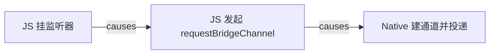
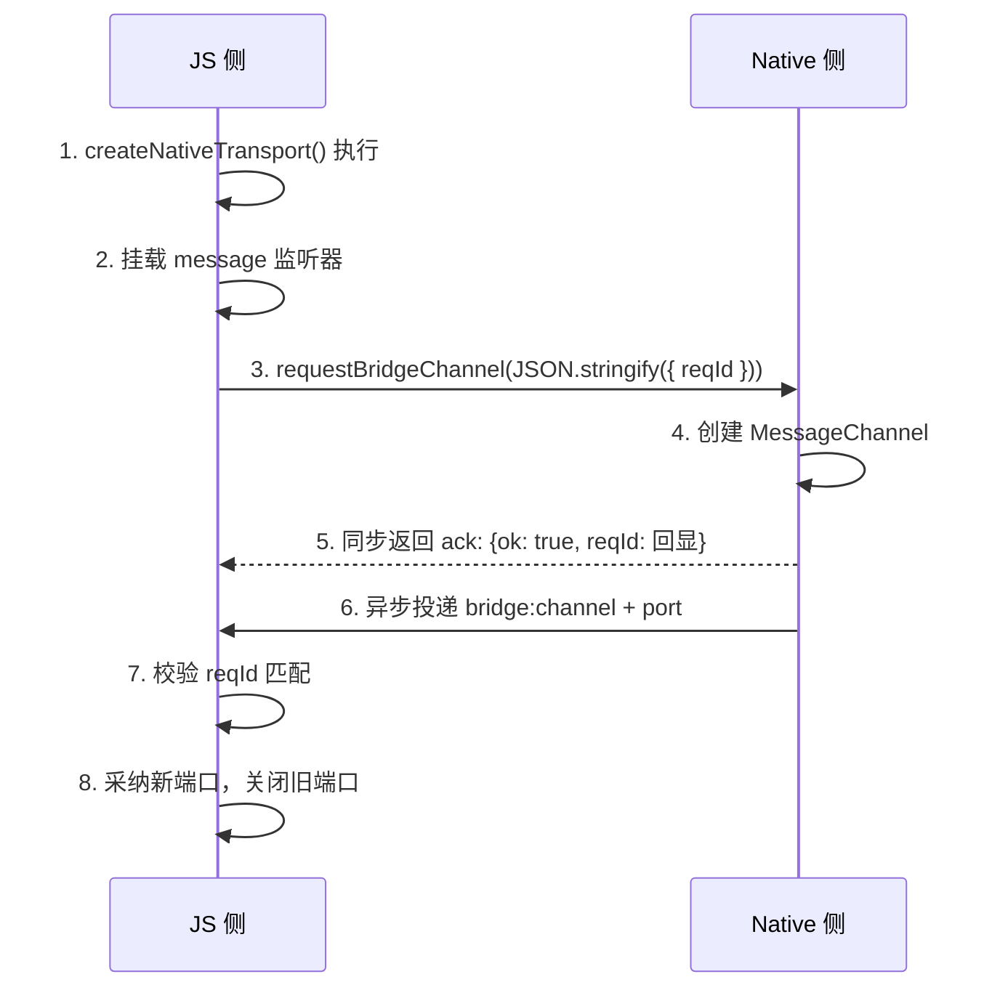
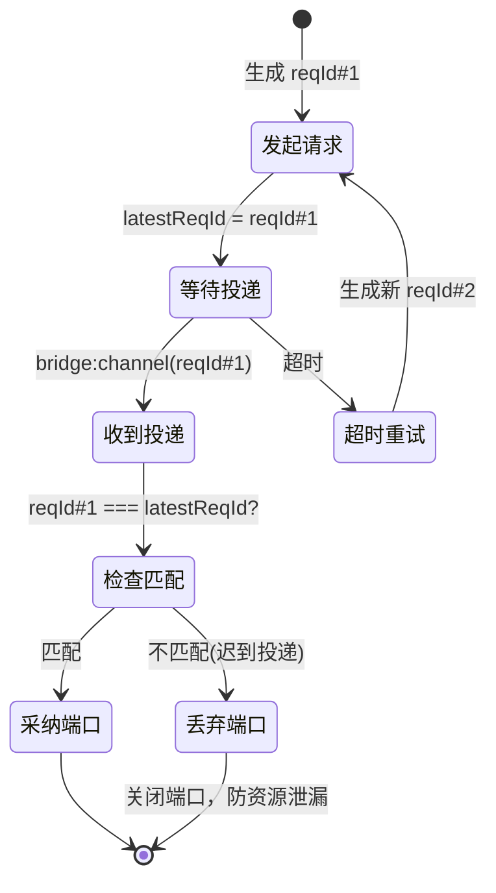
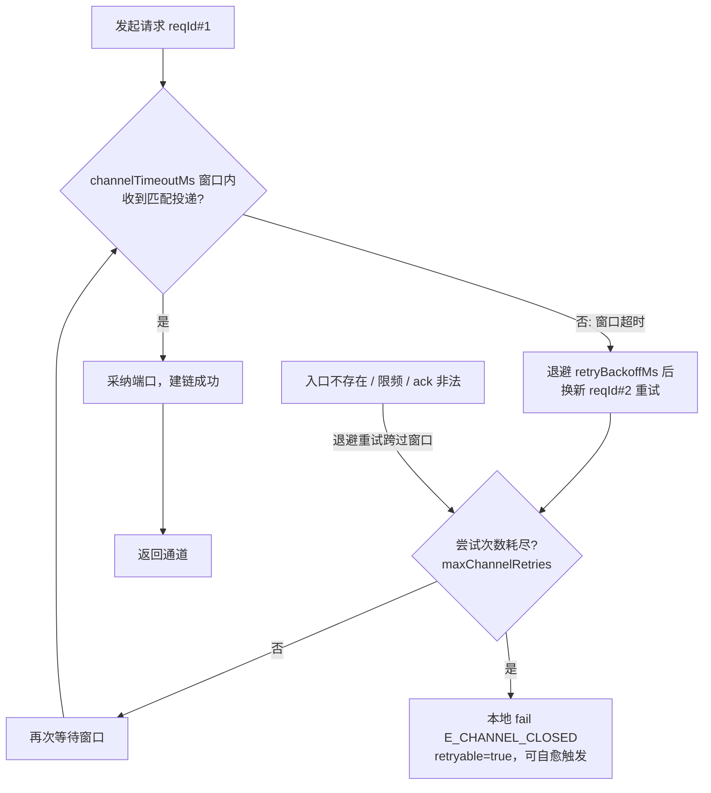
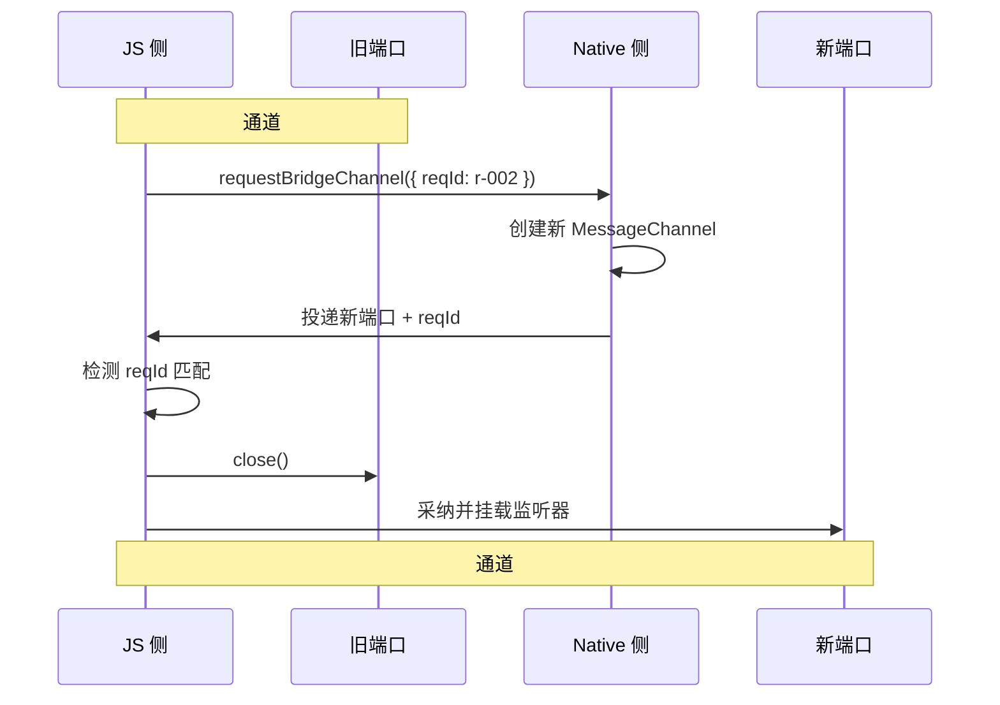
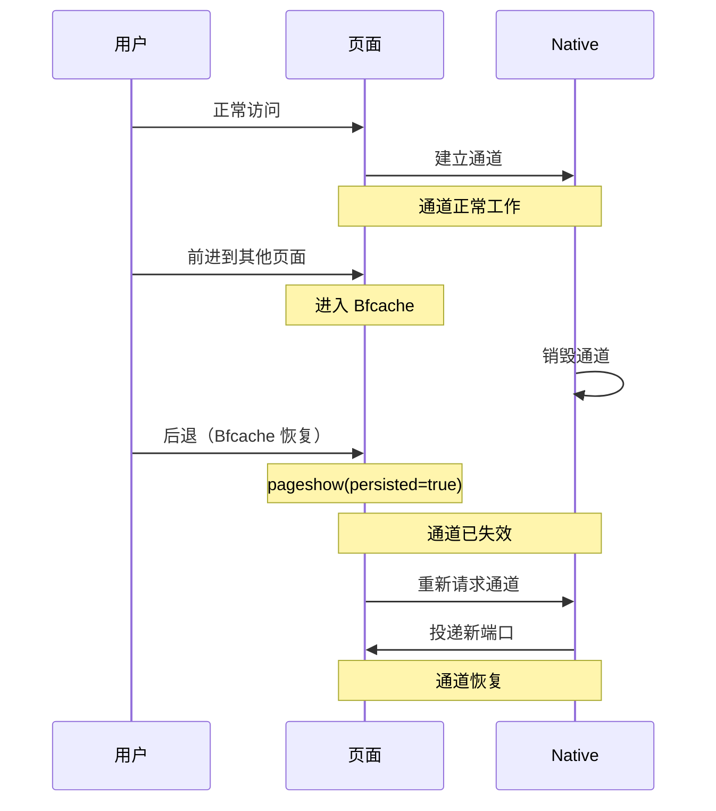
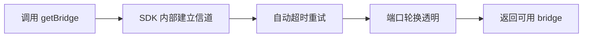
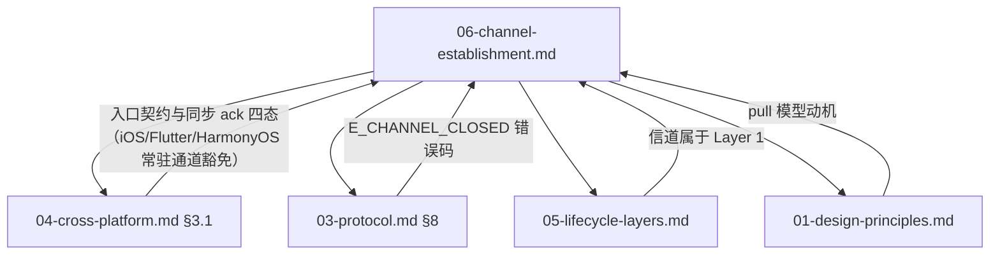

# 06 信道建立机制

> 更新日期：2026-09  
> 适用平台：Android · iOS · Flutter · HarmonyOS

本文档说明 JsBridge2 的信道建立机制设计。

---

## 1. 设计原则：pull 模型

### 1.1 核心思路

JsBridge2 采用 **JS 主导请求**的 pull 模型建立信道：



**核心收益**：将跨进程时序约定转化为 JS 单线程内语句顺序保证，从根本上消除竞态窗口。

### 1.2 信道建立流程



### 1.3 关键保证

| 保证项 | 实现机制 |
|--------|---------|
| 因果序 | JS 单线程内：先挂监听器，后发请求 |
| 幂等重试 | reqId 标识每次请求，支持超时重试 |
| 迟到检测 | reqId 不匹配的投递被丢弃 |
| 资源清理 | 采纳新端口时同步关闭旧端口 |

---

## 2. 协议细节

### 2.1 请求方法签名

pull 入口**仅 Android 注入**（`addJavascriptInterface` 哑入口）；iOS（`WKScriptMessageHandler`）与 Flutter / HarmonyOS（宿主注入 `NativeBridge.postMessage`）为**常驻通道**平台——JS SDK 构造期探测（`isResidentChannel()`，`native-transport.ts`）后直接跳过 pull 请求，不存在请求/采纳窗口。pull 请求的参数为 opts JSON 字符串，`reqId` 为第一个正式字段，接收端忽略未知字段（前向兼容）：

```typescript
// JS 侧调用——必须以方法调用形式在注入对象上调用，不得解构引用后调用：
// Android 注入对象的包装层校验 this 绑定，解构调用会抛
// "Java bridge method can't be invoked on a non-injected object"
const ackJson = window.__jsbridge2__.requestBridgeChannel(JSON.stringify({ reqId: 'r-a3f9' }))
```

**同步 ack 四态**（禁止静默；`ok` 显式为 `true` 且 `reqId` 回显匹配才视为接受）：

| 返回值（JSON 解析后） | 含义 | JS 侧行为 |
|--------|------|----------|
| `{ok: true, reqId: <回显>}` | 请求已接受 | 等待异步投递（`channelTimeoutMs` 窗口） |
| `{error: "rate_limited"}` | 限频拒绝 | 线性退避后换新 reqId 重试 |
| `{error: "malformed"}` | 请求畸形（非法 JSON / reqId 缺失或非字符串） | 线性退避后重试（SDK 正常入参不会触发） |
| `undefined` | 入口不存在（老宿主 / 不在容器内） | 退避重试跨过宿主 bind 时机；耗尽后 `E_CHANNEL_CLOSED` |

> **legacy-only 分支（`undefined` 态的例外，不入退避重试）**：若构造期探测发现宿主仅提供
> `__jsbridge2__.callNativeApi`（老宿主的 legacy 直调通道），既无 pull 入口也无常驻通道，
> 构造期请求直接放弃（不退避重试、不轮询死等）；此后首次 `send()` 即本地 fail
> `E_CHANNEL_CLOSED`（`retryable=true`，message 注明 legacy host），使 pending 快速失败
> 而非各自拖到超时（`native-transport.ts` 构造期分支与 `send()` 的 legacy-only 分支）。

### 2.2 投递事件格式

**bridge:channel 信封**：

```javascript
// MessageEvent.data
{
  "type": "bridge:channel",
  "reqId": "r-a3f9"
}

// MessageEvent.ports[0] 携带 MessagePort
```

**投递信任边界（C59）**：`bridge:channel` 投递只能来自 Native 经由主 frame 的注入通道——JS 侧采纳端口前**必须**校验 MessageEvent 的来源：`event.source === window`（投递源只能是主 frame 自身），跨域 iframe 构造的同形事件（`source` 为 iframe 的 window）一律拒绝：关闭其携带的端口、不采纳、当前请求路径不受影响。reqId 是配对凭证而非信任凭证——reqId 可能经 `console` 等途径泄露，**绝不**单独作为采纳依据。Native 侧对应约束见 [03-protocol.md §9 细则 5](03-protocol.md)（iOS 主 frame 校验 / Android 端口仅投递主 frame JS 环境）。

**v1 词汇变更**：从 `bridge:init`（生命周期广播语义）改为 `bridge:channel`（请求-响应语义）。

### 2.3 reqId 机制

每次请求生成唯一的 reqId（如 `r-a3f9`），用于匹配请求与响应。



**迟到投递场景示例**：

| 时刻 | 事件 | latestReqId |
|------|------|------------|
| T0 | JS 发起请求 #1 | `r-001` |
| T1 | 请求 #1 超时，发起重试 #2 | `r-002` |
| T2 | Native 收到重试 #2，投递端口 P2 | `r-002` |
| T3 | Native 延迟收到请求 #1，投递端口 P1 | `r-002` |
| T4 | JS 先收到 P1，检测到 `r-001 !== r-002` | `r-002` |
| T5 | JS 丢弃 P1 并关闭端口，避免误采纳 | `r-002` |
| T6 | JS 收到 P2，检测到 `r-002 === r-002`，采纳 | `r-002` |

---

## 3. 重试与超时策略

### 3.1 固定窗口 + 线性退避（实然模型）

参数化模型（`ChannelOptions`，`native-transport.ts` 实然常量）：

```javascript
const channelTimeoutMs = 2000   // 单次请求发出后等待投递的窗口（ms），超时换新 reqId 重试
const maxChannelRetries = 3     // 尝试次数上限，耗尽后本地 fail E_CHANNEL_CLOSED
const retryBackoffMs = 500      // 重试退避基数（ms），超时重试固定退避；收到拒绝型 ack 时按
                               // retryBackoffMs × 已重试次数 线性退避
```



耗尽后并非终态：`E_CHANNEL_CLOSED` 携带 `retryable=true`，下一次 `send()` 会重启请求周期（Bfcache / 自愈路径，见 §5.2）。

### 3.2 同步 ack 机制

Native 入口必须同步返回响应（四态见 §2.1 ack 表）：

| 返回值 | 含义 | JS 侧行为 |
|--------|------|----------|
| `{ok: true, reqId: <回显>}` | 请求已接受 | 等待异步投递 |
| `{error: "rate_limited"}` | 速率限制 | 退避后换新 reqId 重试 |
| `{error: "malformed"}` | 请求畸形 | 退避后重试 |
| `undefined` | 入口不存在 | 退避重试；耗尽后 `E_CHANNEL_CLOSED` |

**作用**：使 JS 侧能够区分"等待中"和"已被拒绝"——宿主明确拒绝（`ok:false` 无 error、回显 reqId 不匹配、ack 无法解析）一律按拒绝型处理，不再误挂满 `channelTimeoutMs` 窗口把宿主拒绝伪装成信道超时。

---

## 4. 端口轮换与资源管理

### 4.1 轮换策略

每次 `requestBridgeChannel` 调用都会创建新的 MessageChannel 端口对：



### 4.2 资源清理保证

| 时机 | 清理动作 |
|------|---------|
| 采纳新端口前 | 同步关闭旧端口（若存在） |
| 检测到迟到投递 | 立即关闭该端口并丢弃 |
| 页面卸载 | 浏览器自动回收端口资源 |

### 4.3 in-flight 消息语义

**显式契约**：旧端口关闭时，其上未投递完成的下行消息将被丢弃。

**恢复机制**：请求方本就有超时机制（`core-bridge-client.ts` 默认 10s），丢弃后该请求在超时到期时本地以 `E_TIMEOUT` 落定（`retryable=true`，业务侧可自行决定是否重发）；客户端没有自动重试机制。

**队列消息处理**：`native-transport.ts` 的消息队列（握手前排队）与端口轮换无关：
- 队列中未决消息保留
- 新端口就位后统一冲刷
- 轮换对它们透明

---

## 5. 异常场景处理

### 5.1 双实例守卫

**问题场景**：
- React StrictMode 双挂载（开发模式）
- 热修脚本重复注入
- 多模块独立初始化

**防御措施**：

```javascript
// native-transport.ts（createNativeTransport 入口，模块级 sharedTransport）
if (sharedTransport !== null) {
  console.warn('[jsbridge] createNativeTransport() called twice in one page — reusing existing transport (see docs/06 §5.1)')
  return sharedTransport  // 复用既有实例
}
```

**效果**：页面仍可用，控制台留证据。

### 5.2 Bfcache 恢复

**问题描述**：

Bfcache（Back-Forward Cache）是浏览器的页面快照机制，会导致通道失效。



**检测与恢复**：

```javascript
window.addEventListener('pageshow', (event) => {
  if (event.persisted) {
    // 从 Bfcache 恢复 → 重新建立通道
    requestChannel();  // 换新 reqId 幂等重试
  }
});
```

**闭环保证**：
- 通道正常：Native 正常响应，新端口替换旧端口
- 通道已死：超时后触发退避重试

**宿主侧义务（分两层）**：

- **通道层（instrumented 落点，C42）**：页面恢复后旧端口必关闭、per-WebView 通道记录已清理——宿主 invalidate 义务的可测断言（见 [09-conformance.md §3](09-conformance.md) C42）。
- **Session 层轮换**：`resetPageInstance()` 属于真实页面导航时的 session 轮换（见 [04-cross-platform.md §3.1](04-cross-platform.md)），与 Bfcache 后的通道自愈分属两层，JS 侧 pageshow(persisted) 自愈不依赖宿主先行调用它。

### 5.3 Transport 就绪前到达的请求（conformance C47）

**问题场景**：

JS 侧在页面脚本解析期（`navigationStart` 后百余毫秒）即发起 `requestBridgeChannel`，
若此时 Native Transport 尚未就绪（监听器未绑定、通道未建立），请求将无法被处理。
因协议的 pull 模型中 JS 同步调用立即返回 `{ok:true}`（仅表示"已提交"，不代表
"已建通道"），JS 侧无从感知丢失，只能等 `channelTimeoutMs`（默认 2000ms）超时、
再退避 `retryBackoffMs`（默认 500ms）重试。

**Android 实测影响**（小米 2210132C / Android 16）：
- 修复前首轮握手耗时 **2515ms**（请求被丢弃 → 等超时 + 重试）
- 修复后首轮握手耗时 **67ms**（请求暂存 → bind 时补投）

**Android 防御措施**（`AndroidWebViewBridgeTransport` + `PendingChannelRequests`）：

- Transport 就绪前到达的请求进入暂存队列（容量 64，超限丢最旧，重复 reqId 幂等）；
- `bind()` 完成后立即补投队列中的**最新一个**请求（latest-wins）：被取代的旧 reqId
  不补投——旧 reqId 的端口即便送达，JS 侧也因 reqId 不匹配不会采纳（端口采纳来源
  校验），补投旧请求只会造成"每投一个 reqId 就关闭上一个刚建好的端口"的端口空转；
- 监听器发布与补投同锁（`bindGate`），与哑入口回调的"读监听器 → 入队/投递"互斥，
  关闭"回调读到 null 监听器入队，offer 却落在 bind 已 flush 之后 → 请求滞留至下次
  bind"的丢失窗口；
- 陈旧防呆机制保持不变：补投走与直投相同的 `deliverOnUiThread` 路径，epoch 轮换
  后的请求仍被一致性检查丢弃；`close()` 清空队列。

**宿主侧建议**：将 Transport 初始化（Android 的 `bind()` 调用、iOS 的 
`WKWebViewBridgeTransport` 构造、Flutter/HarmonyOS 的 `bindTransport()` 调用）
提前到页面加载前或 `onPageStarted` 时机，可彻底消除竞态窗口。当前 iOS/Flutter/
HarmonyOS 的初始化时机恰好早于首次请求，因此未暴露此问题，但这是实现巧合而非
协议保证——若将来某端初始化时机后移，同样会遇到该窗口。

**平台实现状态**：Android 已通过 C47 验证队列防御机制；iOS/Flutter/HarmonyOS 当前
无需此防御（初始化早于请求），故未实现 C47，缺口已在 `scripts/check_conformance_ids.sh`
与 [09-conformance.md §4](09-conformance.md) 登记。

---

## 6. 使用方指南

### 6.1 默认行为（无需关心）

使用官方 SDK 时，信道建立过程完全自动化：



- SDK 内部自动完成信道建立
- 超时重试自动进行
- 端口轮换对使用方透明

### 6.2 故障排查

| 症状 | 可能原因 | 排查方法 |
|------|---------|---------|
| 握手超时 | 不在容器内（浏览器直开） | 检查 UA 或同步检测 `window.webkit.messageHandlers` (iOS) |
| 持续超时 | Native 侧未 bind transport | 确认建链时序：Android 构造 `AndroidWebViewBridgeTransport`（哑入口 `requestBridgeChannel` 随构造注入、早于 loadUrl，不随 bind/resetTransport），在导航回调（示例为 `onPageFinished`）中调用 `resetTransport()`（仅 `core.bind()` 建立入站闭环；bind 前到达的请求由暂存队列补投，见 §5.3 / C47）；iOS 构造 `WKWebViewBridgeTransport` 后 `bindTransport()`；Flutter/HarmonyOS 构造期注入 transport 并 `bindTransport()`（提前初始化消除竞态窗口，见 §5.3） |
| 后退后通道失效 | Bfcache 恢复，旧端口已死 | SDK 经 `pageshow(persisted)` 自动失效旧端口并换新 reqId 重试（JS 侧自愈，见 §5.2）；宿主侧验证通道 invalidate 已完成（C42） |

### 6.3 自定义超时时长

```javascript
// 官方装载器（getBridge，选项均可省略走默认值）：
// resolve 的是「握完手的 client」，装载/建链/握手三层折叠为一个 ready 信号
const { client } = await getBridge({
  sdkUrl: '/web/jsbridge-sdk.js', // 可选：window.JsBridgeSDK 不存在时动态注入的脚本地址
  loadTimeoutMs: 5000,             // 动态注入脚本的加载超时
  channelTimeoutMs: 2000,          // §3.1 建链等待窗口
  maxChannelRetries: 3,            // §3.1 尝试次数上限
  retryBackoffMs: 500,            // §3.1 退避基数
  handshakeTimeoutMs: 8000,        // 握手超时（缺省 10s）
});

// 或手动编排（IIFE 全局 / npm 引入后）：
const transport = createNativeTransport();          // 建链（pull 重试）在内部自动完成
const bridgeClient = new CoreBridgeClient(transport);
const client = createJsBridgeClient(bridgeClient);    // ready 门控 + session 绑定
const ready = createReadyExtension(client);
ready.bootstrapReady(
  { onSuccess: () => {}, onFail: (err) => {} },
  { timeoutMs: 8000 },                                // 握手超时
);
```

---

## 7. 验收断言

信道建立机制的正确性由以下 conformance 用例覆盖：

| 用例 | 覆盖点 |
|------|--------|
| C40 | reqId 往返：仅匹配的投递被采纳 |
| C41 | 迟到投递：不匹配的投递被丢弃 |
| C42 | 宿主 instrumented 落点断言：导航/页面恢复后旧端口必关闭、per-WebView 通道记录已清理（JS 侧 pageshow(persisted) 自愈为独立行为，见 §5.2） |
| C47 | bind 前到达的请求被暂存而非丢弃（Android 专有，见 §5.3） |

详见 [09-conformance.md](09-conformance.md)。

---

## 8. 与其他文档的关系



- **入口契约**：[04-cross-platform.md §3.1](04-cross-platform.md) — `requestBridgeChannel` 入口契约（仅 Android pull，iOS/Flutter/HarmonyOS 常驻通道豁免）、同步 ack 四态规则
- **错误码定义**：[03-protocol.md §8](03-protocol.md) — `E_CHANNEL_CLOSED` 传输层错误码
- **三层模型**：[05-lifecycle-layers.md](05-lifecycle-layers.md) — 信道属于 Layer 1
- **设计原则**：[01-design-principles.md](01-design-principles.md) — pull 模型动机说明
