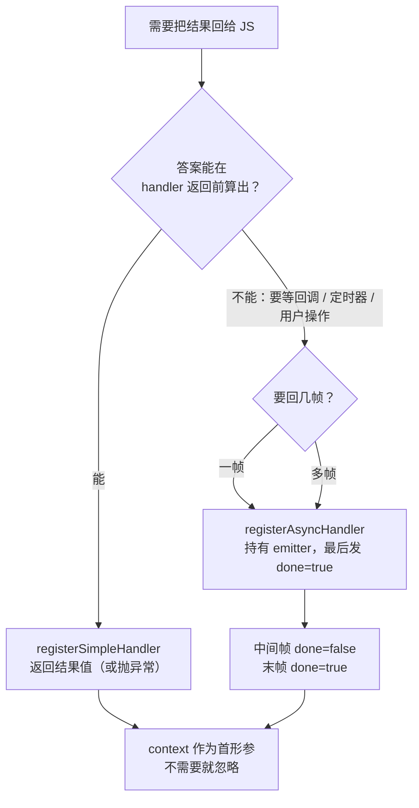

# 08 CoreBridge 接口契约规范

> 更新日期：2026-09
> 适用平台：Android · iOS · Flutter · HarmonyOS

## 1 概述

本文档定义 JsBridge 四端 CoreBridge（Tier 1）层的统一接口规范，确保所有平台在**语义层面**提供一致的能力，同时允许各端用符合自己生态的**惯用法**表达。

### 1.1 设计原则

1. **语义统一，形式本土化**：所有端必须支持相同的能力，但用各自语言生态的惯用法实现
2. **两个具名入口**：handler 注册表面**固定为两个具名方法**——`registerSimpleHandler` 与 `registerAsyncHandler`。四端均**不得**做运行时类型嗅探、参数个数判断或重载匹配；Dart 与 ArkTS 语言上无法重载，具名是两个态唯一能四端同形的表达
3. **帧语义由态决定**：Simple = 恰好一帧（`done` 恒为 `true`）；**多帧（同步或异步）只能由 Async 表达**。Simple 的结果类型中不含 `done` 字段，违反该约束在类型层面即不可表达
4. **旁路推送**：异步多响应通过复用 transport 持久通道实现，不改造分发主干
5. **零兼容包袱**：删除无用户的 API 不提供别名、不保留 `Legacy` 变体（本次清理的前提是预览期零外部用户）。行为由 C01–C65 锚定

### 1.2 与协议的关系

本文档约束的是**宿主侧注册 API**，不改变协议。Simple 与 Async 的差异只体现在原生侧如何产出响应帧；对 JS 客户端而言，两者都是 `kind="response"` 的消息，`reqId` 语义见 [03-protocol.md §2 字段表 / §3.2](03-protocol.md)，`done` / `keep` 语义见 [03-protocol.md §6](03-protocol.md)。

## 2 必需能力声明

### 2.1 同步单响应模式（Simple Handler）

所有端必须支持：

- Handler 接收**可信页面上下文**与请求 payload
- 返回一个结果（成功或失败），**恰好产生一帧响应**
- 该帧的 `done` 恒为 `true`，`ok` 由结果表达
- 通信在 handler 返回时结束

**失败通道**（形式本土化，语义一致）：Java 用 `throws` 抛出异常；Swift 用 `.failure(BridgeError)`；Dart 与 ArkTS 用 `BridgeHandlerResult.failure`（ArkTS 中抛出异常仅为可选补充——内核 `catch` 后经 `BridgeError.normalize` 兜底为同一失败帧，实际用法以返回 `failure` 为主，见 [§4.4](#44-arkts-harmonyos) 与 [§5.3](#53-逐端差异登记)）。异常一律被归一化为 `E_INTERNAL`。

**适用场景**：简单查询、配置获取、用户信息获取、以及任何"在 handler 返回时就有答案"的计算。

### 2.2 异步多响应模式（Async Handler）

所有端必须支持：

- Handler 接收**可信页面上下文**、请求 payload 和一个 **ResponseEmitter**
- 可在 handler 返回后继续异步推送响应帧
- 每帧标记 `done=false`（中间帧）或 `done=true`（最终帧）
- ResponseEmitter 区分 success 和 failure 路径
- **dispatch 启动即返**（验收锚点 C62）：dispatch 对 Async handler 启动后立即返回，**不得内联等待 handler 完成**——长时流式 handler 挂起期间，入站管线必须仍可继续处理后续消息与策略求值。宿主如果需要"等待全部帧落定"，应在 handler 侧自行同步（如终帧信号），而非依赖 dispatch 的阻塞时长（该不变量曾缺失：HarmonyOS 曾为四端中唯一的内联 `await` 实现，长流式 handler 会挂死整条 bindTransport 闭环）
- **dispatch 仅接受 request 信封**（验收锚点 C64）：Tier-1 分发对 `kind != request` 的信封一律丢弃不派发——`response` / `event` 是 Native→JS 方向（docs/03 §1），按 method 命中同名 handler 属路由错误而非 Tier-1 "无策略"的自由。Tier-2（JsBridge）路径已由策略链 `RequestShapePolicy` 先行拒绝（`E_INVALID_MESSAGE`），Tier-1 的守卫为 belt-and-braces（standalone 使用 CoreBridge 时 JS 误发非 request 信封不给 handler 可乘之机）
- **cancelScope 不通知 handler**：`bridge.cancelScope` 只是协议级 ack（四端均为空壳，见 [05-lifecycle-layers.md](05-lifecycle-layers.md) §7「协议层支持」与「Native 侧需要感知 scope 吗」）——框架既不登记 scope 与 handler 的对应、也不会因取消而中止/回调任何 handler。长驻流式 handler 在 JS 侧取消后**继续推帧是合法的**（帧到达 JS 侧因无匹配监听而被丢弃）；若宿主业务需要在取消时收尾资源，应自行监听 scope 生命周期或在 handler 内裁决，不依赖框架
- **launchForResult 等系统交互须自行保证线程/生命周期约束**：登记与回调闭环类 extension（`BridgeResultRegistry`）当前仅 Android 提供，其余端无对应实现（见 [02-architecture.md §5.1](02-architecture.md)、[04-cross-platform.md §4.5](04-cross-platform.md)）；凡涉及平台 UI 线程纪律（Android `ActivityResultLauncher.launch` 主线程约束）与 Activity 生命周期（结果可能在 destroy 后回落）的系统交互，宿主 handler 必须在 handler 侧处理，框架 extension 仅保证登记状态的一致性

**适用场景**：

- Streaming：持续推送数据流（timerLog）
- Progress：操作进度回调（文件上传）
- Chunked：分块返回大数据（搜索结果分页）
- Interactive：需要中间确认的操作（支付流程）
- Background Task：后台任务状态变化（导出任务）
- Incremental：增量计算结果（AI 生成）
- 任何需要跨越异步边界才拿到答案的场景（权限弹窗、Activity 结果、网络请求）

### 2.3 context 获取

`TrustedPageContext`（`origin` / `pageInstanceId`）是**两类 handler 的第一个形参**，随每次分发传入：

- JsBridge（Tier 2）路径传入的正是**策略引擎求值时使用的上下文**——策略判定与 handler 看到的一致，不存在二次构造。Android / Flutter / HarmonyOS 直接传递同一对象；iOS 的 async 分支为规避 Swift 6 并发检查，在 `Task` 内由 `origin` / `pageInstanceId` 复制构造一个**值等价**的新实例（`TrustedPageContext` 为纯数据模型，值语义相同）
- CoreBridge（Tier 1）standalone 路径未叠加 security 层，不存在可信上下文的来源：Android 形态为 `CoreBridge.bind()`，由内核直接注入空上下文（Android `new TrustedPageContext("", "")`，`getOrigin()` 为 `""`）；iOS / Flutter / HarmonyOS 形态为构造期注入 / `attachTransport` + 手动 `dispatch`，上下文由宿主自声明（信任边界不高于 null 配置，见 [04-cross-platform.md §3.1](04-cross-platform.md)；`origin` 仍须为归一化形态，见 [03-protocol.md §9 细则 5](03-protocol.md)）

> **历史说明**：v1.0 曾并存一组 `register*WithContext` 变体，并在 Android 上落入与主注册表并列的第二张表（`JsBridge.contextHandlers`），导致同一 method 两边注册时"先注册者未必生效"。该形态已删除：能力改为参数，注册表全局唯一。回归锚点为 C49。

### 2.4 重复注册语义

**同一 method 重复注册时后者覆盖前者**（last wins），四端一致：

```text
registerSimpleHandler("dup", h1)
registerSimpleHandler("dup", h2)   →  h2 生效，h1 不再被调用
registerAsyncHandler("dup", h3)    →  h3 生效，Simple 适配体被整体替换，无残留帧
```

注册表全局唯一、无隐式优先级。该行为由 **C49** 固定（见 [09-conformance.md](09-conformance.md) §3）。

## 3 选择准则

> 本节为**可直接照做**的判定流程，回答"该用哪个入口、context 怎么拿、重复注册怎么办"。

### 3.1 判定流程



### 3.2 三条硬规则

| 规则 | 内容 |
|------|------|
| **规则 1** | 答案在 handler 返回前可得 → **Simple**；否则（要等异步回调、权限弹窗、Activity 结果、网络、定时器）→ **Async**。误判为 Simple 会让空响应先于真实结果发出，属集成期难定位的错误 |
| **规则 2** | 需要多帧 → **只能 Async**。Simple 恒为单帧，其结果类型中没有 `done`，不存在"用 Simple 发两帧"的写法 |
| **规则 3** | 需要 `origin` / `pageInstanceId` → 直接用**首形参**，不存在"带上下文的注册口"。不需要就忽略该参数 |

### 3.3 常见场景对照

| 场景 | 选择 | 理由 |
|------|------|------|
| 读配置、拼接字符串、本地查询 | Simple | 返回时即有答案 |
| 弹 loading 并立即应答 | Simple | 应答不依赖弹窗关闭 |
| 网络请求、定位、相册/输入选择 | Async | 答案来自异步回调 |
| 计时器持续上报 | Async | 多帧 |
| 进度上报、分块返回 | Async | 多帧 |
| 需要按 origin 做业务分支 | 两者皆可 | context 已是首形参 |

## 4 各端实现规范

### 4.1 Java (Android)

#### 类型定义

```java
import io.github.xesam.android.bridge.api.model.TrustedPageContext;

/** Simple Handler: 单返回值，通信在返回时结束（恰好一帧，done 恒为 true） */
public interface SimpleHandler {
    Object handle(TrustedPageContext context, JSONObject payload) throws Exception;
}

/** Response Emitter: 异步多响应发送器 */
public interface ResponseEmitter {
    void success(Object payload, boolean done);
    void fail(BridgeError error);
}

/** Async Handler: 带 ResponseEmitter 参数，可在返回后继续推帧 */
public interface AsyncHandler {
    void handle(TrustedPageContext context, JSONObject payload, ResponseEmitter emitter) throws Exception;
}
```

#### 注册方法

```java
public void registerSimpleHandler(String method, SimpleHandler handler);
public void registerAsyncHandler(String method, AsyncHandler handler);
```

#### 使用示例

```java
// Simple Handler：同步查得答案
bridge.registerSimpleHandler("getUser", (context, payload) -> {
    String userId = payload.optString("userId");
    if (!"001".equals(userId)) {
        throw new IllegalStateException("user not found");   // 归一化为 E_INTERNAL
    }
    return new JSONObject().put("name", "xesam");
});

// Async Handler：多帧 + 后台线程推送
bridge.registerAsyncHandler("timerLog", (context, payload, emitter) -> {
    ScheduledExecutorService executor = Executors.newSingleThreadScheduledExecutor();
    executor.scheduleAtFixedRate(() -> {
        JSONObject tick = new JSONObject()
                .put("timestamp", System.currentTimeMillis())
                .put("seq", counter.incrementAndGet());
        emitter.success(tick, false);   // done=false，中间帧
    }, 0, 1, TimeUnit.SECONDS);
});
```

#### 实现约束

- `dispatch` 保持 `void`、同步，不改为 async；Async handler 在 `dispatch()` 内被调用，其同步 emit 的帧在 `dispatch()` 返回前即到达 transport
- payload 形参类型固定为 `JSONObject`；非对象 payload 归一化为空对象，handler 不会拿到 `null`
- `respondSuccess` / `respondFail` 是 handler 响应帧的唯一出口与 `sendFailureCount` 递增点（事件帧另由 `postEvent` 经 `transport.send` 发送并递增同一计数）

### 4.2 Swift (iOS)

#### 类型定义

```swift
/// Simple Handler: 单返回值，通信在返回时结束（恰好一帧，done 恒为 true）
public typealias SimpleHandler = (TrustedPageContext, JSONValue?) throws -> BridgeHandlerResult

/// Response Emitter: Result 类型 + done 标记
public typealias ResponseEmitter = @Sendable (Result<JSONValue?, BridgeError>, Bool) async -> Void

/// Async Handler: 带 ResponseEmitter 参数，可在返回后继续推帧
public typealias AsyncHandler = @Sendable (TrustedPageContext, JSONValue?, ResponseEmitter?) async throws -> Void

public enum BridgeHandlerResult {
    case success(JSONValue?)        // 无 done：Simple 恒为单帧
    case failure(BridgeError)
}
```

#### 注册方法

```swift
public func registerSimpleHandler(method: String, handler: @escaping SimpleHandler)
public func registerAsyncHandler(method: String, handler: @escaping AsyncHandler)
```

#### 使用示例

```swift
// Simple Handler
bridge.registerSimpleHandler(method: "getUser") { _, payload in
    guard let userId = payload?["userId"]?.asString else {
        return .failure(BridgeError(code: "E_INVALID_PARAM", message: "userId required"))
    }
    return .success(.object(["name": .string("xesam")]))
}

// Async Handler
bridge.registerAsyncHandler(method: "timerLog") { _, _, emitter in
    var counter = 0
    while true {
        counter += 1
        let tick: JSONValue = .object(["seq": .number(Double(counter))])
        await emitter?(.success(tick), false)          // done=false
        try await Task.sleep(nanoseconds: 1_000_000_000)
    }
}
```

#### 实现约束

- **dispatch 方法签名保持同步**，不改为 async
- Async handler 的帧经 `sendViaTransport` 旁路推送；`dispatch` 立即返回空数组
- `BridgeHandlerResult` 无 `done` 字段——需要多帧请用 Async，不要在结果里"伪造" `done`

### 4.3 Dart (Flutter)

#### 类型定义

```dart
/// Simple Handler: 单返回值，通信在返回时结束（恰好一帧，done 恒为 true）
typedef SimpleHandler = FutureOr<BridgeHandlerResult> Function(
  TrustedPageContext context,
  dynamic payload,
);

/// Response Emitter: Result 包装
typedef ResponseEmitter = Future<void> Function(
  Result<dynamic, BridgeError> result,
  bool done,
);

/// Async Handler: 带 ResponseEmitter 参数，可在返回后继续推帧
typedef AsyncHandler = Future<void> Function(
  TrustedPageContext context,
  dynamic payload,
  ResponseEmitter? emitter,
);

class BridgeHandlerResult {
  const BridgeHandlerResult.success(this.payload);   // 无 done
  const BridgeHandlerResult.failure(this.error);
  final bool ok;
  final dynamic payload;
  final BridgeError? error;
}
```

#### 注册方法

```dart
void registerSimpleHandler(String method, SimpleHandler handler);
void registerAsyncHandler(String method, AsyncHandler handler);
```

#### 使用示例

```dart
// Simple Handler
bridge.registerSimpleHandler('getUser', (TrustedPageContext context, dynamic payload) {
  final String? userId = payload['userId'] as String?;
  if (userId != '001') {
    return BridgeHandlerResult.failure(
      BridgeError(code: 'E_NOT_FOUND', message: 'user not found'),
    );
  }
  return BridgeHandlerResult.success(<String, dynamic>{'name': 'xesam'});
});

// Async Handler
bridge.registerAsyncHandler('timerLog',
    (TrustedPageContext context, dynamic payload, ResponseEmitter? emitter) async {
  var counter = 0;
  Timer.periodic(const Duration(seconds: 1), (Timer timer) async {
    counter += 1;
    await emitter?.call(Result<dynamic, BridgeError>.success({'seq': counter}), false);
  });
});
```

#### 实现约束

- `SimpleHandler` 返回 `FutureOr`，同步与异步实现均可
- `ResponseEmitter` 返回 `Future<void>`
- `dispatch` 签名保持不变；Async handler 的帧经 `sendViaTransport` 推送

### 4.4 ArkTS (HarmonyOS)

#### 类型定义

```typescript
/// Simple Handler: 单返回值，通信在返回时结束（恰好一帧，done 恒为 true）
export type SimpleHandler = (
  context: TrustedPageContext,
  payload: Object | null
) => BridgeHandlerResult | Promise<BridgeHandlerResult>;

/// Response Emitter: Result 类型 + done 标记
export type ResponseEmitter = (result: Result<Object, BridgeError>, done: boolean) => Promise<void>;

/// Async Handler: 带 ResponseEmitter 参数，可在返回后继续推帧
export type AsyncHandler = (
  context: TrustedPageContext,
  payload: Object | null,
  emitter: ResponseEmitter | null
) => void | Promise<void>;

export class BridgeHandlerResult {
  static success(payload: Object | null): BridgeHandlerResult;   // 无 done
  static failure(error: BridgeError): BridgeHandlerResult;
}
```

#### 注册方法

```typescript
registerSimpleHandler(method: string, handler: SimpleHandler): void;
registerAsyncHandler(method: string, handler: AsyncHandler): void;
```

#### 使用示例

```typescript
// Simple Handler
bridge.registerSimpleHandler('getUser', (context: TrustedPageContext, payload: Object | null) => {
  const userId = payload === null ? '' : (payload as Record<string, string>).userId;
  if (userId !== '001') {
    return BridgeHandlerResult.failure(new BridgeError('E_NOT_FOUND', 'user not found'));
  }
  return BridgeHandlerResult.success({ name: 'xesam' });
});

// Async Handler
bridge.registerAsyncHandler('timerLog',
  (context: TrustedPageContext, payload: Object | null, emitter: ResponseEmitter | null) => {
    let counter = 0;
    setInterval(async () => {
      counter += 1;
      await emitter?.(Result.success<Object, BridgeError>({ seq: counter }), false);
    }, 1000);
  });
```

#### 实现约束

- 遵守 ArkTS 语法限制：**不使用 `any`／动态特性**，所有类型显式标注
- `dispatch` 签名保持现状；Async handler 的帧经 ResponseEmitter 适配器 → FrameEmitter → `emitStreamingResponse` 直达 transport——不经 `sendViaTransport`，该方法在该端仅用于 `bindTransport` 入站闭环（与 iOS/Flutter 的旁路形态不同，见 §4.2/§4.3）

## 5 实现关键约束

### 5.1 不改造分发主干

**禁止**：

- ❌ 在 `dispatch` 分发主干内内联 `await`／阻塞等待业务逻辑——禁的是分发主干阻塞（dispatch 对 Async handler 启动即返，验收锚点 C62），而非签名形态（Flutter / HarmonyOS 的 `dispatch` 本为 async 形态，各端签名保持现状）
- ❌ 在入站回调里用 semaphore/阻塞等待包装
- ❌ 把同步分发链路强行异步化

**原因**：

- 触发 Swift 6 并发检查报错（`sending closure risks data race`）
- 破坏现有 C01–C65 测试的调用假设
- 增加复杂度，无实际收益

### 5.2 旁路推送实现

**正确做法**：

- ✅ 复用 CoreBridge 既有出站 API：Android 为 public `respondSuccess` / `respondFail`（无 `sendViaTransport` 对等物）；iOS / Flutter / HarmonyOS 为 public `sendViaTransport` 与响应构造方法
- ✅ transport 在 `bindTransport` 后持久在线
- ✅ AsyncHandler 的 emit 闭包内部转发这些既有 API
- ✅ 与同步 dispatch 返回值路径**互不干扰**、可并存

### 5.3 逐端差异登记

以下差异是**刻意的**（原则 1「语义统一，形式本土化」），不是待收敛项：

| 差异项 | Android | iOS | Flutter | HarmonyOS |
|--------|---------|-----|---------|-----------|
| Simple 失败通道 | `throws` | `BridgeHandlerResult.failure` | `BridgeHandlerResult.failure` | `BridgeHandlerResult.failure` |
| Simple 返回类型 | 裸结果对象 | `BridgeHandlerResult` | `BridgeHandlerResult` | `BridgeHandlerResult` |
| payload 形参类型 | `JSONObject`（非对象归一化为空对象） | `JSONValue?`（原样透传） | `dynamic`（原样透传） | `Object \| null`（原样透传） |
| Async emit 同步性 | emitter 在 `dispatch()` 内同步执行 | 帧经 `Task` 异步到达 | 帧经后台任务异步到达 | 帧经微任务异步到达 |

达到一致的是：**注册入口名称与数量、形参顺序（context 首参）、帧语义（Simple 单帧 `done=true`；多帧只走 Async）、注册表数量（1）、重复注册语义（覆盖）**。

## 6 Conformance

| 用例 | 覆盖点 |
|------|--------|
| C11 | handler 抛出异常被归一化为 `E_INTERNAL` |
| C13 | 流式帧序语义（多帧 `done=false → done=true`） |
| C38 | 缺失可选字段时 Simple handler 仍正常应答 |
| C43 | Async handler 经 emitter 推送多帧（异步时序） |
| C49 | 同一 method 重复注册后者覆盖，注册表条目被替换而非并存 |

C01–C65 的完整定义与各端落点见 [09-conformance.md](09-conformance.md) §3 / §4。

## 7 跨端接口设计对比

| 平台 | 注册入口 | Simple Handler | Async Handler |
|------|---------|----------------|---------------|
| **Android** | `registerSimpleHandler` / `registerAsyncHandler` | 同步返回（`throws` 表失败） | 扁平参数：`success(payload, done)` + `fail(error)` |
| **iOS** | 同上 | `BridgeHandlerResult` | `Result<JSONValue?, BridgeError>` + `Bool` |
| **Flutter** | 同上 | `BridgeHandlerResult` | `Result<dynamic, BridgeError>` + `bool` |
| **HarmonyOS** | 同上 | `BridgeHandlerResult` | `Result<Object, BridgeError>` + `boolean` |

---

**规范版本**: v1.1
**最后更新**: 2026-09-25
