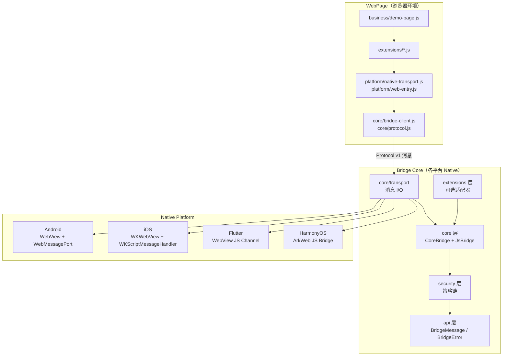
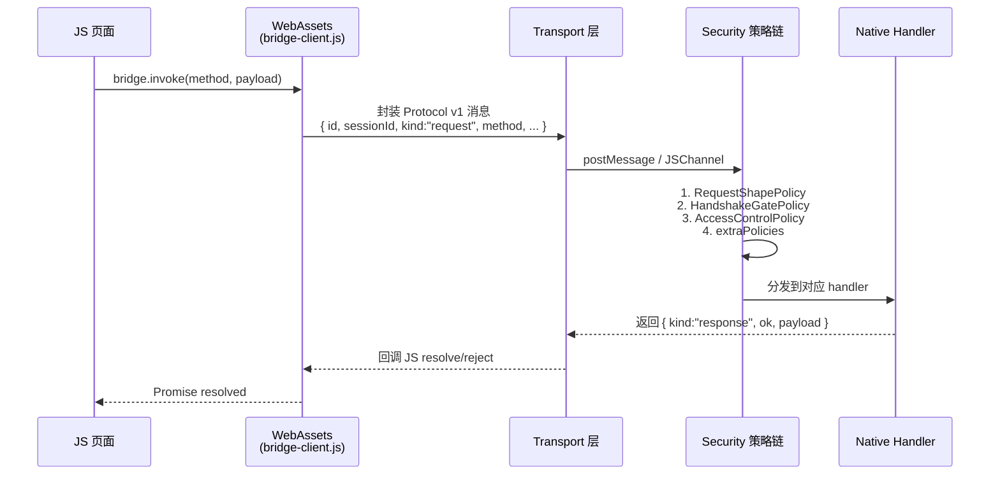
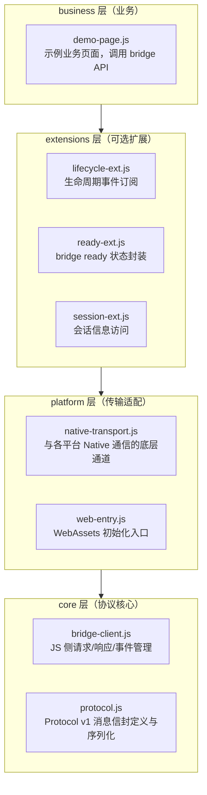

# JsBridge2

多端 JS-Native 通信桥接库，支持 Android、iOS、Flutter、HarmonyOS 四个平台。为 WebView 内运行的 JS 页面与宿主 Native 应用之间提供结构化、有状态的双向通信能力。

> **核心目标不是复用同一套运行时代码，而是让各端遵循同一套协议边界、会话模型和共享 WebAssets。**

---

## 项目定位与目标

WebView 内嵌 H5 是跨平台业务的常见模式，但各平台原生提供的 JS-Native 通信接口差异显著（Android 的 `WebMessagePort`、iOS 的 `WKScriptMessageHandler`、Flutter 的 JS channel、HarmonyOS 的 ArkWeb bridge），导致：

- JS 侧需要针对不同平台写多份适配代码，维护成本高
- 缺乏统一的会话模型、握手机制和错误处理约定
- 安全策略（来源校验、能力管控）各自为战，难以复用

| 问题 | JsBridge2 的解法 |
|------|-----------------|
| 各端 JS 接口不统一 | 共享 WebAssets：同一套 JS 文件跨四端运行 |
| 缺乏会话与握手机制 | Protocol v1：规定消息信封格式、握手方法、会话生命周期 |
| 安全策略分散 | 固定评估顺序的安全策略链，宿主只扩展不覆盖 |
| Native 多端重复实现 | 分层内核：各平台独立实现，但遵循同一协议契约 |

---

## 核心设计原则

**Protocol-first（协议优先）**：所有平台实现均以 Protocol v1 消息信封为契约。任何新特性必须先明确协议语义，再落地到各端实现。

**Behavior-consistent（行为一致）**：四个平台在握手、会话建立、错误码、超时处理等核心行为上必须完全一致。各端均有 `tests/js/bridge-client-conformance.cases.js`（路径前缀为 `js_bridge_XX/`）作为 JS 侧行为验收用例集。

**Layered kernel（分层内核）**：

```
api       → 稳定的公共契约（BridgeMessage、BridgeError、BridgeApiContract）
core      → Tier 1: 纯协议分发（CoreBridge） + Tier 2 入口（JsBridge）
security  → 上下文、策略链、会话/能力（纯逻辑，无 UI）
transport → 消息 I/O 抽象（不做策略决策）
extensions→ 可选适配器（lifecycle、registry、system）
```

依赖方向单向：`JsBridge → CoreBridge → api`，`security → api`，`extensions → JsBridge | CoreBridge | api`。CoreBridge 零 security 依赖。

**Additive evolution（加法演化）**：协议字段只增不删；宿主自定义通过 `extraPolicies` 和 `extensions` 注入，不修改内核行为。

---

## 整体架构概览





---

## 各平台实现概览

| 平台 | 语言 | 传输层 | Core 入口 |
|------|------|--------|-----------|
| Android（参考实现） | Java 8 | `WebMessagePort` / 降级 `JavascriptChannel` | `js_bridge_android/js-bridge-core/` |
| iOS | Swift Package | `WKWebView` + `WKScriptMessageHandler` / `WKUserScript` | `js_bridge_ios/js-bridge-core-swift/Sources/Bridge/` |
| Flutter | Dart | WebView JS channel + platform bridge adapter | `js_bridge_flutter/packages/js_bridge_core/lib/src/` |
| HarmonyOS | ArkTS | ArkWeb JS Bridge API（`@ohos.web.webview`） | `js_bridge_hm/js-bridge-core/src/main/ets/` |

---

## 共享 WebAssets

四端必须携带完全相同的 WebAssets 文件，运行 `pnpm check` 验证一致性。



Android 参考路径：`js_bridge_android/js-bridge-example/src/main/assets/web/`

---

## 快速上手

### Android

```bash
cd js_bridge_android
./gradlew :js-bridge-core:test
./gradlew :js-bridge-core:test --tests "*.PolicyGroupsTest"
./gradlew :js-bridge-example:assembleDebug
./gradlew lint
```

### iOS

```bash
cd js_bridge_ios
swift test --package-path js-bridge-core-swift
xcodebuild -project js-bridge-example/JsBridgeExample.xcodeproj \
  -scheme JsBridgeExample \
  -destination 'generic/platform=iOS Simulator' \
  build CODE_SIGNING_ALLOWED=NO
```

### Flutter

```bash
cd js_bridge_flutter/packages/js_bridge_core
flutter test
cd ../..
flutter test
flutter analyze
```

### HarmonyOS

```bash
cd js_bridge_hm/js-bridge-example
DEVECO_SDK_HOME=/Applications/DevEco-Studio.app/Contents/sdk \
  /Applications/DevEco-Studio.app/Contents/tools/node/bin/node \
  /Applications/DevEco-Studio.app/Contents/tools/hvigor/bin/hvigorw.js \
  assembleHap --mode module -p product=default --no-daemon
```

### 共享 WebAssets

WebAssets 正本位于仓库根目录 `web-assets/`，各平台目录下的副本**不纳入版本管理**，需在首次 clone 或修改正本后手动同步：

```bash
# 首次 clone 后 / 修改 web-assets/ 后：同步到所有平台并校验
cd web-assets && pnpm sync

# JS 客户端行为验收
node js_bridge_hm/tests/js/bridge-client-conformance.cases.js
```

---

## 文档

| 文件 | 内容 |
|------|------|
| [01-protocol.md](01-protocol.md) | Bridge 协议 — 消息信封、握手/会话、流式、错误码、策略链 |
| [02-architecture.md](02-architecture.md) | 架构设计 — 分层内核、类图、消息处理流程、扩展层 |
| [03-cross-platform.md](03-cross-platform.md) | 跨端设计 — 四端对比、一致性保障、WebAssets 机制、新平台接入 |
| [04-conformance.md](04-conformance.md) | 跨端一致性验收用例（C01–C18） |
| [05-review.md](05-review.md) | 架构评审 — 原则落地核查、跨端 API 差异、设计债与改进项 |
